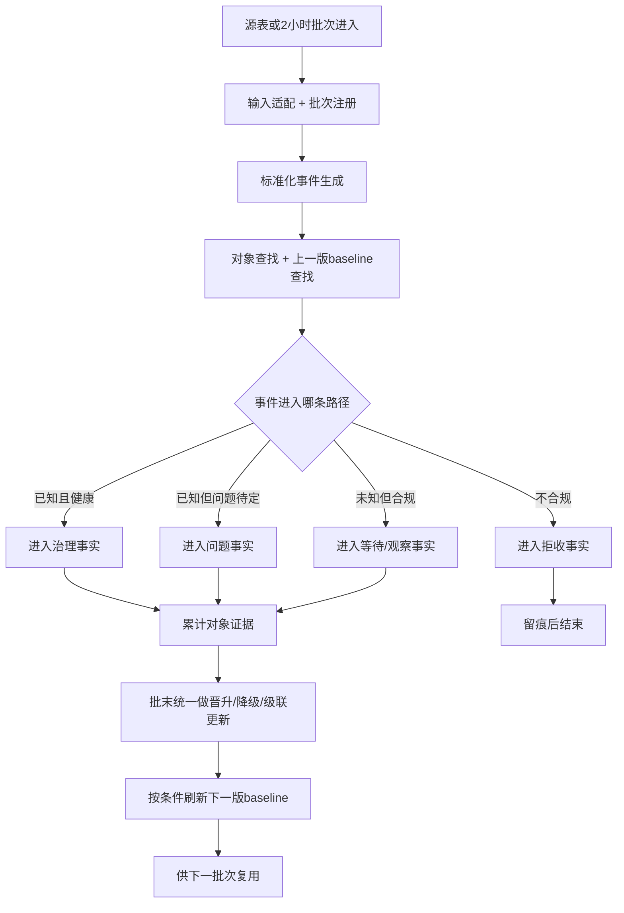
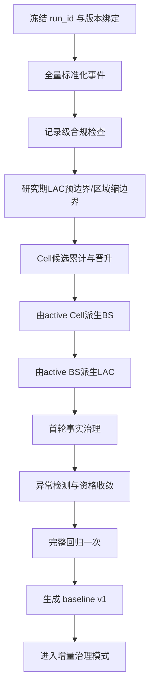
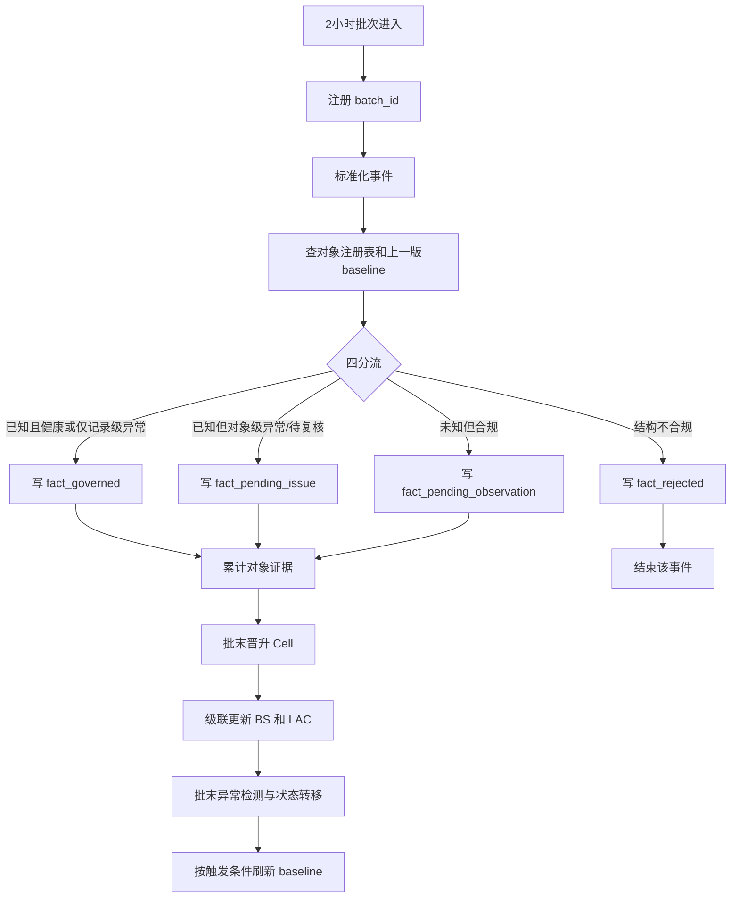
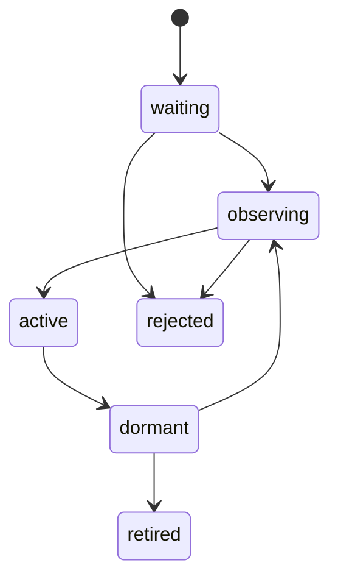
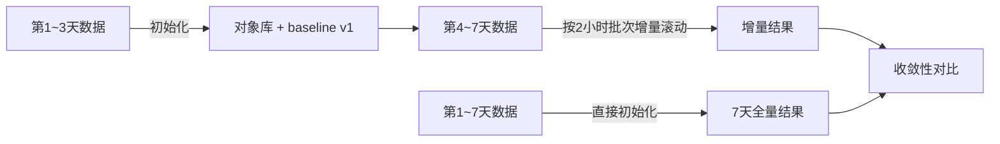

# rebuild3 说明（最终冻结版）

> 状态：最终冻结版（UI 设计前置）  
> 适用对象：人类评审、产品/业务对齐、UI 设计协作者、后续实施 agent  
> 说明：本文件冻结 rebuild3 的主语、流程、边界和当前阶段共识；它不是最终实施任务书，但会成为后续 UI 设计和实施计划的业务基线。

---

## 1. 一句话定位

**rebuild3 = 把 rebuild2 已验证的静态规则，升级为“初始化 + 2 小时增量”共用骨架的本地动态治理系统。**

核心变化不在“换算法”，而在下面五件事被系统化了：

1. 有对象注册
2. 有事件分流
3. 有状态流转
4. 有版本绑定
5. 有冻结基线闭环

---

## 2. 这次已经冻结的核心结论

当前最终共识如下：

1. rebuild3 是**本地动态治理系统**，不是云端大平台，也不是一次性静态重跑系统。
2. 初始化和增量必须**共用同一套治理语义**，只允许入口不同，不允许规则口径漂移。
3. **Cell 是动态治理最小主语**；BS 是空间锚点；LAC 是区域边界与区域健康主语。
4. 状态表达采用**二维模型**：生命周期与健康状态分离。
5. 必须分开三种资格：**存在资格、锚点资格、基线资格**。
6. 当前批次的所有判断，只能参考**上一版冻结 baseline**，不能边判边刷本批 baseline。
7. 北京样本里的严格 GPS/LAC 过滤，只是**研究期收敛策略**，不是长期全国规则。
8. per-Cell 明细库可以保留，但只能是**热层**，不能单独承担长期记忆。
9. 记录级异常和对象级异常，必须走**不同分流路径**。
10. 当前最合理的验证路径仍然是：**3 天初始化起跑，滚动到 7 天，再对比直接 7 天初始化结果。**

---

## 3. rebuild3 最重要的三个“不要混为一谈”

### 3.1 对象存在，不等于对象能当锚点

一个 Cell / BS 可以已经被系统承认存在，但它如果处于碰撞、动态、迁移怀疑等状态，就不应该继续参与 GPS 修正或信号补齐。

因此必须拆开：

- **存在资格**：对象是否被承认存在
- **锚点资格**：对象能否参与修正 / 补齐
- **基线资格**：对象或事实能否参与 baseline / profile

### 3.2 生命周期，不等于健康状态

生命周期回答的是“它处于哪个存在阶段”，健康状态回答的是“它当前是否可被信任”。

最终冻结为：

| 维度 | 持久化状态值 |
|---|---|
| `lifecycle_state` | `waiting / observing / active / dormant / retired / rejected` |
| `health_state` | `healthy / insufficient / gps_bias / collision_suspect / collision_confirmed / dynamic / migration_suspect` |

说明：

- `watch` 不再作为持久化 lifecycle 状态
- 如果 UI 需要表达“active 但近期需重点观察”，应由读模型派生：
  - `lifecycle_state = active`
  - `health_state != healthy`
  - UI 可显示 `watch` 徽标

### 3.3 研究期口径，不等于长期运行口径

北京 7 天样本上的严格过滤，目的是在小窗口内快速收敛、快速暴露问题。

长期运行不应继续把下面两项硬编码成长期主规则：

- 北京 GPS 边界框
- 研究期 LAC 前置过滤

长期规则应更多依赖：

- 运营商合法性
- 编码合法性
- 等待 / 观察 / 拒收机制
- 异常分流机制
- 基线冻结与画像刷新机制

---

## 4. rebuild3 的三个核心对象

| 对象 | 角色 | 在 rebuild3 中主要负责什么 |
|---|---|---|
| `Cell` | 最小治理主语 | 注册、等待、观察、晋升、迁移、局部变化判断 |
| `BS` | 空间锚点 | GPS 修正、信号补齐、空间异常扩散、锚点资格控制 |
| `LAC` | 区域边界 | 区域健康、边界约束、区域级画像与异常占比 |

这里有一个必须说清的边界：

- **初始化阶段**允许使用研究期的 LAC 预边界与 `LAC -> Cell -> BS` 冷启动策略；
- **长期治理语义**仍然是：**Cell 是最小治理主语，BS / LAC 由 active child 派生**。

也就是说，初始化和增量不是两套业务规则，而是**同一语义下的两种入口**。

---

## 5. 系统主语与统一骨架

rebuild3 的系统主语已经从旧的 Step / Layer 流水线切换为：

- **对象**
- **决策**
- **事实**
- **基线**
- **状态流转**

统一骨架可以概括为：

这条骨架真正解决的是四件事：

1. 这条事件是否被系统接受
2. 它属于哪一层事实
3. 它会不会改变对象状态
4. 它会不会影响下一版 baseline

---

## 6. 初始化流程怎么跑

初始化的本质，是用较长窗口历史数据把对象、事实和 baseline 冷启动出来。

### 6.1 初始化流程图

### 6.2 初始化阶段的关键动作

1. 先冻结本轮 run 的版本上下文。
2. 统一解析成标准化事件，标准化事件层保持不可变。
3. 做记录级合规过滤，不合规的直接拒收。
4. 允许在研究期使用严格 LAC / GPS 约束，帮助快速缩小可信边界。
5. 先形成 active Cell，再由 Cell 派生 BS，再由 BS 派生 LAC。
6. 只对满足锚点前提的对象做 GPS 修正和信号补齐。
7. 在首轮对象库形成后，再做一次完整回归，消掉“先粗后细”的语义混杂。
8. 生成第一版 baseline，作为之后所有增量批次的唯一参照。

### 6.3 初始化阶段要特别注意的事

- LAC 预边界只属于**冷启动研究模式**
- 严格 GPS 区域过滤只属于**当前北京样本验证阶段**

这两项都不应被误写成长期全国化主规则。

---

## 7. 2 小时增量流程怎么跑

增量阶段的核心原则是：

**当前批次只看上一版冻结 baseline，批次结束后才可能生成下一版 baseline。**

### 7.1 增量流程图

### 7.2 增量阶段的四类分流

| 路径 | 含义 | 主去向 |
|---|---|---|
| 已知且健康，或仅存在可治理的记录级异常 | 对象存在且当前可治理 | `fact_governed` |
| 已知但对象级异常 / 待复核 | 对象存在，但当前不应直接作为可信正式事实 | `fact_pending_issue` |
| 未知但合规 | 可能成为新对象，但证据不足 | `fact_pending_observation` |
| 结构不合规 | 记录本身不满足规则 | `fact_rejected` |

### 7.3 为什么批末统一更新状态

如果在同一批次内边处理边改对象状态，再用新状态处理后续事件，会导致同一批次前后口径不一致。

因此最终冻结原则是：

1. 事件先进入各自事实层
2. 证据先累计
3. 晋升 / 降级 / 级联更新在批末统一做
4. baseline 刷新永远放在批次判定之后

---

## 8. 对象如何流转

对象状态最终采用**二维表达**：

健康状态独立表达，常见取值包括：

- `healthy`
- `insufficient`
- `gps_bias`
- `collision_suspect`
- `collision_confirmed`
- `dynamic`
- `migration_suspect`

这意味着：

- 对象即便仍是 `active`，也可能 `health_state != healthy`
- 异常首先改变的是**健康状态与资格**
- 异常不等于立刻删除对象

---

## 9. Cell 的三层门槛

Cell 是最小治理单元，但“被看到”≠“能当锚点”≠“能影响基线”。

最终冻结为三层资格：

| 层级 | 回答的问题 | 冻结说明 |
|---|---|---|
| **存在资格** | 系统是否承认它是一个对象 | 达到最小注册门槛后进入正式对象注册表 |
| **锚点资格** | 它能否用于 GPS 修正 / 信号补齐 | 比存在资格更严格，且受异常状态约束 |
| **基线资格** | 它能否参与 baseline / profile 刷新 | 最严格，需要更成熟的时间/样本/稳定性 |

### 9.1 当前 v1 建议（参数化，不硬编码）

为了后续 UI 和实施计划有共同语言，当前冻结以下 **v1 建议阈值方向**：

- **存在资格（Cell 晋升）**
  - 合规业务主键稳定
  - GPS 有效点数、设备数、时间跨度达到最小可判断水平
  - 允许进入 `observing -> active` 的门槛参数化
- **锚点资格**
  - 建议初版使用：
    - GPS 有效点数 `>= 10`
    - 设备数 `>= 2`
    - 质心 P90 半径 `< 1500m`（或已明确标记为移动对象）
    - 最低时间跨度 `>= 1 天`
    - 无禁用锚点的异常
- **基线资格**
  - 在锚点资格之上进一步要求：
    - 更高的样本量 / 活跃天数
    - 足够的原始信号占比
    - 稳定性达到画像成熟要求

这些数值仍应参数化，并在后续实施计划与回放验证中确认。

---

## 10. 哪些异常能进正式事实，哪些不能

这是 rebuild3 必须明确的边界。

### 10.1 记录级异常

例如：

- 单条记录 GPS 偏离
- 原始 GPS 缺失但 BS 中心点可回填
- 轻微信号缺失，需要 donor 补齐
- `normal_spread`
- `single_large`（只影响精度等级，不直接推翻对象身份）

这类记录通常仍可进入 `fact_governed`，但必须：

- 带异常标签
- 显式记录 `gps_source / signal_source`
- 由资格矩阵决定 `baseline_eligible`

### 10.2 对象级异常

例如：

- `collision_suspect`
- `collision_confirmed`
- `dynamic`
- `migration_suspect`
- 对象级 `gps_bias`

这类异常会破坏对象身份或可信性，不应直接作为可信正式事实参与对象更新和 baseline 刷新。

它们默认进入：

- `fact_pending_issue`

同时：

- 对象失去锚点资格
- 对象或事实默认失去 baseline 资格
- 需要进入异常审查与后续状态转移链路

### 10.3 冻结版资格矩阵（v1）

| 情况 | 主事实去向 | 可做锚点 | 可进 baseline | 说明 |
|---|---|---|---|---|
| 正常对象 / 正常记录 | `fact_governed` | 是 | 是 | 标准路径 |
| 仅记录级 GPS / 信号异常 | `fact_governed` | 由对象资格决定 | 由标签与规则决定 | 记录保留，来源显式标注 |
| `normal_spread` | `fact_governed` | 是 | 是 | 画像降低 GPS 精度等级 |
| `single_large` | `fact_governed` | 有条件是 | 有条件是 | 依赖 GPS 可信度与策略参数 |
| `waiting / observing / evidence insufficient` | `fact_pending_observation` | 否 | 否 | 证据累计中 |
| `collision_suspect` | `fact_pending_issue` | 否 | 否 | 待复核问题事实 |
| `collision_confirmed` | `fact_pending_issue` | 否 | 否 | 明确禁用锚点与 baseline |
| `dynamic` | `fact_pending_issue` | 否 | 否 | 可做低精度画像但不进正式基线 |
| `migration_suspect` | `fact_pending_issue` | 否 | 否 | 等待迁移确认 |
| 结构不合规 | `fact_rejected` | 否 | 否 | 留痕后结束 |

---

## 11. 数据应该怎么存

rebuild3 不应再依赖“一张总明细包打天下”，而应至少拆成三层长期数据保留结构：

| 层级 | 作用 | 说明 |
|---|---|---|
| **热层** | 服务近期画像、等待池、观察池、异常复核 | 以 per-Cell 热明细为主，按窗口滚动保留 |
| **长层** | 服务活跃节奏、成熟度、退役判断、慢变化 | 按日或更粗粒度长期保留 |
| **归档层** | 服务审计、回放、完整回归 | 保留完整治理后历史 |

结论非常明确：

- per-Cell 最近 N 条治理后明细是合理的
- 但它只能做**热层**
- 不能替代长期汇总和归档事实

---

## 12. 为什么“上一版冻结 baseline”这么重要

这是 rebuild3 能否稳定收敛的关键点。

如果用当前批次刚写进去的数据，立刻刷新当前批 baseline，再拿这个 baseline 继续处理当前批剩余事件，就会出现自我强化和循环依赖。

正确顺序必须是：

1. 当前批次只参考上一版 baseline
2. 当前批次完成后，再决定是否生成下一版 baseline
3. 新 baseline 只供下一批次使用

这条原则必须贯穿：

- 准入判断
- GPS 修正
- 信号补齐
- 对象状态转移
- 画像刷新

---

## 13. 版本体系

所有对象、事实、异常、画像、读模型都必须能追溯到下面 4 个版本标识：

1. `run_id`
2. `contract_version`
3. `rule_set_version`
4. `baseline_version`

同时必须保证：

- `run_id` 与 `batch_id` 分离
- 批次要显式记录窗口与来源
- 同一批次可以重复回放、重复比对
- 标准事件级幂等键显式落库，不只依赖原始 `record_id`

### 13.1 event_time 当前冻结口径

当前冻结版为避免后续再次争议，先统一采用：

- **系统事件时间**：默认使用 `ts_std`
- **原始时间证据**：保留来自 `cell_infos / ss1 / 原始字段` 的时间证据列

这意味着当前可以稳定推进 UI 和实施计划，同时为后续升级保留空间。

---

## 14. 北京研究期口径 vs 长期运行口径

必须显式区分：

| 维度 | 当前研究期 | 未来长期运行 |
|---|---|---|
| 区域过滤 | 严格北京边界框 | 不固化为长期硬规则 |
| LAC 角色 | 可作为初始化缩边界策略 | 增量期主要是 Cell / BS 派生结果 |
| 时间窗口 | 3 天初始化 + 4 天增量验证 | 参数化，可扩展为更长累计窗口 |
| 热层保留 | 服务当前画像和等待池 | 将来按流量分层与稳定性策略调整 |

架构原则只有一条：

**研究期特殊规则必须参数化，不能写死成长期系统语义。**

---

## 15. 验证路径

当前冻结的验证路径仍然是：

### 15.1 对比维度

- **对象收敛**：active Cell / BS / LAC 数量差与主键集合重合度
- **空间收敛**：BS 中心点距离差分布、覆盖半径 P50 / P90 差
- **信号收敛**：补齐率、RSRP / RSRQ / SINR 分位差异
- **异常收敛**：碰撞 / 动态 / 迁移怀疑对象集合重合度
- **决策收敛**：四分流占比一致率
- **热层稳定性**：per-Cell 热层样本稳定性与画像刷新波动

### 15.2 当前期望

当前冻结版仍建议以后续实施计划中的验收目标为参考：

- 对象主键集合重合度 > 95%
- BS 中心点差异 P90 < 200m
- 异常分类一致率 > 90%

这些值是验证目标，不是 UI 设计阻塞项。

---

## 16. 当前阶段先做什么，不做什么

### 16.1 当前阶段先做什么

1. 冻结对象、决策、事实、基线、版本这五类主语
2. 冻结状态机、资格矩阵、事实分层和版本绑定口径
3. 明确 UI 设计会消费的对象读模型和批次读模型
4. 冻结本地验证路径：3 天起跑，滚到 7 天，对比直接 7 天结果
5. 为 UI 确认后的最终实施任务书准备稳定输入

### 16.2 当前阶段不做什么

1. 不直接进入最终开发编码
2. 不先重写整套 UI
3. 不先做云端平台、消息队列或复杂调度系统
4. 不把北京研究期的严格过滤直接固化成全国长期规则
5. 不在 UI 设计前冻结最终 API 明细和前端组件实现细节

---

## 17. 审阅通过后的顺序

当前阶段的建议顺序已经冻结为：

1. **先完成 rebuild3 的 UI 设计**
2. **再基于本套最终文档 + UI 方案，生成最终实施任务书**
3. **最后进入实际编码和批次回放验证**

也就是说，当前这份文档是：

- 人类对齐稿
- UI 设计输入稿
- 后续实施计划的业务基线

但它不是最终开发排期表。

---

## 18. 最终结论

rebuild3 的关键，不是把旧 Step 换个名字，而是把系统真正变成：

- 有对象注册
- 有事件分流
- 有状态流转
- 有版本绑定
- 有冻结基线闭环

只要这五件事统一起来，初始化和增量就能共享一套骨架，UI 设计、开发计划和后续实现也才能真正对齐。
