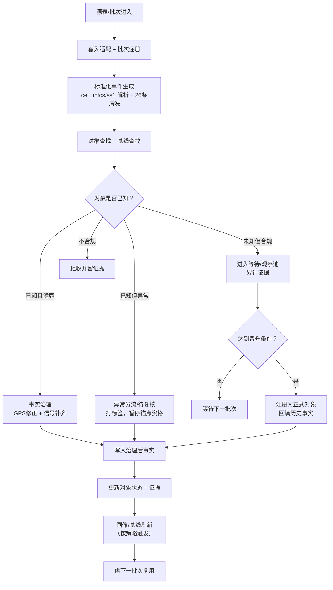
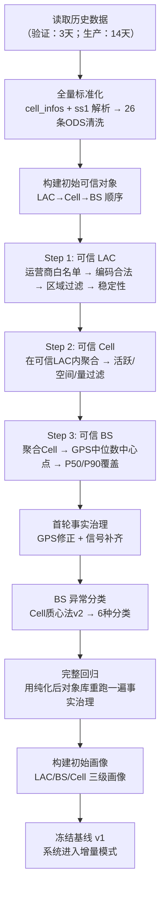
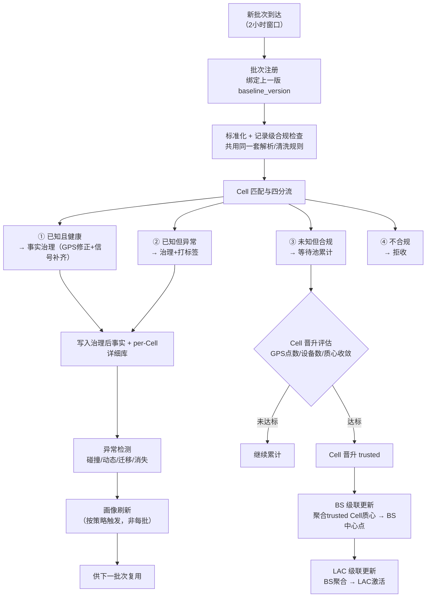
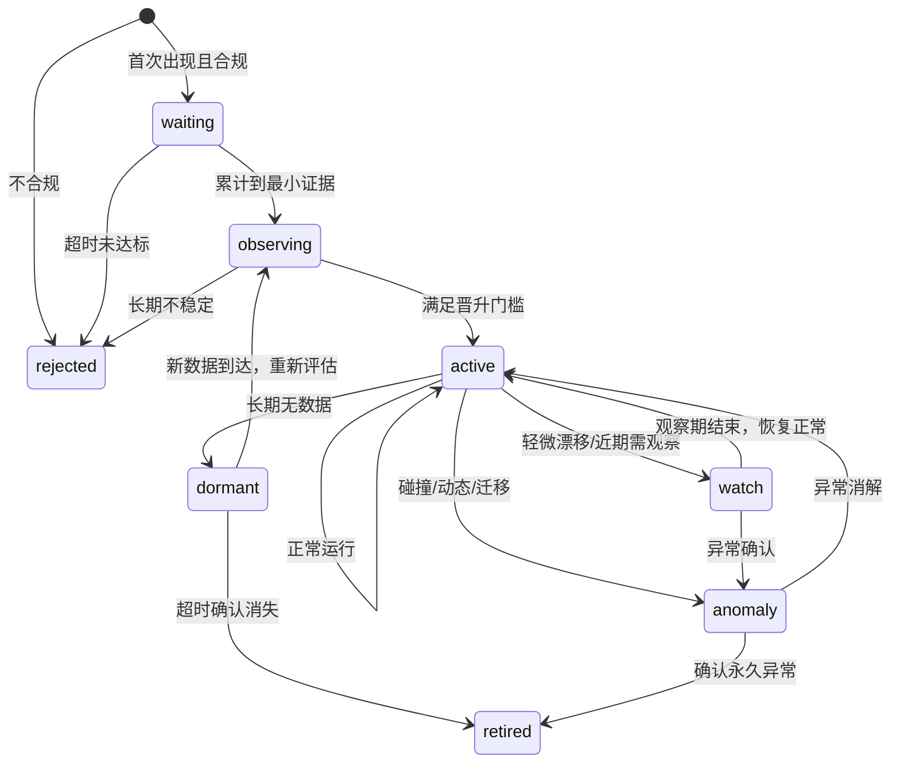
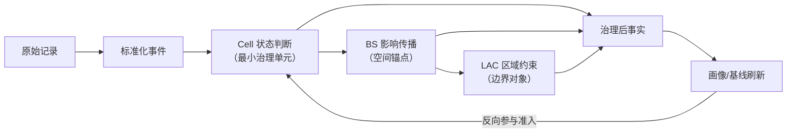
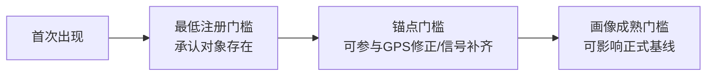
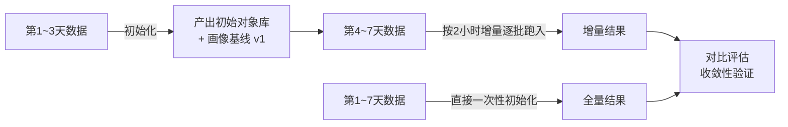

# rebuild3 重构说明（人类友好版）

> 产出日期：2026-04-03
> 定位：与人类对齐 rebuild3 的整体方向、核心变化和实施路径
> 阅读前提：无需代码访问权限，所有概念均已自包含解释

---

## 一、一句话定位

**rebuild3 = 把 rebuild2 已验证的静态规则，升级为"初始化 + 2 小时增量"共用骨架的动态治理系统。**

核心变化不在算法，而在**对象管理**——对象有了生命周期，规则有了版本，处理有了批次。

---

## 二、项目背景速览

### 2.1 我们在做什么

从运营商原始报文数据中，持续构建并维护三级基础对象库与画像：

| 层级 | 说明 | 主键 |
|------|------|------|
| **LAC**（位置区） | 网络分区，一个城市区域的逻辑分区 | (运营商, 制式, LAC编码) |
| **BS**（基站） | 由 cell_id 推算（4G=cell_id/256, 5G=cell_id/4096） | (运营商, 制式, LAC, BS_ID) |
| **Cell**（小区） | 最小粒度，基站下的扇区 | (运营商, 制式, LAC, CellID) |

层级关系：运营商 → 制式(4G/5G) → LAC → BS → Cell

### 2.2 rebuild2 已经完成了什么

rebuild2 用北京一周的静态数据，已经验证了完整的处理链路：

1. **字段治理**：27 列原始字段 → 60 列标准化字段（含 cell_infos JSON 解析、ss1 紧凑字符串解析、26 条清洗规则）
2. **可信库构建**：LAC→Cell→BS 逐级筛选，产出 1,057 个可信 LAC、57 万 Cell、19 万 BS
3. **GPS 修正 + 信号补齐**：用 BS 中心点修正 GPS 漂移，两阶段信号补齐策略
4. **BS 异常分类**：Cell 质心法 v2 算法，6 种分类（normal_spread / single_large / dynamic_bs / collision_confirmed / collision_suspected / collision_uncertain）
5. **画像基线**：三级画像设计（进行中）

### 2.3 技术栈

| 组件 | rebuild2 | rebuild3 |
|------|----------|----------|
| 数据库 | PostgreSQL 17 | PostgreSQL 17（不变） |
| 后端 | Python FastAPI + asyncpg | Python FastAPI + asyncpg（不变） |
| 前端 | 原生 HTML + CSS + ES Modules | **Vue 3 + TypeScript + Vite**（全部重写） |

前端改用 Vue 3 + TypeScript 的原因：rebuild2 的原生 HTML 页面已变得非常庞大，单文件难以维护。rebuild3 复用的是**业务逻辑和交互设计**，不是前端代码。

### 2.4 rebuild3 要解决什么新问题

| 场景 | rebuild2 的做法 | rebuild3 需要的做法 |
|------|----------------|-------------------|
| 新 Cell 首次出现 | 一次性聚合直接产出 | 进入等待池 → 累计观察 → 达标晋升 |
| 已知 BS 的 GPS 偏了 | 标记在异常表里人工分析 | 自动检测 → 判断类型 → 按规则分流 |
| 画像过时了 | 重跑全链路 | 定期用增量数据刷新画像 |
| 解析规则改了 | 从头全量重算 | 评估影响范围 → 局部重算 or 完整回归 |

---

## 三、rebuild3 的核心设计

### 3.1 五个稳定主语

rebuild3 的系统主语从"Layer/Step 流水线"切换为：

```
┌─────────────────────────────────────────────────────────┐
│  1. 标准化事件层 ─── 不可变输入事实                        │
│  2. 对象注册层   ─── Cell/BS/LAC 当前状态与关系            │
│  3. 决策分流层   ─── governed / candidate / issue / rejected│
│  4. 治理后事实层 ─── 修正/补齐后的正式事实                  │
│  5. 画像基线层   ─── 冻结版本的准入参照                    │
└─────────────────────────────────────────────────────────┘
```

### 3.2 对象分工

| 对象 | 角色 | 说明 |
|------|------|------|
| **Cell** | 动态治理最小主语 | 决定"对象是否存在、是否迁移、是否异常" |
| **BS** | 空间锚点 | 决定"能否作为 GPS/信号修正锚点，异常是否影响同站其他 Cell" |
| **LAC** | 边界约束 | 决定"区域边界和区域健康" |

### 3.3 两种运行模式，一套骨架

初始化和增量共享同一条处理主骨架，只是输入窗口和状态起点不同：

- **初始化**：对象注册表为空，输入窗口长（3~14 天），沿用 LAC→Cell→BS 研究顺序
- **增量**：对象注册表和基线已存在，输入窗口短（2 小时），改为 Cell 先行

---

## 四、总体流程图

### 4.1 统一骨架总览



### 4.2 初始化流程



### 4.3 2 小时增量流程（Cell 先行）



### 4.4 对象生命周期状态机



**二维状态模型**（避免状态爆炸）：

| 维度 | 状态值 | 说明 |
|------|--------|------|
| **生命周期 lifecycle_state** | waiting / observing / active / watch / dormant / retired / rejected | 对象"在不在" |
| **健康状态 health_state** | healthy / insufficient / gps_bias / collision_suspect / collision_confirmed / dynamic / migration_suspect | 对象"好不好" |

"active 但异常观察中" = `lifecycle_state=active` + `health_state=collision_suspect`，不需要发明新状态。

### 4.5 级联关系图



级联规则：
- **Cell active** → 触发 BS 重算
- **BS active/health 变化** → 触发 LAC 重算
- **异常不会自动删除对象**，只改变 health_state
- **split / migration** 必须保留关系历史，不能直接覆盖旧对象

---

## 五、Cell 三层门槛

Cell 是动态治理的最小单元，但"注册"≠"可用"≠"成熟"：



| 门槛 | 回答的问题 | 特点 |
|------|-----------|------|
| **最低注册** | 这个 Cell 是否已被系统承认"它存在" | 高流量 1 天可能就够，低流量可累计到 90 天 |
| **锚点** | 这个 Cell/BS 是否可靠到能参与 GPS 修正和信号补齐 | 比注册门槛更严格 |
| **画像成熟** | 这个对象是否已成熟到可以影响正式基线刷新 | 最严格，需要足够的时间和设备覆盖 |

晋升条件**基于数据质量（GPS 点数/设备数/质心收敛度），不是固定时间窗口**。

---

## 六、异常在流程中的位置

异常不再混在主流程里做隐式 patch，而是有固定旁路：

| 异常类型 | 性质 | 处理方式 |
|----------|------|----------|
| **GPS 漂移**（记录级） | 单条记录 GPS 偏离，对象本身健康 | 自动修正为 BS 中心点，标记来源，不改对象状态 |
| **正常散布** | BS 范围略大，但 Cell 质心收敛 | 治理后事实正常写入，画像标记精度等级 |
| **碰撞** | 不同物理基站共用同一 BS 编码 | 对象标记异常，暂停锚点资格，虚拟拆分 |
| **动态 BS** | 高铁/车载，位置持续变化 | 画像标记低精度，GPS 修正降级 |
| **迁移** | 物理位置永久变化 | 旧对象退役，新位置重新注册 |
| **数据不足** | 信息不足以判断 | 保持等待/观察，不急于覆盖也不急于拒收 |

**关键原则**：区分"记录级异常"和"对象定义级异常"：
- 记录级异常（GPS 漂移、信号异常）→ 可写入治理后事实，打标签
- 对象定义级异常（碰撞、动态、迁移）→ 不能直接进入可用于画像的正式事实

---

## 七、北京研究口径 vs 长期运行口径

**这是必须明确的边界**：

| 维度 | 当前研究期 | 未来长期运行 |
|------|-----------|-------------|
| LAC 过滤 | 严格 GPS 边界框（只保留北京范围） | 只需运营商白名单过滤海外 |
| GPS 区域限制 | 北京经纬度硬约束 | 国内数据不做区域硬约束 |
| 时间窗口 | 固定 7 天 | 可配置，低流量可累计 90 天 |
| LAC 角色 | 初始化前置门控 | 变为 Cell 聚合的派生属性 |

**架构原则**：这些差异必须做成可配置参数，不硬编码为系统架构。

---

## 八、三条必须守住的原则

1. **标准化事件不可变** —— 一旦解析完成，不回头修改
2. **批次判定只看上一版冻结基线** —— 不在同一批次内边判边刷
3. **画像刷新永远发生在批次判定之后** —— 切断循环依赖

这三条确保系统不会自举污染。

---

## 九、数据保留策略方向

| 层 | 面向 | 策略 |
|----|------|------|
| **热明细**（per-Cell 详细库） | 当前画像、锚点计算、等待池 | 每个 Cell 保留最近 N 条，滚动更新 |
| **长期汇总**（日级聚合） | 活跃节奏、退役判断、慢变化 | 日级保留，体量小 |
| **归档事实** | 完整回归、审计、回放 | 全量保留 |

per-Cell 详细库的 N 不是拍脑袋常数，应由画像稳定性、流量分层、有效样本覆盖三个指标共同决定。

---

## 十、版本体系

每次运行必须绑定 4 个标识，所有产出可追溯：

```
run_id              ─── 一次运行实例
├── contract_version    ─── 字段解析口径（27→60列映射+清洗规则版本）
├── rule_set_version    ─── 治理规则口径（GPS阈值+补齐策略+碰撞算法版本）
└── baseline_version    ─── 画像基线口径（画像聚合数据窗口和规则版本）
```

---

## 十一、验证计划



**对比什么**：
- 对象集合重合度（active Cell/BS/LAC 数量和主键集合）
- 空间收敛（BS 中心点距离差、覆盖半径差）
- 信号收敛（补齐率、RSRP/RSRQ 分位差异）
- 异常收敛（碰撞/动态对象集合重合度）
- 决策收敛（四分流占比一致率）

**7 天足够验证"收敛骨架"，不够验证"长期运行行为"**（如季节性变化、退役判断）。

---

## 十二、现在该做什么，不该做什么

### 该做（P0）

1. 冻结对象状态机（二维：lifecycle + health）
2. 冻结版本体系（run_id + 3 个版本号）
3. 设计 per-Cell 详细库和对象注册表
4. 用 3 天数据跑通初始化
5. 用第 4~7 天数据跑增量验证
6. 对比验证收敛性

### 不该急着做

1. ❌ 完整 UI 重写（先做运行中心 + 对象页 + 日更审查页）
2. ❌ 云端物理建模
3. ❌ 规则实验室完整闭环
4. ❌ 2G/3G 展开完整设计
5. ❌ 复杂审批流和权限
6. ❌ 一次性冻结所有长期参数

---

## 十三、进入实现前必须确认的 5 项决策

| # | 决策项 | 影响 |
|---|--------|------|
| 1 | **event_time 口径**：用 ts_std（上报时间）还是 cell_ts_std？ | 影响活跃天数、补齐、画像时间 |
| 2 | **源适配起点**：从原始 27 列重新解析，还是复用 rebuild2 标准化结果？ | 决定初始化入口 |
| 3 | **Cell/BS/LAC 晋升阈值**：Cell 的 GPS 点数/设备数/质心收敛阈值 | 决定收敛速度 |
| 4 | **异常对象锚点资格矩阵**：哪些异常可写事实/可修正/可补齐/可进基线 | 决定事实质量 |
| 5 | **per-Cell 热库保留策略**：N 值、是否分流量等级、淘汰策略 | 决定画像精度和存储 |

---

## 十四、已识别风险

| 风险 | 缓解 |
|------|------|
| 初始化与增量口径不一致 | 共享同一套晋升规则、计算函数、异常语义 |
| 基线循环依赖 | 批次只看上一版 baseline，批后才刷新 |
| LAC 逻辑混乱 | 仅初始化允许 LAC 预边界；增量时 LAC 只做派生 |
| 异常对象污染锚点 | 分离"存在资格""锚点资格""基线资格" |
| 等待池回填破坏历史一致性 | 回填只改事实层和后续画像，不回写旧 baseline_version |
| event_time / 幂等没先冻住 | 实现前先冻结 |

---

## 十五、总结

rebuild3 最重要的不是"把 Step 改名"，而是把系统主语改成：**对象 → 决策 → 事实 → 画像 → 状态流转**。

只要以下四件事统一，3 天初始化 + 4 天增量完全有机会收敛到与 7 天全量初始化近似等价：

1. Cell 晋升条件统一
2. BS/LAC 纯由 active child 派生
3. 批次只看冻结基线
4. 异常对象被正确剥夺锚点资格
