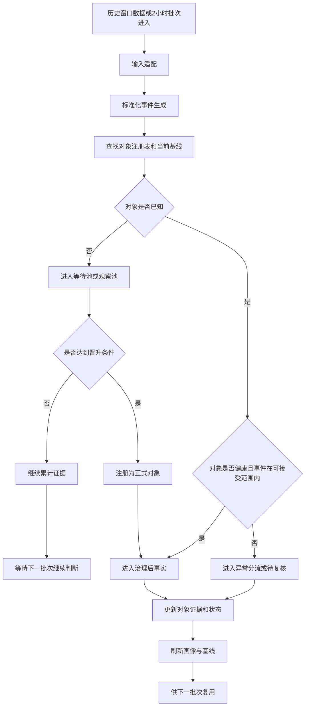
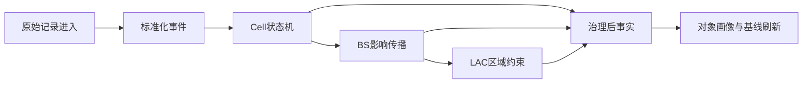
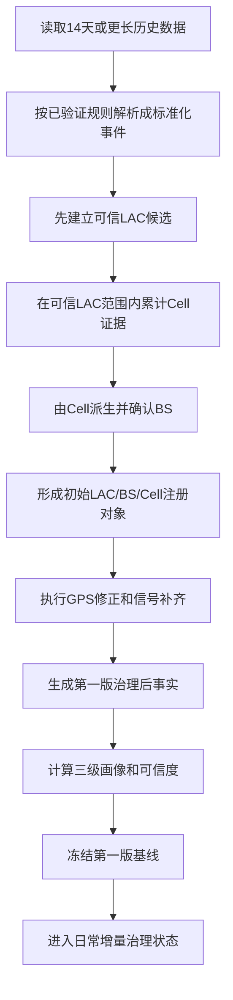
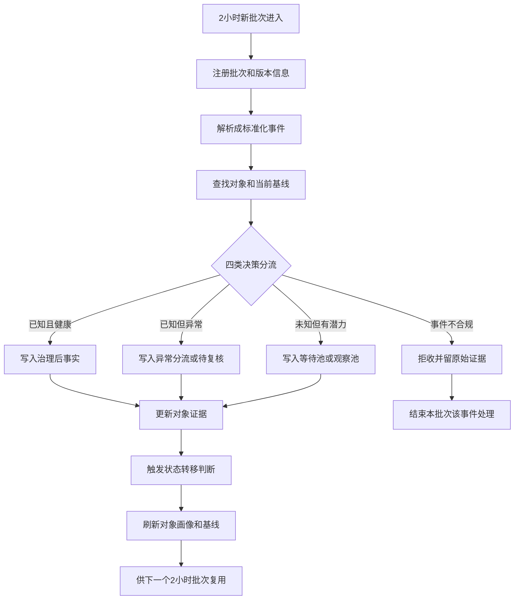

# rebuild3 面向人类的重构流程与总体框架

## 0. 第三方阅读说明

本文按“业务对象和治理动作”讲 rebuild3，即使读者不能访问代码、数据库或仓库，也应能直接理解主逻辑。

文中少量会出现当前项目内部常用名词，统一按下面理解：

- `rebuild2`：上一轮本地验证版本，已经把静态历史数据跑通，并验证了字段解析、可信对象、GPS 修正、异常分类和画像基线。
- `rebuild3`：当前要设计的动态治理版本，目标是支持初始化、2 小时增量、等待/观察/晋升和异常分流。
- “标准化事件”：把原始记录解析成统一结构后的事件记录，至少含运营商、制式、LAC、Cell、BS、GPS、信号、时间、来源等信息。
- “对象”：系统长期维护的 `LAC`、`BS`、`Cell` 及其状态，不等于一次批次中的临时统计结果。
- “治理后事实”：系统已经接受、允许后续画像和基线使用的事件事实。
- “基线”：由历史治理后事实汇总出来的对象画像和可信范围，用于后续增量准入。

如果文中引用当前数据库表名，那只是为了定位现状来源；理解本框架并不依赖代码访问。

## 1. rebuild3 的一句话定位

`rebuild3` 不是再做一轮静态重跑，而是把既有冷启动成果升级成“对象可注册、事实可准入、异常可分流、基线可刷新”的本地动态治理系统。

本轮建议同时明确对象分工：

- `Cell` 是动态治理里的最小主语；
- `BS` 是空间锚点和聚合异常主语；
- `LAC` 是边界约束和区域级健康主语。

## 2. 为什么它是动态治理系统，而不是静态重跑系统

静态重跑系统只回答一个问题：把一段历史数据跑完后，得到什么结果。

rebuild3 要回答的是另一组问题：

1. 新到的 2 小时数据该直接沉淀、继续观察，还是分流到异常队列？
2. 一个未见过的 Cell 什么时候只是“新样本”，什么时候可以变成“正式对象”？
3. 一个已在库对象发生漂移时，是正常变化、GPS 偏差、碰撞、动态、迁移，还是数据不足？
4. 画像和可信度如何反过来参与准入、补齐和基线刷新？

这类问题只有在“对象状态 + 批次决策 + 滚动证据累计”的框架下才能稳定回答，因此 rebuild3 必须是动态治理系统。

## 3. rebuild3 的总体分层 / 分域

为兼容本地现状，rebuild3 不建议先按云端 ODS/DWD/ADS 物理层去讲，而建议按逻辑域组织：

### 3.1 输入适配域

作用：解决“当前是一张 LAC 原始表、两张 GPS/LAC 原始表，未来可能换源”的问题。

负责：

- 源表注册；
- 批次边界；
- 原始记录唯一键；
- 原始字段到标准输入契约的映射。

### 3.2 标准化事件域

作用：统一承接 `cell_infos`、`ss1` 解析、字段清洗、主键派生和合规标记。

负责：

- 输出稳定标准事件；
- 保留原始证据与解析来源；
- 形成后续所有治理决策的统一输入。

### 3.3 对象注册域

作用：承接 LAC / BS / Cell 的当前主档、历史绑定关系和最小状态。

负责：

- 当前对象是否已被系统承认；
- 对象处于等待、观察、正式、观察中异常、退役中的哪一类状态；
- 对象当前绑定到哪个 LAC / BS 关系。

这里要特别说明一个重构选择：

- 冷启动初始化阶段，仍可沿用“先 LAC、后 Cell、再 BS”的研究顺序；
- 进入日常动态治理后，优先发生状态变化的通常是 `Cell`，因此增量治理应以 `Cell` 为最小判断单元，再把影响向 `BS`、`LAC` 传播。

### 3.4 决策与分流域

作用：把“每条新事件如何处理”从 SQL 研究过程里抽出来，变成稳定的治理内核。

负责：

- 已知对象直接准入；
- 已知对象异常分流；
- 未知对象等待/观察；
- 拒收与问题留痕；
- 决策结果可追溯。

### 3.5 治理后事实域

作用：沉淀系统已经接受的事实底盘。

负责：

- GPS 修正后的事实；
- 信号补齐后的事实；
- 来源标签、异常标签、准入标签；
- 是否允许进入画像刷新。

### 3.6 画像与基线域

作用：把对象画像从“静态展示结果”提升为“日常准入依据”。

负责：

- LAC / BS / Cell 基线；
- GPS / signal 可信度；
- 健康状态与阈值；
- 基线版本与刷新窗口。

### 3.7 异常与规则实验域

作用：承接碰撞、动态、迁移、疑难样本和规则回放。

负责：

- 异常对象队列；
- 规则实验；
- 局部重算；
- 回归验证。

## 4. 总体流程图

下面这张图是 rebuild3 的总骨架图，刻意不依赖代码表名，便于第三方直接评估：



这张图表达的是 rebuild3 的核心变化：系统不再只是“把一段历史数据跑完”，而是要对每个批次、每个对象持续做准入、观察、晋升和异常处理。

## 5. 对象主语关系图

下面这张图专门说明本轮建议采用的对象主语分工：



这张图的意思是：

- `Cell` 决定“对象是否存在、是否迁移、是否异常、是否继续观察”；
- `BS` 决定“该对象还能不能作为 GPS/信号锚点，以及异常是否会影响同站其他 Cell”；
- `LAC` 决定“该对象是否仍落在可接受的区域边界和区域健康上下文中”。

## 6. 从原始数据到治理后事实与画像的完整流向

可以把 rebuild3 看成一条“统一骨架、两种运行模式”的流：

```text
源表/批次进入
  ↓
输入适配
  ↓
标准化解析（cell_infos / ss1 / 清洗 / 主键派生）
  ↓
对象查找 + 基线查找
  ↓
决策内核
  ├─ 已知且健康：进入治理后事实
  ├─ 已知但异常：进入异常分流 / 待复核
  ├─ 未知但有潜力：进入等待 / 观察池
  └─ 明显不合规：拒收并留证据
  ↓
治理后事实更新对象证据
  ↓
对象状态转移
  ↓
画像 / 基线滚动刷新
  ↓
下个批次继续复用同一套对象与基线
```

这条流里最关键的变化是：初始化和增量都走同一条主骨架，只是输入窗口和“状态起点”不同。

## 7. 初始化流程

初始化不是 rebuild3 的“特殊系统”，而只是用较长窗口数据一次性把对象和基线冷启动出来。

建议顺序：



### 7.1 阶段 A：历史窗口标准化

- 读取 14 天或更长历史数据；
- 用现有“标准化输入契约”统一解析。这里的含义是：沿用当前项目已经验证过的原始字段映射、`cell_infos / ss1` 解析、清洗和主键派生规则；
- 不在这一层做对象主档判断，只生成标准事件。

### 7.2 阶段 B：首轮对象建库

- 先按可信 LAC 规则建立 LAC 候选；
- 在可信 LAC 范围内累计 Cell 证据；
- 由 Cell 派生 BS；
- 生成初始 LAC / BS / Cell 注册对象。

这里直接复用上一轮静态验证中已经成立的规则，但产出不再只是“可信库统计表”，而是“对象注册表 + 初始画像 + 初始状态”。

### 7.3 阶段 C：首轮事实治理

- 对历史标准事件执行 GPS 修正、信号补齐、异常标记；
- 产出第一版治理后事实；
- 对事实打上 `baseline_eligible` 与 `governed_status`。

### 7.4 阶段 D：初始画像与基线冻结

- 从首轮治理后事实计算 LAC / BS / Cell 基线；
- 生成 `baseline_version = 1`；
- 记录 `run_id / contract_version / rule_set_version / baseline_version` 绑定。

初始化完成后，系统不再回到“只有研究表没有对象状态”的阶段。

## 8. 本地验证路径

本轮不是完整线上运行，而是先用现有北京历史数据把动态骨架跑通。

建议验证顺序：

1. 先用现有 3 天数据做初始化起跑。
2. 再按增量方式把窗口滚到 7 天。
3. 最后把“3 天起跑后滚到 7 天”的结果，与“直接一次性跑 7 天”的结果做对比。

这条路径的重点不是先把所有长期线上参数写死，而是先验证：

- 对象注册是否稳定；
- 等待/观察/晋升链路是否成立；
- 增量沉淀结果是否与直接 7 天结果大体一致；
- 当前研究结论能否平滑迁移到动态治理骨架。

## 9. 2 小时增量流程

2 小时增量只是把输入窗口换短，治理内核不换。

建议顺序：



### 9.1 批次进入

- 注册 `batch_id`；
- 记录输入源、窗口范围、记录数、契约版本。

### 9.2 标准化与查找

- 解析为标准事件；
- 查找对象注册表；
- 查找当前基线与对象健康状态。

### 9.3 四类决策分流

#### 一类：对象已知且处于健康状态

- 允许直接进入治理后事实；
- 可以按对象基线做 GPS 修正和信号补齐；
- 事件可参与后续画像刷新。

#### 二类：对象已知，但表现出异常

例如：

- GPS 偏差明显；
- BS 碰撞迹象；
- 动态 BS / 动态 Cell；
- 可能迁移；
- 当前样本不足无法下结论。

这类事件不能直接覆盖对象主档，而应：

- 进入异常证据池；
- 给对象打 `watch` / `suspect` 状态；
- 决定是否允许“带标签沉淀”或暂不沉淀。

#### 三类：对象不在库中，但有成为新对象的可能

- 进入等待池；
- 按对象键累计样本；
- 达到最低注册门槛后转入观察池；
- 满足稳定性、可信度和画像条件后晋升。

#### 四类：事件本身不合规

- 直接拒收；
- 保留错误原因与原始证据；
- 不进入正式事实，也不参与画像。

## 10. 等待 / 观察 / 晋升 / 异常分流的大逻辑

### 10.1 未知对象的路径

```text
首次出现
  ↓
等待池（样本不足）
  ↓
观察池（样本够，但尚未稳定）
  ↓
晋升评估
  ├─ 通过：注册为正式对象
  ├─ 继续观察：窗口未够或画像不稳
  └─ 拒收：结构不合规 / 长期不稳定 / 明显异常
```

### 10.2 已知对象的路径

```text
已注册对象收到新事件
  ↓
与当前画像/基线比对
  ├─ 在范围内：正常沉淀
  ├─ 轻微漂移：带标签沉淀，进入观察
  ├─ 强异常：进入异常分流，不直接更新对象主档
  └─ 长期消失或被新关系替代：进入退役/迁移评估
```

### 10.3 rebuild3 的关键变化

rebuild2 把这些逻辑主要表达成“阶段和步骤”。

rebuild3 要把它们表达成“对象生命周期”。

## 11. Cell 最低注册与样本门槛

本轮建议把 `Cell` 明确写成动态治理里的最小治理单元，但不要把样本要求简化成一个固定天数。

更合理的是拆成三层门槛：

### 11.1 最低注册门槛

回答的问题是：

- 这个 `Cell` 是否已经足以被系统承认“它存在”。

特点：

- 高流量 `Cell` 可能 1 天就够；
- 低流量 `Cell` 可以累计到更长窗口；
- 本轮先把它写成参数化规则，不先写死统一阈值。

### 11.2 锚点门槛

回答的问题是：

- 这个 `Cell` 或其所属 `BS` 是否已经稳定到可以参与 GPS 修正、信号补齐和对象准入判断。

这通常比“最低注册门槛”更严格。

### 11.3 画像成熟门槛

回答的问题是：

- 这个对象是否已经成熟到可以影响正式基线刷新。

这意味着：

- “对象已经注册”不等于“对象已经能影响基线”；
- rebuild3 需要允许“对象先存在，后成熟”。

## 12. 缺失值补齐与对象健康度的关系

在 rebuild3 里，补齐不再只是一个后置技术动作，而必须受对象健康度约束。

### 12.1 可以直接用库内结果补齐的前提

至少满足：

1. 对象已经正式注册；
2. 当前对象健康状态不是碰撞 / 动态 / 迁移待判；
3. GPS 或 signal 可信度达到最低门槛；
4. donor 与当前事件的时间距离、对象关系满足规则。

### 12.2 不应直接补齐的场景

以下场景必须优先继续累计观察，而不是直接套用库内结果：

1. 新对象还在等待/观察池；
2. BS 被标记为 `collision_confirmed` / `collision_suspected`；
3. Cell / BS 正处于动态迁移怀疑期；
4. 当前批次只有极少样本，无法说明是漂移还是临时噪声。

### 12.3 基线的角色变化

rebuild3 里画像不是“最后展示一下”，而是：

- 决定是否可补齐；
- 决定是否可直接准入；
- 决定是否允许该事件参与下一轮基线刷新。

## 13. 动态 BS / 碰撞 / 迁移 / 漂移等异常在流程中的位置

异常不应继续混在主流程里做隐式 patch，而应在主流程中有固定旁路。

建议分成四类：

### 13.1 正常漂移

含义：

- 对象还在已知范围内，但局部统计发生轻微变化。

处理：

- 允许沉淀；
- 不立刻改主档；
- 累计多批后决定是否刷新基线。

### 13.2 GPS 偏差

含义：

- 单条或单批 GPS 偏离对象锚点，但对象本身健康。

处理：

- 可按对象锚点修正；
- 保留偏差标签；
- 事件可进入治理事实。

### 13.3 碰撞 / 动态 / 迁移

含义：

- 已超出“单条记录修正”范畴，开始威胁对象本身定义。

处理：

- 进入异常证据池；
- 对对象打 `suspect_collision` / `suspect_dynamic` / `suspect_migration`；
- 暂停其作为补齐锚点；
- 后续走局部重算或人工确认。

### 13.4 数据不足待观察

含义：

- 当前批次提供的信息不足以判定是正常变化还是结构性异常。

处理：

- 不急于覆盖对象主档；
- 不急于强制拒收；
- 进入观察池，等待更多批次。

## 14. LAC 过滤的研究口径与长期口径

本轮必须明确区分两种口径：

### 14.1 研究期口径

当前只有北京 7 天样本，研究目标又是“快速发现问题、让结果尽量符合人的逻辑认知”，因此早期采用严格的 GPS 区域过滤是合理的。

它的作用是：

- 快速剔除漫游、边界和异常样本；
- 在小窗口、小区域下更快得到可解释结果；
- 有利于尽快暴露碰撞、动态、迁移和补齐问题。

### 14.2 长期运行口径

未来全国化运行时，不应继续把“严格 GPS 区域边界”当成主规则。

更合理的长期口径应是：

- 先用运营商和编码合法性做主过滤；
- 对明显海外或明显错误样本做轻量排除；
- 把剩余异常样本交给对象注册和等待/拒收机制自然沉没。

也就是说：

- 北京严格 GPS 过滤是研究策略；
- 全国运行轻量过滤才是长期策略。

## 15. 当前 UI / DB / Agent 如何继续承接这套框架

### 15.1 UI 承接方式

当前 step/workbench 风格应保留，但角色要重新定义：

- `raw / audit / ods`：承接输入契约与源适配视图；
- `trusted / bs-gps / anomaly / profile`：承接初始化结果、异常研究和画像基线视图；
- 新增但不急着重写现有页：
  - 对象注册视图；
  - 批次决策视图；
  - 等待/观察池视图。

结论：先加新读模型，不先砍旧页面。

### 15.2 DB 承接方式

当前 `legacy` 与 `rebuild2` 表族应继续保留：

- 历史研究结果表作为回归基线和对照输入；
- 当前本地验证版已经跑出的标准化结果、可信对象结果和治理后事实表作为初始化输入；
- 新增 `registry / decision / batch / version` 表族承接动态治理。

结论：先增量建表，不先迁移或重命名旧表。

### 15.3 Agent 承接方式

当前基于 prompt + 文档 + 工作台的协作方式可以直接保留。

需要变化的是：

- 稳定输入文档从“很多阶段 prompt”收敛为少量核心文档；
- 后续 agent 讨论对象和状态，而不是继续围绕零散 Step 表争论。

## 16. 数据保留策略的方向

既然 `Cell` 是最小治理单元，就不适合把所有明细永久放在同一个高频热库里。

本轮建议的方向是：

### 16.1 热明细

面向：

- 等待池；
- 观察池；
- 迁移判断；
- 异常复核；
- 近期增量回放。

特点：

- 只保留最近窗口；
- 观察中对象保留更细；
- 超大、稳定对象不必长期保留全部细粒度热明细。

### 16.2 长期汇总

面向：

- 活跃度；
- 上报节奏；
- 基线成熟度；
- 缺失/暂停的辅助判断。

特点：

- 日级或更粗粒度长期保留；
- 足以支撑对象状态转移；
- 体量远小于明细库。

### 16.3 归档事实

面向：

- 完整回归；
- 历史回放；
- 审计。

## 17. 现在本地应该先做什么，不该急着做什么

### 17.1 本地应该先做的

1. 冻结对象注册表、等待池、观察池、治理后事实、画像基线的最小骨架。
2. 冻结 `run / batch / version / idempotency` 的最小口径。
3. 先做“3 天起跑，再滚到 7 天”的本地验证。
4. 再把结果与“直接跑 7 天”的静态结果做对比。
5. 明确哪些异常先做“标记+分流”，哪些以后再做“拆分重算”。

### 17.2 本地不该先做的

1. 不要先重写整套 UI。
2. 不要先做云端物理建模。
3. 不要先做复杂调度平台或流式基础设施。
4. 不要一开始就把所有对象异常做成复杂审批流。
5. 不要在本轮过度纠结“对象多久算彻底消失”，它应先做成参数化能力。
6. 不要继续把 Layer/Step 中间表当成长期主语。

## 18. 本文结论

rebuild3 最重要的不是“把 Step 改名”，而是把系统主语改成：

- 对象；
- 决策；
- 事实；
- 画像；
- 状态流转。

更具体地说：

- 冷启动初始化仍保留研究期的 `LAC -> Cell -> BS` 主链；
- 动态治理改成 `Cell` 为最小主语、`BS` 为锚点、`LAC` 为边界；
- 北京严格过滤只保留为研究策略，不写成全国长期规则。

只要这个主语和边界切换完成，初始化和 2 小时增量就能共用一套骨架，现有 UI / DB / Agent 体系也能被平滑承接。
