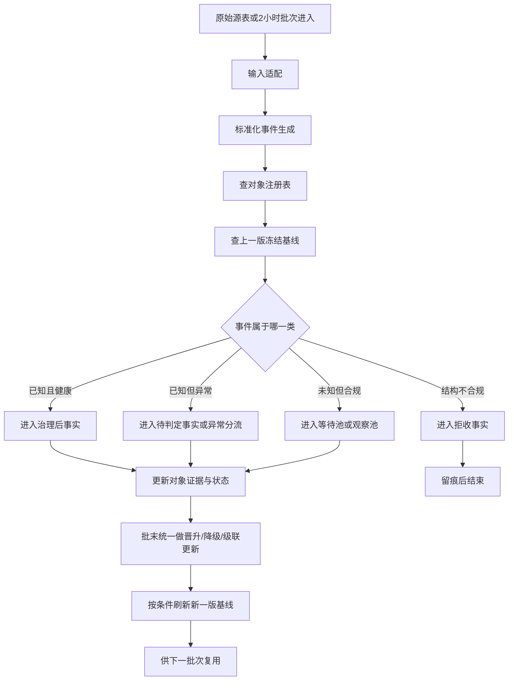
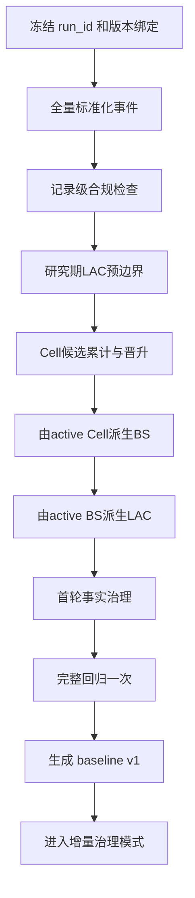
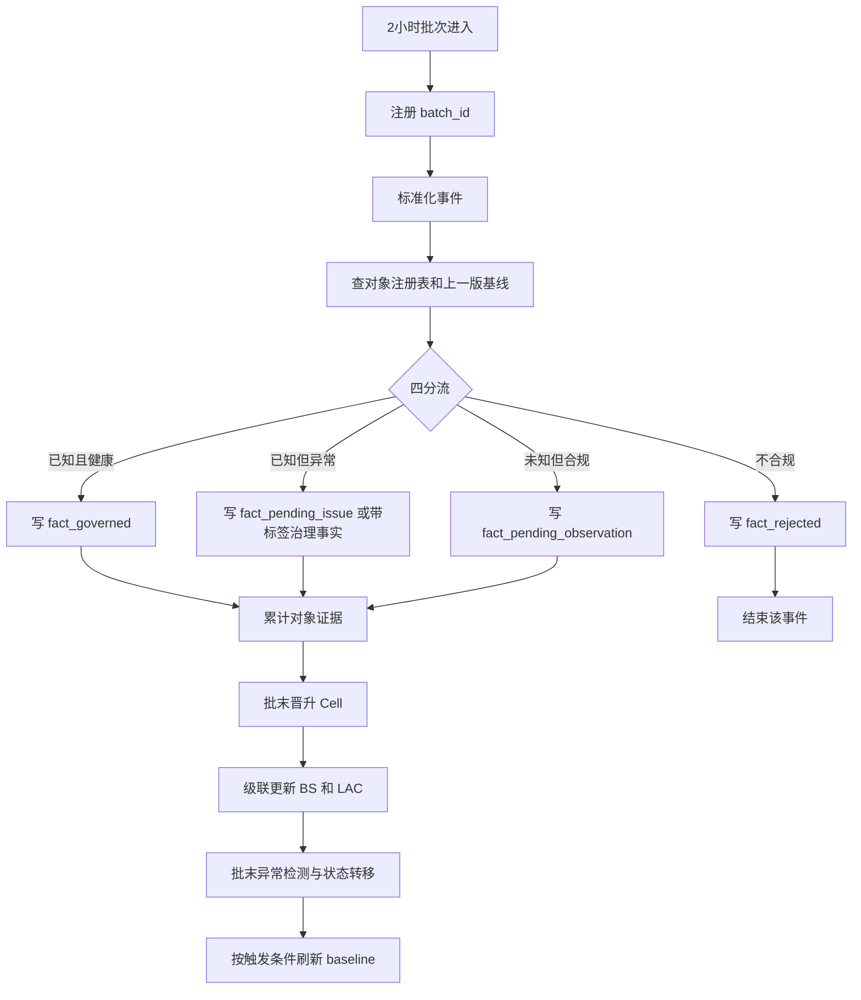
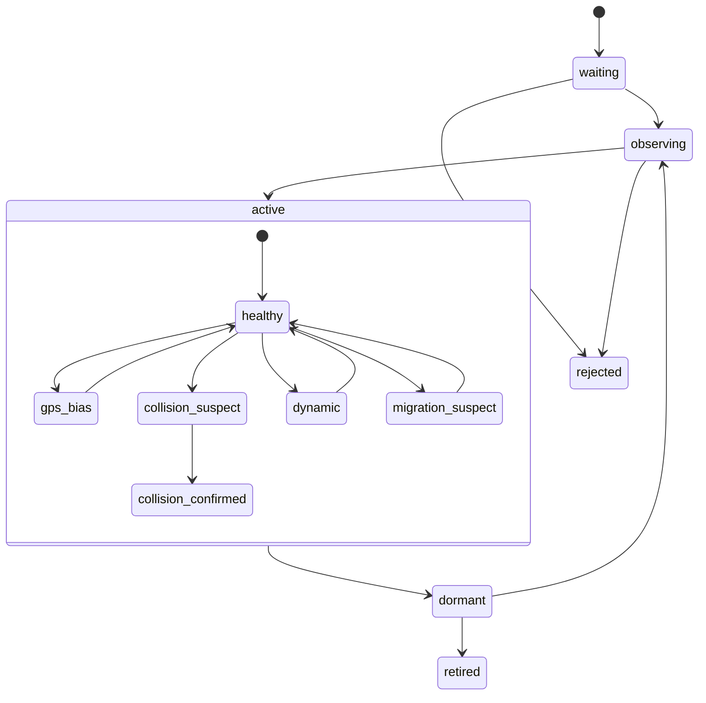

# rebuild3 说明（人类友好版）

> 状态：审阅版  
> 适用对象：人类评审、产品/业务对齐、后续 UI 设计输入  
> 依据：`01a/01b/02a/02b/03a/03b` 与 `第三方评估.md` 综合收敛  
> 说明：这份文档不展开代码细节，重点是把 rebuild3 的主语、流程、边界和当前阶段共识讲清楚

## 1. 这次重构到底在做什么

rebuild3 不是“把 rebuild2 再跑一遍”，而是把 rebuild2 已经验证过的静态成果，升级成一套可持续运行的动态治理骨架。

它要解决的，不再只是“7 天数据跑完后结果是什么”，而是下面这些持续问题：

1. 新进来的 2 小时数据，应该直接沉淀、继续观察，还是进入异常分流。
2. 一个新出现的 Cell，什么时候只是新样本，什么时候可以成为正式对象。
3. 一个已知对象发生漂移时，是正常变化、GPS 偏差、碰撞、动态、迁移，还是证据不足。
4. 画像和可信度，如何反过来参与下一批次的准入、修正和补齐。

一句话说，rebuild3 要把系统主语从“Layer / Step 流水线”切换成：

- 对象
- 决策
- 事实
- 基线
- 状态流转

## 2. 这次已经确定的核心结论

综合 6 份候选文档和第三方评估，当前应冻结为以下共识：

1. rebuild3 是本地动态治理系统，不是云端大平台，也不是静态重跑系统。
2. 初始化和增量必须共用同一套治理规则，只允许入口不同，不允许口径不同。
3. `Cell` 是动态治理里的最小主语，`BS` 是空间锚点，`LAC` 是区域边界和区域健康主语。
4. 状态表达采用二维模型，而不是把所有语义塞进一个大状态枚举里。
5. 必须分开三种资格：对象是否存在、对象是否可做锚点、对象是否可进入基线。
6. 当前批次的所有判断，只能参考“上一版冻结基线”，不能边判边刷本批基线。
7. 北京 7 天样本里的严格 GPS/LAC 过滤，只是研究期收敛策略，不是未来长期全国规则。
8. per-Cell 明细库可以保留，但只能做热层，不能单独承担长期记忆。
9. 异常不能一刀切。记录级异常和对象级异常，要走不同分流路径。
10. 当前最合理的验证路径仍然是：3 天初始化起跑，滚动到 7 天，再对比直接 7 天初始化结果。

## 3. rebuild3 里最重要的三个“不要混为一谈”

### 3.1 对象存在，不等于对象能当锚点

一个 BS 或 Cell 可以已经被系统承认存在，但如果它处于碰撞、动态、迁移怀疑状态，就不应该继续拿它去做 GPS 修正或信号补齐。

所以至少要拆开：

- 对象存在资格
- 锚点资格
- 基线资格

### 3.2 生命周期，不等于健康状态

生命周期回答的是“它现在处于哪个阶段”，健康状态回答的是“它现在能不能被信任”。

建议冻结为两轴：

| 维度 | 推荐状态 |
| --- | --- |
| `lifecycle_state` | `waiting / observing / active / dormant / retired / rejected` |
| `health_state` | `healthy / insufficient / gps_bias / collision_suspect / collision_confirmed / dynamic / migration_suspect` |

这样就能表达：

- 一个对象已经 `active`，但当前 `health_state != healthy`
- 一个对象已经注册，但暂时不能做锚点
- 一个对象已经存在，但仍不能进入 baseline

### 3.3 研究期口径，不等于长期运行口径

当前北京样本上的严格过滤，目的是在小窗口内快速收敛、快速暴露问题。

长期运行不应继续把“北京 GPS 边界”和“研究期 LAC 前置过滤”硬编码成主规则。长期规则应更轻，更多依赖：

- 运营商合法性
- 编码合法性
- 对象等待/观察/拒收机制
- 异常分流机制

## 4. rebuild3 的三个核心对象

| 对象 | 角色 | 在 rebuild3 中主要负责什么 |
| --- | --- | --- |
| `Cell` | 最小治理主语 | 注册、等待、观察、晋升、迁移、局部变化判断 |
| `BS` | 空间锚点 | GPS 修正、信号补齐、空间异常扩散、锚点资格控制 |
| `LAC` | 区域边界 | 区域健康、边界约束、区域级画像与异常占比 |

这里有一个重要边界：

- 初始化阶段仍允许沿用 rebuild2 的 `LAC -> Cell -> BS` 冷启动顺序。
- 增量治理阶段应统一切换为 `Cell` 先判断，再把影响传播到 `BS` 和 `LAC`。

所以，初始化和增量不是两套规则，而是同一规则下的两种入口。

## 5. 总体流程图

下面这张图是 rebuild3 的总骨架图。

这张图里最关键的，不是“流程更长了”，而是系统开始显式回答四件事：

1. 这条事件是否被系统接受。
2. 它接受后属于哪种事实层。
3. 它会不会改变对象状态。
4. 它会不会影响下一版基线。

## 6. 初始化流程怎么跑

初始化的本质，是用较长窗口历史数据把对象、事实和 baseline 冷启动出来。

### 6.1 初始化流程图

### 6.2 初始化阶段的关键动作

1. 先冻结本轮 run 的版本上下文。
2. 统一解析成标准化事件，标准化事件层保持不可变。
3. 做记录级合规过滤，不合规的直接拒收，不进等待池。
4. 允许在研究期使用严格 LAC/GPS 约束，帮助快速缩小可信边界。
5. 先形成 active Cell，再由 Cell 派生 BS，再由 BS 派生 LAC。
6. 只对满足锚点前提的对象做 GPS 修正和信号补齐。
7. 在首轮对象库形成后，再做一次完整回归，消掉“先粗后细”的语义混杂。
8. 生成第一版 baseline，作为之后所有增量批次的参照。

### 6.3 初始化阶段要特别注意的事

初始化允许沿用研究期顺序，但不能把研究期特殊策略误写成长期架构规则。

尤其是下面两件事：

- LAC 预边界只属于冷启动研究模式
- 严格 GPS 区域过滤只属于当前北京样本验证阶段

## 7. 2 小时增量流程怎么跑

增量阶段的核心原则是：

当前批次只看上一版冻结基线，批次结束后才可能生成下一版基线。

### 7.1 增量流程图

### 7.2 增量阶段的四类分流

| 路径 | 含义 | 去向 |
| --- | --- | --- |
| 已知且健康 | 对象存在且当前可接受 | `fact_governed` |
| 已知但异常 | 对象存在，但当前存在异常或待判定问题 | `fact_pending_issue` 或带标签治理事实 |
| 未知但合规 | 有成为新对象的潜力，但证据还不足 | `fact_pending_observation` + 等待/观察池 |
| 结构不合规 | 记录本身不满足规则 | `fact_rejected` |

### 7.3 为什么批末统一更新状态

如果当前批次边处理边刷新对象状态、再立刻用新状态处理同批后续事件，就会出现“同一批次前后口径不一致”的问题。

所以当前建议是：

- 事件先进入对应事实层
- 证据先累计
- 晋升、降级、级联更新在批末统一做
- baseline 刷新永远放在批次判断之后

## 8. 对象如何流转

下面这张图主要回答“一个对象会经历哪些阶段”。

这个图表达的重点是：

1. 生命周期和健康状态是两回事。
2. “异常”首先改变的是健康状态，不一定立刻删除对象。
3. 对象即便继续存在，也可能暂时失去锚点资格或 baseline 资格。

## 9. 哪些异常能进正式事实，哪些不能

这是当前文档里必须说清的一点。

### 9.1 可以进入治理后事实的异常

如果是记录级异常，例如：

- GPS 偏差
- 轻微漂移
- `single_large`
- `normal_spread`

那么这类记录通常仍然可以进入 `fact_governed`，但必须带异常标签，且是否允许进入 baseline 要单独控制。

### 9.2 不能直接当正式治理事实的异常

如果异常已经破坏对象身份本身，例如：

- `collision_confirmed`
- `dynamic`
- `migration_suspect`

那么这类记录不能直接作为“可被信任的正式事实”参与对象更新和画像刷新。

它们应进入：

- `fact_pending_issue`
- 或进入 `fact_governed` 但强制 `baseline_eligible = false`

同时，相关对象默认应失去锚点资格。

## 10. 数据应该怎么存

rebuild3 的数据层，不应再是“一张明细表包打天下”。

推荐拆成下面三层：

| 层级 | 作用 | 说明 |
| --- | --- | --- |
| 热明细 | 服务近期画像、等待池、观察池、近期异常复核 | 可按 per-Cell 保留最近窗口 |
| 长期汇总 | 服务活跃节奏、成熟度、退役判断、慢变化 | 按日或更粗粒度长期保留 |
| 归档事实 | 服务回放、审计、完整回归 | 保留完整治理后历史 |

结论很明确：

- per-Cell 最近 N 条治理后明细是合理的
- 但它只能做热层，不能替代长期汇总和归档

## 11. 为什么“上一版冻结基线”这么重要

这是 rebuild3 能否稳定收敛的关键点。

如果用当前批次刚写进去的数据，立刻刷新当前批的 baseline，再拿这个 baseline 继续处理当前批剩余事件，就会出现自我强化和循环依赖。

正确顺序必须是：

1. 当前批次只参考上一版 baseline
2. 当前批次完成后，再决定是否生成下一版 baseline
3. 新 baseline 只供下一批次使用

这条原则要贯穿：

- 准入判断
- GPS 修正
- 信号补齐
- 对象状态转移
- 画像刷新

## 12. 本轮先做什么，不做什么

### 12.1 当前阶段先做什么

1. 冻结对象、决策、事实、基线、版本这五类主语。
2. 冻结状态机、资格矩阵、事实分层和版本绑定口径。
3. 明确 UI 设计将要消费的对象读模型和批次读模型。
4. 冻结本地验证路径：3 天起跑，滚到 7 天，对比直接 7 天结果。

### 12.2 当前阶段不做什么

1. 不直接进入最终开发编码。
2. 不先重写整套 UI。
3. 不先做云端平台、消息队列或复杂调度系统。
4. 不把北京研究期的严格过滤直接固化成全国长期规则。

## 13. 审阅通过后的顺序

这次产出的 3 份最终文档，作用是先把共识冻住。

审阅通过后，建议顺序应明确为：

1. 先完成 rebuild3 的 UI 设计。
2. 再基于这份说明文档和 UI 方案，补一版“最终实施开发任务书”。
3. 最后才进入实际编码和批次回放验证。

也就是说，当前这份文档是“人类对齐稿”，不是“直接开干的最终开发说明”。

## 14. 最终结论

rebuild3 的关键，不是把旧的 Step 换个名字，而是把系统真正变成：

- 有对象注册
- 有事件分流
- 有状态流转
- 有版本绑定
- 有基线闭环

只要这五件事统一起来，初始化和增量就能共享一套骨架，现有 UI / DB / Agent 协作方式也能被平滑承接。

