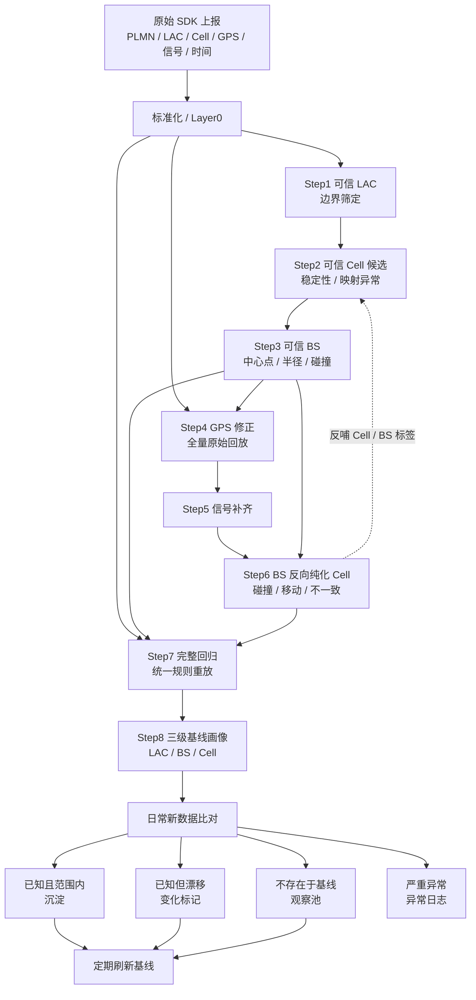
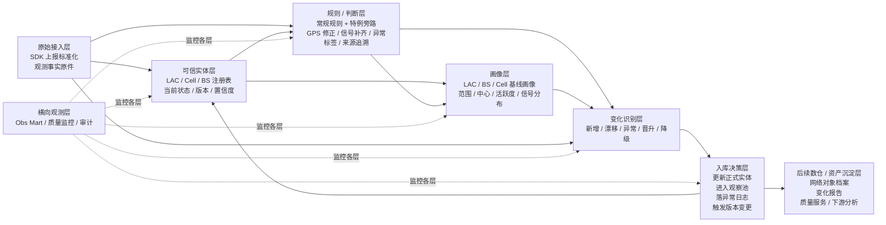

According to documents from 2026-03-18，以下判断完全基于你上传的三份核心文档，不涉及代码实现。核心依据文档：fileciteturn0file0、fileciteturn0file1、fileciteturn0file2。【22:1†00_业务逻辑与设计原则.md†L1-L5】【26:0†02_项目现状与逻辑梳理_外部评审版.md†L1-L5】【22:3†01_数仓构建可行性与总体方案.md†L1-L4】

# 1. 项目整体理解

这个项目的本质，不是“把脏数据洗干净”，而是把**带噪声的终端观测流**，逐步转化为**可信的网络对象档案**与**持续运行的识别机制**。文档已经把业务目标讲得很清楚：你要为 LAC、Cell、BS 建立可信画像，用于网络覆盖质量评估、基站变更发现和数据质量监控；同时又坚持“有效 cell_id = 有效上报”“修正优于丢弃”“层层收敛、互相印证”“基线驱动”的治理哲学。【26:0†02_项目现状与逻辑梳理_外部评审版.md†L13-L18】【26:0†02_项目现状与逻辑梳理_外部评审版.md†L46-L65】【22:1†00_业务逻辑与设计原则.md†L11-L38】

换句话说，这个项目真正要回答的，不是“哪条记录该删”，而是四个连续的业务问题：

1. 这个 LAC / Cell / BS 是否可以被当成一个可信对象来看待。  
2. 这条上报记录在保留的前提下，哪些字段需要被修正、补齐或强标注。  
3. 新来的数据是在支持既有对象、提示对象变化、发现新对象，还是暴露异常噪点。  
4. 哪些结果应该进入正式资产档案，哪些只能进入观察池或异常日志。  

这也是为什么我不把它理解成一次性的“清洗工程”，而是一个**对象治理 + 基线构建 + 持续识别**的体系。【22:1†00_业务逻辑与设计原则.md†L11-L38】【22:1†00_业务逻辑与设计原则.md†L210-L257】

这里“可信基线”之所以必要，是因为你后续要做的是**变化识别**，而不是静态统计。没有基线，就无法区分“今天看到的是对象真的变了”还是“只是 GPS 又漂了、样本又乱了”。文档也明确给出了这个体系成立的统计学前提：GPS 漂移通常是偶发的而非系统性的，粒度越大越抗噪，治理目标是得到“足够可信的基线”，而不是追求 100% 还原真值。【26:0†02_项目现状与逻辑梳理_外部评审版.md†L81-L94】

因此，“先用异常更少的数据建立基线，再用基线反哺整体数据”不是一个实现技巧，而是这个项目的核心方法论：先在粗粒度上筛出可信边界和稳定对象，再利用这些对象作为锚点去修正细粒度字段，最后再把修正后的全量数据沉淀为长期基线。这样做的目的，是把“没有参照的全量脏观测”转化成“有参照的可比较观测”。【22:1†00_业务逻辑与设计原则.md†L50-L109】【22:1†00_业务逻辑与设计原则.md†L113-L206】

一句话判断：**这是一个基于统计稳定性构建可信对象库，再用对象库驱动全量观测归一化和持续识别的治理系统。**

# 2. 当前治理链路拆解

先给结论：**当前链路的顺序大体合理，问题主要不在先后次序，而在结构表达。**  
因为这条链其实混合了三条逻辑线：

- **A 线：信任边界与实体构建**——Step 1~3，先找可信 LAC，再找可信 Cell，再聚合出可信 BS。  
- **B 线：基于实体锚点的明细修复**——Step 4~5，再加 Step 7，用可信 BS/Cell 结果去修正 GPS、补齐信号，并统一回放全量数据。  
- **C 线：基线沉淀与持续运营**——Step 8 + 每日增量比对，用最终明细产出画像，并把画像变成后续入库和变化识别的参照。  
【22:1†00_业务逻辑与设计原则.md†L50-L257】【26:0†02_项目现状与逻辑梳理_外部评审版.md†L100-L164】

## 当前治理流程理解图

## 每一步在业务上分别解决什么问题

**Step 1：可信 LAC**  
输入是 14 天原始数据，输出是可信 LAC 维表；它解决的是“哪些地盘边界值得信任”。这是治理的第一道边界，不是精细识别，但它能先把明显不合规、不在目标区域、缺乏稳定性的 LAC 排除掉，防止垃圾继续向下传播。【22:1†00_业务逻辑与设计原则.md†L50-L65】【26:0†02_项目现状与逻辑梳理_外部评审版.md†L102-L107】

**Step 2：可信 Cell**  
输入是可信 LAC 范围内的明细，输出是 Cell 统计维表；它解决的是“哪些 Cell 在统计行为上是稳定的、可被进一步利用的”。这一步本质上是在做 Cell 级别的候选筛选和异常映射识别。【22:1†00_业务逻辑与设计原则.md†L69-L83】【26:0†02_项目现状与逻辑梳理_外部评审版.md†L109-L113】

**Step 3：可信 BS**  
输入是可信 Cell，输出是可信 BS 维表；它解决的是“如何从 Cell 级连接事实反推出一个更稳定的空间锚点”。因为原始数据没有直接 BS，只能从 cell_id 规则反推，所以这里实际上是在构建后续 GPS 修正的核心参照系。【22:1†00_业务逻辑与设计原则.md†L87-L109】【26:0†02_项目现状与逻辑梳理_外部评审版.md†L115-L120】

**Step 4：GPS 修正**  
输入是全量原始数据 + 可信 BS，输出是 GPS 已修正的全量明细；它解决的是“如何在不丢掉有效上报的前提下，让空间属性尽量可用”。这一步不是建对象，而是利用可信对象去修正记录字段。【22:1†00_业务逻辑与设计原则.md†L113-L140】【26:0†02_项目现状与逻辑梳理_外部评审版.md†L122-L128】

**Step 5：信号补齐**  
输入是 GPS 修正后的明细，输出是信号补齐后的最终明细；它解决的是“如何保住原本有业务价值、但字段缺失的观测事实”。它依旧属于明细增强，不属于对象主档构建。【22:1†00_业务逻辑与设计原则.md†L144-L156】【26:0†02_项目现状与逻辑梳理_外部评审版.md†L130-L134】

**Step 6：BS 反向纯化 Cell**  
输入是最终明细 + BS 维表，输出是 Cell 级异常标记；它解决的是“用聚合出的 BS 画像反过来审视下属 Cell，形成闭环”。这一步非常关键，因为它意味着系统不只是自上而下筛选，还会自下而上修正认知。【22:1†00_业务逻辑与设计原则.md†L160-L168】【26:0†02_项目现状与逻辑梳理_外部评审版.md†L136-L140】

**Step 7：完整回归**  
输入是原始全量数据 + 最终 BS/Cell/标记，输出是统一规则下的最终明细库；它解决的是“如何避免局部修正后造成的全链路不一致”。这一步从业务上很成立，但从架构上看更像一个**冷启动控制步骤**，而不是一个应长期单独存在的数据层。【22:1†00_业务逻辑与设计原则.md†L172-L185】【26:0†02_项目现状与逻辑梳理_外部评审版.md†L142-L146】

**Step 8：三级基线画像**  
输入是完整回归后的最终明细库，输出是 LAC / BS / Cell 三层画像；它解决的是“如何把一次冷启动的治理结果，沉淀成后续每天都能拿来比较的基线”。【22:1†00_业务逻辑与设计原则.md†L189-L206】【26:0†02_项目现状与逻辑梳理_外部评审版.md†L148-L164】

所以，当前链路最准确的理解不是“8 个线性步骤”，而是：

- 前半段在**建可信对象**；
- 中间段在**用可信对象修记录**；
- 后半段在**把修好的记录再变成长期可比较的对象画像**。

# 3. 核心业务逻辑与对象关系分析

## 3.1 LAC、Cell、BS、GPS 各自扮演什么角色

**LAC：信任边界实体**  
LAC 的价值不在精确定位，而在先划定“可信分析边界”。它更像治理体系里的“地盘边界”与区域上下文，适合作为第一层粗粒度筛选和分区条件。【22:1†00_业务逻辑与设计原则.md†L50-L65】【26:0†02_项目现状与逻辑梳理_外部评审版.md†L102-L107】

**Cell：原始连接事实实体**  
Cell 是终端真实连接到网络的最小业务事实单元，是原始数据里最硬的对象键。文档把“有效 cell_id = 有效上报”放在第一原则，本质上是在说：Cell 连接事实比 GPS 更接近业务真相，因此 Cell 是整个治理体系的底座之一。【22:1†00_业务逻辑与设计原则.md†L11-L18】【26:0†02_项目现状与逻辑梳理_外部评审版.md†L48-L55】

**BS：空间锚点实体 / 运营资产实体**  
BS 虽然在原始数据里并非直接字段，而是从 cell_id 规则反推出来的，但一旦构建完成，它立刻变成了后续所有空间修正和覆盖判断的锚点。所以从“数据生成逻辑”看，BS 是衍生的；但从“治理使用逻辑”看，BS 是主锚点、主资产对象。【22:1†00_业务逻辑与设计原则.md†L87-L120】【26:0†02_项目现状与逻辑梳理_外部评审版.md†L115-L128】

**GPS：观测属性 / 修正对象，不是核心实体**  
GPS 在这个项目里并不是一个应该单独建“可信主库”的主体，它本质上是附着在观测记录上的空间属性，而且这个属性天然会漂移。你真正要沉淀的不是“GPS 对象”，而是**对象的可信空间属性**与**每条记录的定位判定结果**。这也是为什么文档把 GPS 修正放在 BS 锚点建立之后，而不是更早阶段。【22:1†00_业务逻辑与设计原则.md†L113-L140】

补一句很重要的话：**信号字段也不是独立实体，它是附着在 Cell 连接事实上的观测属性。** 所以它应该被保留、补齐、追溯来源，但不应该喧宾夺主地变成对象定义本身。【22:1†00_业务逻辑与设计原则.md†L13-L18】【22:1†00_业务逻辑与设计原则.md†L144-L156】

## 3.2 当前治理顺序是否有内在合理性

有，而且这种合理性来自“粒度”和“可靠性”的匹配。

- 先做 LAC，是因为大粒度更抗噪，适合先确定可信边界。  
- 再做 Cell，是因为 Cell 是原始连接事实，比 GPS 更稳定。  
- 再做 BS，是因为 BS 要从 Cell 反推，且它会成为后续空间锚点。  
- 再修 GPS，是因为 GPS 需要依赖更可靠的 BS 中心点。  
- 再用 BS 反向审视 Cell，是因为只有聚合过后，才有能力判断哪些 Cell 是噪点、移动对象或碰撞残留。  
【26:0†02_项目现状与逻辑梳理_外部评审版.md†L81-L94】【22:1†00_业务逻辑与设计原则.md†L50-L168】

所以当前顺序不是随意堆出来的，它有明确的统计学和业务合理性。真正的问题不在“为什么先做 LAC 再做 BS”，而在“这些动作应该归属于哪种长期结构”。

## 3.3 哪些应视为基础实体，哪些应视为衍生结果或判断结果

我建议后续架构里明确区分三类东西：

**基础实体**  
LAC、Cell、BS。  
其中，LAC 是边界实体，Cell 是原始连接实体，BS 是运营侧最重要的空间锚点实体。【26:0†02_项目现状与逻辑梳理_外部评审版.md†L20-L36】

**衍生结果**  
合理 GPS、覆盖半径、活跃天数、样本量、信号中位数、共享运营商等。这些都不是对象的“身份”，而是对象在一段时期内的属性或统计结果。【22:1†00_业务逻辑与设计原则.md†L189-L206】

**判断结果**  
信任状态、碰撞标记、移动标记、异常标签、变化类型、新增/观察池/正式库/异常日志归属、补齐来源、GPS 来源等。这些不是对象本身，而是系统对对象或记录做出的判断。它们应该进入规则/判断层和决策层，而不是混在实体主档里当作同等语义字段。【22:1†00_业务逻辑与设计原则.md†L132-L156】【26:0†02_项目现状与逻辑梳理_外部评审版.md†L156-L164】

最关键的一句是：**后续数仓支持中，GPS 修正结果和异常标签都不应与 LAC / Cell / BS 主档混成同一种“实体语义”。**

# 4. 当前方案的优点、成立点与主要问题

## 4.1 已经成立、值得保留的核心逻辑

**第一，业务哲学是正确的。**  
把有效 cell_id 视为真实连接事实，把 GPS 视为可修正属性，把信号视为必须保留的观测，这使体系天然更贴近业务价值，而不是为了“表面干净”去牺牲有效数据。【22:1†00_业务逻辑与设计原则.md†L11-L27】

**第二，当前治理顺序符合可靠性梯度。**  
LAC → Cell → BS → GPS 的顺序，本质上是在用更粗、更稳定、样本更大的对象去约束更细、更容易漂移的属性，这在文档给出的统计前提下是成立的。【26:0†02_项目现状与逻辑梳理_外部评审版.md†L81-L94】【22:1†00_业务逻辑与设计原则.md†L50-L140】

**第三，系统已经具备“闭环治理”的雏形。**  
Step 3 的 Cell→BS 正向聚合、Step 6 的 BS→Cell 反向纯化、Step 7 的完整回归，本质上说明你已经不是在做单向流水线，而是在做闭环治理，这一点非常重要，也很难得。【22:1†00_业务逻辑与设计原则.md†L29-L38】【22:1†00_业务逻辑与设计原则.md†L160-L185】

**第四，画像作为基线，日常做增量比对，这个运营模型是对的。**  
它让系统目标从“一次性冷启动”自然延伸到“每日可运行”，这是走向数仓和长期资产沉淀的必要方向。【22:1†00_业务逻辑与设计原则.md†L189-L257】【26:0†02_项目现状与逻辑梳理_外部评审版.md†L154-L164】

**第五，标记而不删除，天然适合做可审计治理。**  
这意味着未来下游既可以拿“正式可信集”，也可以拿“带标签的全量集”，不会因为上游清洗过猛而失去分析空间。【22:1†00_业务逻辑与设计原则.md†L24-L27】【22:3†01_数仓构建可行性与总体方案.md†L67-L75】

## 4.2 哪些部分已经具备长期架构基础

我认为，下面这些已经足以沉淀为长期架构基础：

- **核心哲学**：有效 cell_id、修正优于丢弃、闭环、基线驱动。  
- **对象关系链路**：LAC 是边界，Cell 是连接事实，BS 是空间锚点，GPS 是被修正属性。  
- **冷启动 / 日常两阶段模式**：先建基线，再做增量比对。  
- **三级画像思路**：LAC / BS / Cell 三级基线非常适合后续长期运营。  
- **异常标签体系的方向**：碰撞、移动、漂移、异常、新增、观察池等都已经出现了“状态机”的雏形。  
【22:1†00_业务逻辑与设计原则.md†L11-L38】【22:1†00_业务逻辑与设计原则.md†L189-L257】【26:0†02_项目现状与逻辑梳理_外部评审版.md†L154-L206】

## 4.3 主要问题：不是逻辑错，而是“语义层次还没彻底分开”

### 问题 1：当前 Layer 结构更像探索历史，不像长期语义结构

文档自己也已经指出了：当前 5 层 + 20 多步是从微观字段问题一点点推导出来的，导致层次过多、边界模糊、依赖隐含、正向/反向逻辑分散，完整回归也没有被显式表达为独立控制步骤。【26:0†02_项目现状与逻辑梳理_外部评审版.md†L168-L206】

这意味着今天的 Layer 编号，更多是在记录“你曾经怎么一步步把系统做出来”，而不是在表达“这个系统长期应该按什么语义存在”。

### 问题 2：可信实体、修正明细、规则判断、画像基线还混在一起

现在的材料里，至少有四种不同性质的产物还没有被彻底拆开：

- **实体主档**：谁是可信 LAC / Cell / BS。  
- **修正后的观测事实**：每条记录修正后的 GPS、补齐后的信号。  
- **规则判断结果**：碰撞、移动、异常、补齐来源、GPS 来源等。  
- **画像与基线**：覆盖半径、活跃天数、信号中位数、变化阈值等。  

一旦这四种语义长期混表，后续数仓支持就会很痛苦：同一张表既像主档、又像明细、又像规则证据、还像基线，维护成本会越来越高。【22:3†01_数仓构建可行性与总体方案.md†L79-L147】【26:0†02_项目现状与逻辑梳理_外部评审版.md†L174-L188】

### 问题 3：Cell 的“可信主档”语义还不够清楚

这是我认为最关键、但文档里还没有完全抽清的一点。

从你的业务描述看，“可信 Cell 库”应该是核心对象之一；但当前材料里 Step 2 的输出更像是 **Cell 统计维表**，Step 4/5 输出又是**最终明细库**，Step 8 输出又是 **Cell 画像**。也就是说，**“可信 Cell 到底是哪张主档、它的正式状态是什么”**，现在还没有像 LAC 和 BS 那样被单独抽出来。【22:1†00_业务逻辑与设计原则.md†L69-L83】【26:0†02_项目现状与逻辑梳理_外部评审版.md†L109-L113】【22:3†01_数仓构建可行性与总体方案.md†L83-L96】

这会直接影响后续入库决策和变化识别：  
到底是更新 Cell 主档、更新 Cell 画像，还是只写一条异常判断？如果这层语义不清，后面每天都很难稳定跑。

### 问题 4：特例处理已经被识别出来，但还没有独立位置

文档非常清楚地指出了碰撞 BS、全室内 BS、移动 Cell 等已知局限，并明确要求“架构上预留旁路”。这说明问题已经被识别，但还没有稳定地放进结构里。【26:0†02_项目现状与逻辑梳理_外部评审版.md†L81-L86】【26:0†02_项目现状与逻辑梳理_外部评审版.md†L188-L206】

这类特例如果继续和主流程混着长，会有两个风险：

- 主流程越来越难读，因为常规逻辑和特例逻辑缠在一起。  
- 特例结果会污染基线，因为错误的空间锚点会被继续用于日常修正。  

### 问题 5：冷启动与日常运营的“对象状态机”还没有正式定义

文档已经有了“正式库 / 观察池 / 异常日志 / 变化数据”的概念，也明确了日常运营的四种分流，但这些概念还没有被抽象成正式的对象生命周期和入库决策机制。【22:1†00_业务逻辑与设计原则.md†L214-L257】【26:0†02_项目现状与逻辑梳理_外部评审版.md†L154-L164】

这会带来一个非常现实的问题：  
当一个对象“漂移”时，你是更新原对象、生成新版本、暂存观察、还是先打变化标记不改主档？  
这不是 SQL 问题，而是业务状态机还没有写清楚。

### 问题 6：技术分层已经在形成，但业务语义分层还需要先行

01 文档给了 ODS / DWD / DIM / DWS / ADS 的数仓映射，这是技术承载层的合理起点；但如果业务语义层不先拆清，技术分层只会把今天的混杂继续搬过去。【22:3†01_数仓构建可行性与总体方案.md†L79-L147】

所以，**不是先问“放在 DWD 还是 DIM”，而是先问“它是实体、判断、画像还是决策”。**

### 问题 7：文档里已出现轻微层次归属差异，进一步说明当前结构仍有探索性

一个小但很有代表性的信号是：  
00/02 文档把 GPS 修正、信号补齐清楚地写成 Step 4 / Step 5；而 01 的总体链路概括又把部分 GPS 修正和信号补齐写进了 Layer3→Layer4 的连续段。这个差异不影响你业务哲学本身，但说明当前 Layer 名称还没有稳定到足以担当长期业务语义骨架。【22:1†00_业务逻辑与设计原则.md†L113-L156】【22:3†01_数仓构建可行性与总体方案.md†L30-L47】

# 5. 面向长期治理/数仓支持的结构化重组建议

我的核心建议只有一句话：

**不要再让 Layer0~5 和 Step00~52 继续充当业务架构主语；应该把现有流程重组为“可信实体 + 规则判断 + 画像基线 + 变化识别 + 入库决策”的治理体系。**

也就是说，未来真正长期存在的，不应该是“第几层第几步”，而应该是“这张表/这类产物在业务上到底扮演什么角色”。

## 5.1 建议的长期业务语义分层

### 1）原始接入层
作用：承接 SDK 上报，完成字段标准化、主键解析、基础合规校验。  
这里沉淀的是**观测事实原件**，不是可信判断结果。  
它回答的问题是：**今天到底观测到了什么。**

### 2）可信实体层
作用：沉淀 LAC / Cell / BS 的正式对象注册表。  
这里应该只放对象当前的正式状态：主键、当前有效属性、状态、置信度、有效期/版本等。  
它回答的问题是：**当前系统承认有哪些对象，它们现在是什么状态。**

这里特别要强调：  
- LAC 是边界实体；  
- Cell 是连接事实实体；  
- BS 是空间锚点实体；  
- GPS 不是实体。  
【26:0†02_项目现状与逻辑梳理_外部评审版.md†L20-L36】【22:1†00_业务逻辑与设计原则.md†L87-L140】

### 3）规则 / 判断层
作用：承接常规规则和特例旁路，对“记录”和“对象”分别做判断。  
这里应该放：

- GPS 修正结果与 GPS 来源；  
- 信号补齐结果与 donor 来源；  
- 碰撞、移动、室内、异常等标签；  
- 信任评分 / 风险等级；  
- 特例旁路的路由结论。  

它回答的问题是：**为什么这条记录/这个对象会被这样解释。**

我建议把碰撞 BS、全室内 BS、移动 Cell 的逻辑都收进这一层，作为“常规规则之外的旁路判断”，而不是继续散在主流程里。【26:0†02_项目现状与逻辑梳理_外部评审版.md†L81-L86】【26:0†02_项目现状与逻辑梳理_外部评审版.md†L188-L206】

### 4）画像层
作用：基于已经归一化、带判断标签的事实数据，沉淀 LAC / BS / Cell 画像与基线。  
这里放的是“正常是什么样”，不是“对象本身是谁”。  
它回答的问题是：**这个对象平时应该长什么样、波动范围在哪里。**【22:1†00_业务逻辑与设计原则.md†L189-L257】

### 5）变化识别层
作用：拿新数据去撞实体当前状态和画像基线，识别新增、漂移、异常、晋升候选、降级候选。  
它回答的问题是：**今天发生的现象，是支持既有认知，还是在挑战既有认知。**

### 6）入库决策层
作用：把变化识别的结果转成正式动作。  
例如：

- 更新正式实体主档；  
- 新建对象候选进入观察池；  
- 标记变化但暂不改主档；  
- 落异常日志不进入正式库；  
- 为对象生成新版本或调整状态。  

它回答的问题是：**系统最终要不要承认、更新、延后观察，还是拒绝。**

这一层，是当前材料里最缺、但对长期治理最关键的一层。

### 7）后续数仓 / 资产沉淀层
作用：对外提供资产档案、变化报告、质量服务、下游分析数据集。  
这里才是 ODS / DWD / DIM / DWS / ADS 的承载空间。  
换句话说：**ODS/DWD/DIM/DWS/ADS 是实现容器，前面六层才是业务语义。**【22:3†01_数仓构建可行性与总体方案.md†L79-L147】

## 面向长期治理的建议架构图

## 5.2 把当前探索流程重组为长期体系的方式

我建议做如下折叠：

- **Step 1** → “信任边界构建”  
- **Step 2 + Step 3 + Step 6** → “可信实体闭环构建”  
- **Step 4 + Step 5 + Step 7** → “归一化事实生成”  
- **Step 8** → “画像 / 基线沉淀”  
- **每日增量四分流** → “变化识别 + 入库决策”  

这样一来，当前 8 步不会消失，但它们会从“架构主体”退回成“某一业务层里的处理动作”。

## 5.3 哪些东西应长期保留，哪些只是阶段性计算

**应长期保留为核心结构的：**

- 可信实体注册表（LAC / Cell / BS）  
- 归一化后的观测事实  
- 规则判断与来源追溯结果  
- 三级画像 / 基线  
- 变化识别结果  
- 入库决策与对象状态变迁记录  
【22:1†00_业务逻辑与设计原则.md†L189-L257】【22:3†01_数仓构建可行性与总体方案.md†L79-L147】

**不适合成为长期核心结构的：**

- 基于当前探索历史拆出来的 Step 临时表  
- 仅服务于某一步过滤的中间子集  
- donor 匹配等阶段性补齐中间结果  
- 完整回归本身作为“长期层”  
- UI / API / patch / dashboard 这类辅助系统结构  
【26:0†02_项目现状与逻辑梳理_外部评审版.md†L176-L188】【22:3†01_数仓构建可行性与总体方案.md†L79-L96】

特别强调两点：

**完整回归应被显式保留，但它是“冷启动控制步骤”，不是长期业务层。**  
它的价值在于保证统一规则回放，而不是成为业务语义上的独立数据层。【22:1†00_业务逻辑与设计原则.md†L172-L185】

**Obs Mart 应该保留为横向观测体系，而不是核心业务逻辑承载层。**  
独立出来是合理的，但前提是它只做审计、观测、告警和对比，不承载主判断口径。【22:3†01_数仓构建可行性与总体方案.md†L67-L75】【26:0†02_项目现状与逻辑梳理_外部评审版.md†L184-L186】

## 5.4 当前仍缺失的信息，以及它们会影响什么判断

以下信息在现有文档里还不够清楚，它们不影响我对方向的判断，但会影响你下一步的正式架构设计：

**1）对象状态机没有完全写清楚**  
比如：正式库、观察池、异常日志、变化待确认之间的状态转移条件是什么。  
影响：入库决策层和对象版本管理无法定型。

**2）“变化”到底是覆盖原对象，还是生成新版本，没有明确口径**  
比如 BS 搬迁、Cell 参数变化，是更新现有对象，还是视为对象新版本。  
影响：主档建模、历史保留和变化报告都受影响。

**3）可信度 / 风险等级 / 晋升条件还没有统一模型**  
文档里已有风险等级、碰撞标记、观察池，但还没有统一成一套对象级评估模型。  
影响：后续无法稳定形成“承认对象”的统一门槛。

**4）特例旁路的 fallback 策略还未正式定义**  
比如碰撞 BS、全室内 BS 被识别后，到底是禁止 GPS 钉点、降级为低置信度、等待外部坐标，还是进入人工确认。  
影响：错误特例处理会污染后续基线。  
【26:0†02_项目现状与逻辑梳理_外部评审版.md†L81-L86】【26:0†02_项目现状与逻辑梳理_外部评审版.md†L188-L206】

# 6. 下一步行动建议（P0 / P1 / P2）

## P0：必须优先明确和沉淀的内容

### P0-1：先把 LAC / Cell / BS 的“对象定义 + 状态机”写成正式文档
**为什么重要**：  
因为后续所有数仓化、画像化、入库判定，最终都要落在“对象是什么、对象处于什么状态”上。现在这层语义还不够正式，尤其是 Cell 主档语义最模糊。

**不做的风险**：  
你会不断在“统计表”“最终明细表”“画像表”之间来回借语义，导致后续每天都难以判断到底该更新哪张表、哪个才是真正主档。

**预期产物**：  
一份《对象定义与生命周期说明》：至少明确  
- LAC / Cell / BS 的主键与当前正式属性  
- official / candidate / changed / exception / retired（或等价状态）  
- 新增、漂移、异常、晋升、降级的状态转移规则

---

### P0-2：把“实体主档、归一化事实、规则判断、画像基线”四类语义彻底拆开
**为什么重要**：  
这是从探索式实现走向长期架构的分水岭。  
今天最大的问题不是规则不够多，而是不同语义还在混表或混步骤。

**不做的风险**：  
技术上即便迁到数仓，业务语义仍然混杂，后面任何新规则都会进一步加深耦合。

**预期产物**：  
一份《业务语义分层图 + 表语义矩阵》，至少明确：
- 哪些表是对象注册表  
- 哪些表是修正后的观测事实  
- 哪些表是规则判断与来源追溯  
- 哪些表是画像与基线  
- 哪些表是变化识别与入库决策

---

### P0-3：把特例旁路正式化，而不是继续藏在主流程里
**为什么重要**：  
碰撞 BS、全室内 BS、移动 Cell 不是偶发实现细节，而是已被文档明确确认的已知局限，后续一定会长期存在。【26:0†02_项目现状与逻辑梳理_外部评审版.md†L81-L86】

**不做的风险**：  
常规规则会被越来越多的 if/else 稀释；更严重的是，错误锚点会持续污染后续基线，导致“错上加错”。

**预期产物**：  
一份《特例对象分类与路由策略》：  
- 哪些特例进入旁路  
- 旁路后允许什么修正、禁止什么修正  
- 是否降置信度、是否进入观察池、是否等待外部佐证

---

### P0-4：先把“日常入库判定矩阵”明确下来
**为什么重要**：  
项目最终目标不是冷启动，而是每天来的新数据都能被稳定地识别和沉淀。文档虽然已经提出四分流，但还没有被正式化成对象级决策契约。【22:1†00_业务逻辑与设计原则.md†L214-L257】

**不做的风险**：  
你能建出一次基线，但跑不成持续运营；或者每天只是打标签，却不能真正沉淀成资产变化。

**预期产物**：  
一份《每日入库判定矩阵》：  
- 已知且范围内 → 如何沉淀  
- 已知但漂移 → 何时只打标，何时更新主档，何时新版本  
- 新 Cell / BS → 观察池晋升条件  
- 严重异常 → 异常日志保留范围和回查策略

## P1：建议尽快补齐的结构

### P1-1：把冷启动和日常运营改写成“同一套语义契约、两种运行模式”
**为什么重要**：  
冷启动和日常本质上不应该是两套世界。它们应该共享同样的实体定义、规则判断口径和画像口径，只是输入窗口和回放方式不同。

**不做的风险**：  
冷启动是一套解释，日常又是一套解释，最后同一对象会出现口径分裂。

**预期产物**：  
一份《冷启动 / 日常统一处理蓝图》：  
- 冷启动：历史窗口 + 完整回放  
- 日常：增量撞基线 + 决策入库  
- 二者共用哪些对象表、事实表、判断表和画像表

---

### P1-2：把“画像指标”和“对象正式属性”分开定义
**为什么重要**：  
画像层是“正常范围”的统计表达，不等于对象身份本身。  
比如覆盖半径、信号中位数、活跃天数、样本量，更适合作为画像，而不是主档身份字段。

**不做的风险**：  
主档会过于肥大且频繁变化，画像又失去独立的比较价值。

**预期产物**：  
一份《对象字段 / 画像字段分类清单》，明确：
- 哪些字段是当前正式属性  
- 哪些字段是统计画像  
- 哪些字段是规则判断  
- 哪些字段只是明细追溯字段

---

### P1-3：把 Obs Mart/质量观测体系固定成横向审计机制
**为什么重要**：  
文档里已经有“可审计”方向，这是好事，但它应该是横向观测层，不应反过来承载业务主判断。【22:3†01_数仓构建可行性与总体方案.md†L67-L75】

**不做的风险**：  
质量表会慢慢变成真正的逻辑源头，导致主流程和监控逻辑纠缠。

**预期产物**：  
一份《治理质量 KPI 清单》，建议至少包含：
- LAC / Cell / BS 晋升率  
- 漂移率、异常率、碰撞率  
- GPS 修正率、信号补齐率  
- 观察池转正率  
- 基线更新前后差异率

## P2：可以后续逐步完善的内容

### P2-1：区域化与场景化参数策略
**为什么重要**：  
当前阈值以北京城市区为背景，未来扩展到全国后，城市 / 郊区 / 高速 / 高铁等场景会出现明显差异。

**不做的风险**：  
统一阈值会在全国范围内带来较多误判，但它不影响你现在先把结构搭起来。

**预期产物**：  
一份《区域 / 场景参数化策略》，按制式、区域类型、场景类型定义差异化基线口径。

---

### P2-2：引入外部真值源的长期策略
**为什么重要**：  
文档已经指出，碰撞 BS 和全室内 BS 这类特例，长期最好用外部基站坐标库做交叉验证。【26:0†02_项目现状与逻辑梳理_外部评审版.md†L85-L86】

**不做的风险**：  
你仍然可以先跑起来，但极端特例的上限会比较明显。

**预期产物**：  
一份《外部坐标 / 外部资产源融合路线图》。

---

### P2-3：面向下游的资产服务产品化
**为什么重要**：  
当核心治理体系稳定后，才值得进一步设计覆盖评估、变更推送、质量告警等服务化产物。

**不做的风险**：  
不会影响治理主干，但会延后业务价值释放。

**预期产物**：  
面向运维 / 网优 / 质量监控的资产视图、变化报告、订阅型服务定义。

# 7. 最终结论

这个项目现在已经不是一个“还在摸索要不要做基线”的项目了。  
从文档看，你已经把**正确的业务哲学**和**正确的治理主链**找出来了：  
有效 cell_id 作为硬事实，LAC→Cell→BS→GPS 的层层收敛，BS→Cell 的反向纯化，完整回归保证统一口径，三级画像支撑日常增量比对。这些都是长期可保留的骨架。【22:1†00_业务逻辑与设计原则.md†L11-L38】【22:1†00_业务逻辑与设计原则.md†L160-L257】

你现在真正卡住的，不是“规则还不够多”，而是**探索期形成的步骤结构，还没有被重组为长期可运行的业务语义结构**。  
更直白一点说：

- 业务逻辑已经开始稳定；  
- 架构语义还没有完全稳定；  
- 下一步最重要的，不是继续补更多规则，而是先把**对象、判断、画像、决策**四层关系固定下来。  

所以，我给你的最终判断是：

**当前治理链路在业务逻辑上是成立的，且主顺序不建议推翻；但它必须尽快从“按问题堆 Step”升级为“按对象和决策建结构”。**  
优先级最高的动作也非常明确：**先固化对象主档与状态机，再拆开实体 / 明细 / 判断 / 画像四类语义，然后把特例旁路和日常入库决策正式化。**

如果这三件事做成了，你的项目就会从“探索式实现”真正进入“可持续运行的数据治理体系”，后续无论接数仓、做增量、还是沉淀长期资产，都会顺很多。
