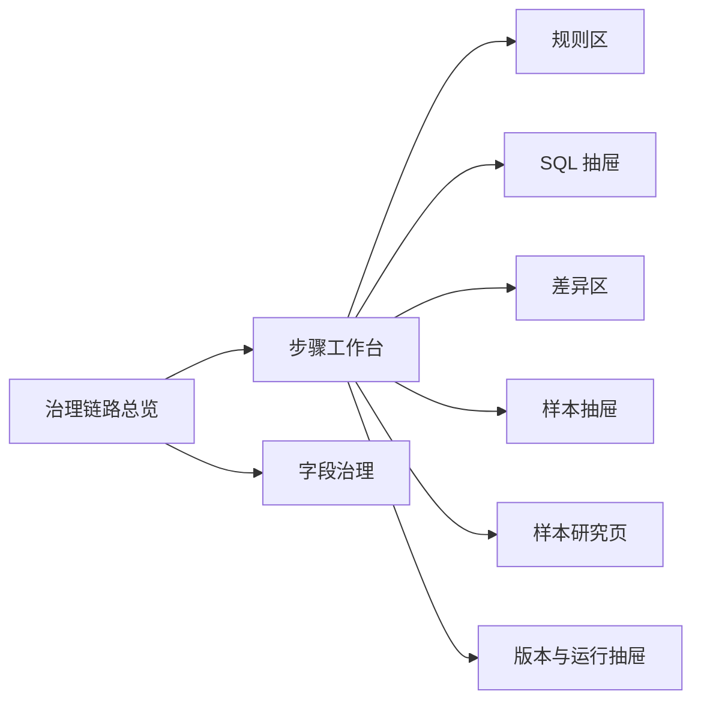

# 本地治理链路工作台一期：UI 开发意见

> 版本：v1.0  
> 用途：指导 UI 草图与首轮页面开发  
> 配套文档：`本地治理链路工作台一期：开发基础文档`

---

## 1. UI 的正确定位

这期 UI 不是一个“治理运营平台”，也不是一个“自动化任务平台”。

它首先是一个：

**治理链路调试与验证工作台**

它的核心价值不是展示“系统跑了什么”，而是帮助人快速回答：

- 我当前在看哪一步？
- 这一步的输入和输出分别是什么？
- 这一步用了哪些规则？
- 这一步实际执行了哪些 SQL？
- 参数是什么？
- 和上一次相比，数据变了什么？
- 哪些样本说明了问题？
- 这些变化是不是我想要的？

如果 UI 不能帮助回答这些问题，它就不是当前阶段需要的 UI。

---

## 2. 一期 UI 的总原则

### 原则 1：页面以“步骤”为主线，不以“平台模块”为主线

当前阶段最重要的是治理链路本身。

所以导航和页面组织应该优先围绕：

- 数据起点
- 可信 LAC
- Cell 统计
- 可信 BS
- GPS 修正
- 信号补齐
- 完整回归
- 画像 / 基线
- 伪日更

而不是优先围绕：

- 任务中心
- 运营中心
- 大屏
- 审批中心

### 原则 2：规则、SQL、参数、结果变化必须被看见

这四类内容不能被弱化。

尤其是：

- SQL 不应该被藏起来；
- 参数不应该只在接口层存在；
- 结果变化不能只显示“成功/失败”；
- 规则命中必须能追溯到样本。

### 原则 3：先做“工作台”，不要先做“大平台”

一期 UI 的成功标准，不是页面数量多，而是：

- 一个人能否快速理解当前治理链路；
- 一个人能否快速判断这一步是否合理；
- 一个人能否快速完成“改规则 → 重跑 → 看差异 → 看样本”的闭环。

### 原则 4：视觉上宁可朴素，也要信息关系清楚

一期 UI 不需要追求复杂图表和炫酷交互。

更重要的是：

- 信息层级清楚；
- 上下游关系清楚；
- 对比关系清楚；
- 钻取路径清楚；
- 样本回溯清楚。

---

## 3. 一期 UI 的推荐结构

我建议一期 UI 只围绕 **4 个主页面 + 3 个全局抽屉/面板** 来设计。

这比上一版“平台式 8~9 页”更符合当前阶段。

## 3.1 主页面

1. **治理链路总览页**
2. **步骤工作台页**（核心页面，所有治理步骤共用一个模板）
3. **字段治理页**
4. **样本研究页**

## 3.2 后置页面

以下页面不建议一期独立成大页：

- 大而全的运行中心
- 大而全的问题中心
- 大而全的对象中心
- 基线中心独立页
- 审计与版本独立页
- 数据流转独立页

这些内容一期可以：

- 放进链路总览页的区块
- 放进步骤工作台页的侧栏 / 抽屉
- 放进全局版本抽屉

## 3.3 全局抽屉 / 面板

1. **版本与运行抽屉**
2. **SQL 查看抽屉**
3. **样本 / 对象详情抽屉**

这样做的好处是：

- 结构更轻；
- 人的主注意力仍停留在治理链路上；
- 不会被过度平台化打散。

---

## 4. 推荐的信息架构



### 4.1 顶部全局上下文条（必须存在）

整个系统顶部建议固定一条上下文条，始终展示：

- 当前 run
- 对比 run
- 参数集
- 规则集版本
- SQL bundle 版本
- 契约版本
- 基线版本（如适用）
- 当前步骤

这条上下文条非常关键，因为当前所有判断都依赖“我现在看的到底是哪一次运行”。

### 4.2 左侧治理链路导航（建议固定）

左侧不要先放传统平台菜单，而是优先放治理链路节点。

例如：

- 数据起点
- 可信 LAC
- Cell 统计
- 可信 BS
- GPS 修正
- 信号补齐
- 完整回归
- 画像 / 基线
- 伪日更

每个节点显示：

- 最近状态
- 输入行数 / 输出行数
- 与上次相比是否有显著变化

### 4.3 主内容区始终围绕“当前步骤”展开

无论从总览页进入还是从样本跳转进入，主内容区都应该回到“当前步骤上下文”。

---

## 5. 四个主页面的详细建议

## 5.1 页面 1：治理链路总览页

### 页面目标

让人一进来就知道：

- 当前这条链路有哪些步骤；
- 最近一次 run 跑到了哪里；
- 哪些步骤变化最大；
- 哪些步骤最值得点进去看。

### 页面结构建议

```text
┌──────────────── 顶部上下文条 ────────────────┐
│ run | compare run | 参数集 | 规则集 | SQL版本 | 契约版本 │
└──────────────────────────────────────────────┘

┌──── 左侧链路导航 ────┐  ┌──────── 主内容区：链路总览 ────────┐
│ 数据起点             │  │ [链路节点图]                        │
│ 可信 LAC             │  │ 每个节点展示：                       │
│ Cell 统计            │  │ - 输入/输出数量                      │
│ 可信 BS              │  │ - 关键指标变化                       │
│ GPS 修正             │  │ - 异常样本数                         │
│ 信号补齐             │  │ - 与 compare run 的变化标记          │
│ 完整回归             │  │                                      │
│ 画像 / 基线          │  │ [底部：本次 run 的关注点摘要]         │
│ 伪日更               │  │ - 变化最大的 3 个步骤                │
└─────────────────────┘  │ - 新出现的问题类型                   │
                          │ - 建议优先查看的步骤                 │
                          └──────────────────────────────────────┘
```

### 必须有的模块

- 链路节点总览
- 当前 run 摘要
- 与 compare run 的差异摘要
- 重点问题提示
- 跳转到任一步骤工作台

### 不建议放得过重的内容

- 全局任务表
- 复杂图表墙
- 大量对象统计大盘

---

## 5.2 页面 2：步骤工作台页（核心页）

这是一期最重要的页面。

### 页面目标

让人针对某一个步骤，完整地看到：

- 业务作用
- 输入输出
- 规则
- SQL
- 参数
- 结果变化
- 样本
- 下游影响
- 是否需要重跑

### 页面结构建议

```text
┌──────────────── 顶部上下文条 ────────────────┐
│ run | compare run | 参数集 | 规则集 | SQL版本 | 契约版本 │
└──────────────────────────────────────────────┘

┌──── 左侧链路导航 ────┐  ┌──────────── 步骤工作区 ────────────┐
│ 数据起点             │  │ [步骤标题 + 业务目的 + 当前状态]      │
│ 可信 LAC             │  │ [输入库 / 输出库 / 上下游说明]         │
│ Cell 统计            │  │ [规则卡片区]                          │
│ 可信 BS              │  │ [参数区]                              │
│ GPS 修正             │  │ [关键 SQL 列表 + 打开 SQL 抽屉]        │
│ 信号补齐             │  │ [处理前后指标变化]                     │
│ 完整回归             │  │ [本次 vs 对比 run 差异区]              │
│ 画像 / 基线          │  │ [样本表：异常/修正/过滤/补齐]          │
│ 伪日更               │  │ [下游影响提示]                         │
└─────────────────────┘  │ [执行按钮：从此步重跑 / 局部重跑]      │
                          └──────────────────────────────────────┘
```

### 这一页必须包含的 8 个区块

#### A. 步骤说明区

至少展示：

- 步骤名称
- 业务目的
- 当前状态
- 上游步骤
- 下游步骤

#### B. 输入 / 输出区

至少展示：

- 输入库名
- 输出库名
- 输入行数
- 输出行数
- 主键 / 核心对象维度

#### C. 规则区

每条规则至少展示：

- 规则名称
- 规则目的
- 当前参数
- 命中数量
- 影响范围

#### D. 参数区

显示本次 run 在该步骤真正使用的参数。

不要只展示“参数集名称”，而是要把关键参数展开给人看。

#### E. SQL 区

SQL 必须可见。

至少要支持：

- 当前步骤 SQL 列表
- 实际执行顺序
- 打开 SQL 查看抽屉
- 查看 SQL 版本
- 如可能，查看与上次 run 的 SQL diff

#### F. 数据变化区

必须能看见：

- 处理前后总量变化
- 对象数变化
- 关键字段分布变化
- 规则命中后的变化

#### G. 差异区

至少支持：

- 与 compare run 的关键指标 diff
- 新增 / 减少 / 变化对象数
- 关键字段分布差异

#### H. 样本区

至少展示 3 类样本：

- 典型修正样本
- 典型异常样本
- 边界样本

样本行要能打开详情抽屉。

### 这页的关键交互

- 从链路节点进入当前步骤
- 打开规则详情
- 打开 SQL 抽屉
- 查看差异明细
- 从指标钻取到样本
- 从样本跳到对象详情抽屉
- 触发从当前步骤开始重跑

### 这页必须避免的问题

- 过度依赖 Tabs，把最关键内容藏起来
- 只展示图，不给表
- 只展示指标，不给样本
- 只展示“已运行”，不展示 SQL / 参数

---

## 5.3 页面 3：字段治理页

### 页面目标

这页不是主舞台，但必须是一个清晰的辅助基础页。

它帮助回答：

- 系统到底认识哪些字段；
- 原始字段如何映射到标准字段；
- 字段最近是否发生变化；
- 哪些步骤依赖了这个字段。

### 页面结构建议

```text
┌──────────────── 顶部上下文条 ────────────────┐
│ run | 契约版本 | 数据批次 | 时间窗口                      │
└──────────────────────────────────────────────┘

┌──────────── 字段治理页 ────────────┐
│ [搜索 / 过滤]                      │
│ [字段注册表]                       │
│ 字段名 | 原始名 | 标准名 | 类型     │
│ 有值率 | 异常率 | 最近变化 | 影响步骤 │
│                                      │
│ [字段详情抽屉]                       │
│ - 字段说明                           │
│ - 映射规则                           │
│ - 健康度趋势                         │
│ - 依赖步骤                           │
│ - 最近变更记录                       │
└──────────────────────────────────────┘
```

### 必须有的模块

- 字段注册表
- 字段健康度快照
- 字段变更日志
- 影响步骤说明

### 一期不建议做的内容

- 拖拽式字段血缘编辑器
- 复杂字段审批流
- 复杂契约发布流

---

## 5.4 页面 4：样本研究页

### 页面目标

把“问题”从抽象统计变成可研究的真实样本。

这页不是传统问题管理系统，而是研究页。

### 页面结构建议

```text
┌──────────────── 顶部上下文条 ────────────────┐
│ run | compare run | 问题类型 | 样本集 | 时间窗口 │
└──────────────────────────────────────────────┘

┌──────────── 样本研究页 ────────────┐
│ [问题类型筛选]                     │
│ GPS漂移 / 碰撞BS / 移动Cell / 映射异常 │
│ unknown                            │
│                                      │
│ [样本列表]                          │
│ 样本ID | 所属步骤 | 对象 | 标签 | 当前结论 │
│                                      │
│ [样本详情]                          │
│ - 原始值 vs 修正值                  │
│ - 命中的规则                        │
│ - 所属 run                          │
│ - 是否进入对比验证                  │
│ - 跳转到对应步骤工作台              │
└──────────────────────────────────────┘
```

### 必须有的模块

- 问题类型过滤
- 样本集列表
- 样本详情
- 回跳到对应步骤

### 一期可以先不做的内容

- 问题生命周期流转管理
- 复杂的责任人分派
- 复杂的协同评论流

---

## 6. 三个全局抽屉 / 面板建议

## 6.1 版本与运行抽屉

用于查看：

- 当前 run 的基本信息
- compare run
- 参数集
- 规则集版本
- SQL bundle 版本
- 契约版本
- 基线版本

作用：

- 让任何页面都能快速明确上下文

## 6.2 SQL 抽屉

这是当前阶段必须加强的部分。

建议支持：

- SQL 列表
- 单条 SQL 展开
- 参数替换结果
- SQL 版本
- 与上一版本的 diff（可后置到 1.1）

如果这块做得太弱，整个 UI 会重新退回“结果浏览器”。

## 6.3 样本 / 对象详情抽屉

任何样本、对象、异常行都应该能通过抽屉快速展开。

抽屉里至少展示：

- 关键标识
- 原始值
- 修正值
- 所属步骤
- 所属 run
- 命中规则
- 关联对象

---

## 7. 全局筛选器建议

整个系统顶部建议统一以下筛选维度：

- `run_id`
- `compare_run_id`
- `parameter_set`
- `rule_set_version`
- `sql_bundle_version`
- `contract_version`
- `baseline_version`
- 时间窗口
- 运营商
- 制式
- 问题类型

目的不是做复杂过滤，而是保证所有页面讨论的是同一套上下文。

---

## 8. UI 组件层面的明确建议

## 8.1 优先使用“信息块 + 表格 + 差异标记”

一期优先使用：

- 指标卡片
- 表格
- 徽标 / 标签
- 行内 diff
- 抽屉
- 折叠 SQL 区

不要一开始依赖：

- 复杂图表墙
- 过度动画
- 重图轻表

## 8.2 差异展示必须足够直接

建议统一差异表达方式：

- `+` / `-` 数量
- 增减百分比
- diff badge
- 新增 / 消失 / 变化 三类标签

## 8.3 页面尽量减少深层跳转

优先用：

- 同页区块
- 右侧抽屉
- 下拉展开

少用：

- 多级新页面跳转
- 打开新窗口

原因很简单：

当前工作方式是高频来回核对，太深的跳转会打断思路。

---

## 9. 一期不应该这样设计

以下设计方向，我明确不建议一期采用：

### 9.1 不要首页就是“大运营总览”

当前最重要的不是让系统看起来像在运营，而是让人能看懂治理链路。

### 9.2 不要把 SQL 隐藏成后台能力

当前阶段 SQL 是工作台核心内容，不是后台细节。

### 9.3 不要先做“完整对象中心”

LAC / BS / Cell 的对象视角当然重要，但一期不应成为主入口。

对象详情更适合作为：

- 样本抽屉
- 步骤钻取能力
- 辅助详情

### 9.4 不要把问题系统做成工单系统

一期问题页的目标是研究样本，不是跑流程。

### 9.5 不要做过多页面

如果一上来拆出太多独立大页，会让主线从“治理链路”变成“平台导航”。

---

## 10. 推荐的前后端契约粒度（供开发参考）

这里只给 UI 需要的数据块级别，不展开到接口实现。

## 10.1 链路总览页需要的数据块

- 当前 run 摘要
- compare run 摘要
- 链路节点列表
- 每节点输入 / 输出指标
- 每节点差异摘要
- 重点问题摘要

## 10.2 步骤工作台页需要的数据块

- 步骤基本信息
- 输入输出数据集信息
- 规则清单
- 参数清单
- SQL 清单
- 指标快照
- diff 摘要
- 样本列表
- 下游影响说明

## 10.3 字段治理页需要的数据块

- 字段列表
- 健康度快照
- 变更日志
- 依赖步骤列表

## 10.4 样本研究页需要的数据块

- 问题类型列表
- 样本集列表
- 样本明细
- 命中规则
- 回跳步骤链接

---

## 11. UI 开发顺序建议

### 第一轮：先做 3 个最关键页面

1. 治理链路总览页
2. 步骤工作台页
3. 字段治理页

只要这三页做对，整体方向就基本正确。

### 第二轮：补样本研究页与全局抽屉

把：

- SQL 抽屉
- 版本抽屉
- 样本详情抽屉
- 样本研究页

补起来。

### 第三轮：再评估是否独立出伪日更页

等冷启动链路工作台和样本研究页都稳定后，再决定是否单独拉出伪日更页。

---

## 12. 最终结论

一期 UI 的正确方向不是“做一个全面的平台”，而是：

- 以治理链路为主线；
- 以步骤工作台为核心；
- 以规则、SQL、参数、差异、样本为主要内容；
- 以字段治理为必要辅助页；
- 以抽屉和轻页面承载版本、SQL、样本详情；
- 让人最快理解并验证治理逻辑。

一句话概括：

**先把 UI 做成“看得懂、改得动、比得出、能验证”的治理链路工作台，而不是做成一个表面完整但不利于调试的平台。**
