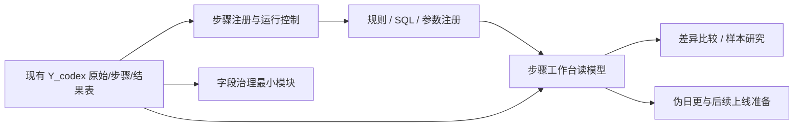
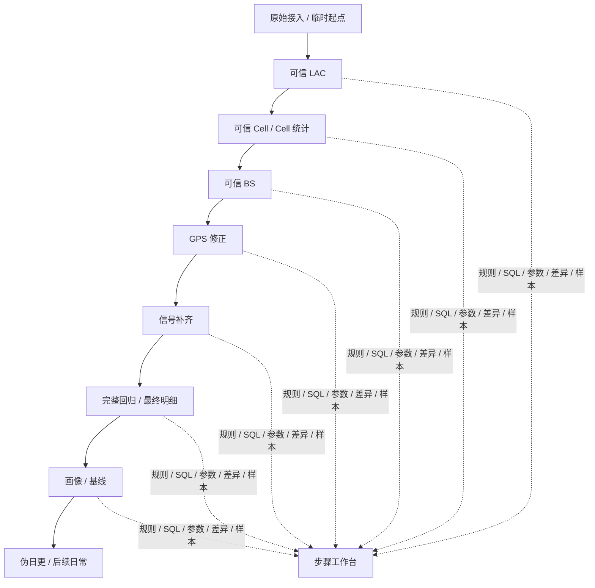

# 本地治理链路工作台一期：开发基础文档

> 版本：v1.0  
> 用途：作为当前阶段研发、页面开发、SQL整理、规则调整的共同基础文档  
> 适用阶段：本地 PostgreSQL 闭环验证阶段，不是正式云端数仓阶段

---

## 1. 文档定位

这份文档不是“最终数仓方案”，也不是“自动化运营平台方案”。

它服务的是当前最现实的开发目标：

**把已经跑通的治理链路，整理成一个便于人理解、便于 AI 协作、便于重复验证的本地治理链路工作台。**

当前阶段真正要解决的是：

1. 把现有治理步骤看清楚；
2. 把每一步的输入、输出、规则、SQL、参数、结果变化看清楚；
3. 调整规则或参数后，能快速重跑并比较差异；
4. 通过样本验证判断逻辑是否正确；
5. 在本地把链路调顺，再准备上线和后续迁移。

所以，这一期系统首先是一个：

**治理链路调试与验证工作台**

而不是：

- 自动化编排平台
- 复杂运营平台
- 完整数仓门户
- 复杂元数据治理平台

---

## 2. 当前阶段的核心判断

### 2.1 当前最重要的不是“自动化”，而是“看清楚”

当前工作方式本质上是：

- 调整一组规则 / 参数 / SQL
- 选择起始步骤和结束步骤
- 顺序执行 SQL
- 观察每一步的数据变化
- 比较本次与上次的差异
- 用样本确认逻辑是否合理
- 再决定是否继续修改

这个过程本身没有问题，而且就是当前阶段最有价值的工作方式。

因此，一期系统应该优先支持：

- **手动触发重跑**
- **按步骤查看结果**
- **按步骤比较差异**
- **直接查看规则、SQL、参数**
- **快速回到样本验证**

而不是优先支持：

- 自动任务编排
- 复杂审批流
- 高频日常运营流程
- 花哨但不帮助判断的数据大屏

### 2.2 当前主视角应是“步骤与库”，不是“平台模块”

在当前阶段，人真正关心的是：

- 这个库是怎么来的；
- 它是从哪一个上游库按什么规则得到的；
- 哪些字段被修正、补齐或标记；
- 和上一次相比，数据到底发生了什么变化；
- 这种变化是否符合预期。

所以，一期系统应该以：

**治理链路节点 → 步骤工作台 → 规则/SQL/差异/样本**

作为主线。

### 2.3 当前不是推翻现有 Layer，而是先把现有能力装进更清晰的壳里

当前已经存在的 Layer / Step / 表结构是有效资产，不应该在一期就被重建。

一期更合理的做法是：

- 保留现有 `Y_codex_*` 结果表；
- 先把这些表注册成“步骤产物”；
- 再额外增加一套轻量的工作台元数据表；
- 用这套元数据把现有链路、SQL、参数、版本、差异、样本组织起来。

换句话说，一期优先做的是：

**“围绕现有治理结果建立工作台”**，而不是“重新造一套治理库体系”。

---

## 3. 一期目标与非目标

## 3.1 一期目标

### 目标 A：把现有治理链路显式化

至少能明确展示：

- 当前有哪些步骤；
- 每一步的业务目的；
- 每一步的输入库与输出库；
- 每一步用到哪些规则；
- 每一步执行哪些 SQL；
- 每一步产出的关键统计指标。

### 目标 B：建立“可重复验证”的最小运行闭环

至少支持：

- 选择 run 参数；
- 从指定步骤开始执行；
- 执行到指定步骤结束；
- 记录本次 run 使用的参数集、规则集、SQL 版本；
- 比较本次 run 与历史 run 的差异。

### 目标 C：把问题研究能力补进链路

至少支持：

- 从步骤里直接看到异常样本；
- 对 GPS 漂移、碰撞 BS、移动 Cell、映射异常等问题建立样本集合；
- 调整规则后做采样重跑或局部重跑；
- 比较规则变更前后的结果变化。

### 目标 D：保留最小字段治理能力

至少支持：

- 字段注册；
- 原始字段到标准字段映射；
- 字段健康度快照；
- 字段变更记录；
- 字段影响范围说明。

这块是基础辅助能力，不是当前主工作流，但必须存在。

### 目标 E：为后续上线与迁移留下清晰边界

一期产出的不是最终数仓，而是：

- 清晰的步骤说明；
- 可比较的运行记录；
- 稳定的规则与 SQL 对应关系；
- 更容易迁移到云端的逻辑契约。

## 3.2 一期非目标

以下内容不应作为一期的必须项：

- 完整自动化任务编排系统
- 复杂审批流 / 协作流
- 大而全的数据平台门户
- 复杂权限模型
- 复杂字段依赖可视化编辑器
- 先重做全套表结构再开始开发
- 为了“更像正式平台”而隐藏真实 SQL

---

## 4. 业务原则与产品原则

## 4.1 业务原则（必须沿用）

1. **有效 cell_id = 有效上报**  
   记录可以修 GPS，但不能因为 GPS 漂移就否定连接事实。

2. **修正优于丢弃**  
   有问题的字段优先修正、补齐、标记，不轻易整条删除。

3. **层层收敛、互相印证**  
   正向是 LAC → Cell → BS → GPS，反向是 BS → Cell，最后还有完整回归。

4. **基线驱动**  
   冷启动构建可信基线，后续用新数据撞基线。

## 4.2 产品原则（本地工作台必须遵守）

1. **人理解得快，优先于系统看起来高级**  
   页面首先要帮助人看懂逻辑。

2. **规则、SQL、参数、结果变化必须同屏或近距离可见**  
   不能把最关键的信息藏在很深的弹窗后面。

3. **先服务“调试与验证”，再服务“自动化运营”**  
   当前主线不是运营管理，而是链路校准。

4. **以步骤为主线，以对象和问题为辅助钻取**  
   当前阶段最强主线是治理步骤，不是对象大盘。

5. **保留现有结果资产，增量建设工作台元数据**  
   不要一开始就推翻现有表。

---

## 5. 一期推荐的整体结构

我建议一期用下面 6 个开发模块组织，而不是继续讨论抽象层次。

### 模块 1：现有结果资产层

这是当前一期的真实基础。

包括但不限于：

- `Y_codex_Layer2_*`
- `Y_codex_Layer3_*`
- `Y_codex_Layer4_*`
- `Y_codex_Layer5_*`
- 当前已有的 obs 表

这部分不重建，先保留。

### 模块 2：步骤注册与运行控制

作用：把“当前到底有哪些治理步骤”显式化，并能把每次重跑记录下来。

至少应管理：

- 步骤定义
- 步骤顺序
- 步骤业务说明
- 输入库 / 输出库
- 可选起点 / 终点
- run 记录
- step_run 记录
- 成功 / 失败 / 跳过状态

### 模块 3：规则 / SQL / 参数注册

作用：让每一步“到底怎么跑”可见。

至少应管理：

- 规则说明
- 规则参数
- SQL 清单
- SQL 顺序
- SQL 版本
- 参数集
- 本次 run 绑定的规则集 / 参数集

### 模块 4：步骤工作台读模型

作用：面向 UI 提供稳定、清晰的读取视图。

它不是新的治理结果表，而是围绕步骤生成的“观察型读模型”。

至少应支持展示：

- 步骤摘要
- 输入 / 输出信息
- 行数变化
- 对象数变化
- 关键字段分布
- 规则命中情况
- 关键 SQL
- 本次 vs 上次差异

### 模块 5：差异比较 / 样本研究

作用：让规则调优真正闭环。

至少应支持：

- run 对比
- 步骤对比
- 指标对比
- 样本集管理
- 异常样本抽样
- 采样重跑
- 局部重跑

### 模块 6：字段治理最小模块

作用：让字段变化可见、可追踪、可解释。

至少应支持：

- 字段注册
- 映射说明
- 字段健康度
- 字段变更记录
- 字段影响范围

这块不应做成大平台，但必须存在。

---

## 6. 当前治理链路在工作台中的表达方式

一期 UI 和后端都应该围绕下面这条链路组织，而不是围绕“平台功能列表”组织。

### 6.1 步骤不只是“结果节点”，还是“研究节点”

每一个步骤页面都应该回答同一组问题：

- 这一步要解决什么问题？
- 输入来自哪里？
- 输出到哪里？
- 这一步用了哪些规则？
- 这一步用了哪些 SQL？
- 参数是什么？
- 和上一次相比变了什么？
- 哪些样本值得看？
- 这一步继续往后会影响哪些结果？

### 6.2 当前步骤命名建议

为避免让 UI 直接暴露内部 Step 号，一期建议用“业务名 + 当前库映射”的方式表达：

| 工作台业务步骤名 | 说明 | 当前库映射（示意） |
|---|---|---|
| 原始接入 / 临时起点 | 真正 raw 或临时起点 | Layer0 或 Step06 过滤集 |
| 可信 LAC | 构建可信边界 | Layer2 Step03/04 |
| Cell 统计与可信筛选 | Cell 行为稳定性与映射情况 | Layer2 Step05 |
| 可信 BS | 基于 Cell 聚合出的空间锚点 | Layer3 Step30 |
| GPS 修正 | 用 BS 锚点修正定位 | Layer3 Step31 / Layer4 Step40 |
| 信号补齐 | 保住连接事实上的信号字段 | Layer3 Step33 / Layer4 部分步骤 |
| 完整回归 / 最终明细 | 用整理后的逻辑重放全量 | Layer4 Final |
| 画像 / 基线 | LAC / BS / Cell 画像 | Layer5 Profile |
| 伪日更 | 新数据撞基线 | 后续新增 |

这里的目的不是替换内部表名，而是让 UI 对人更好懂。

---

## 7. 运行模型：一期应支持的 4 种运行方式

### 7.1 全链路重跑

用途：

- 大改规则后验证整体效果
- 冷启动完整重放
- 上线前最终确认

要求：

- 支持选择起始步骤、终止步骤
- 支持绑定参数集和规则集
- 记录所有 step_run

### 7.2 局部重跑

用途：

- 修改某一步规则后，从该步骤往后重跑
- 减少不必要成本

要求：

- 指定起点步骤
- 自动识别下游影响范围
- 保留与上次 run 的比较能力

### 7.3 样本重跑

用途：

- 验证某类 GPS 漂移样本
- 验证某类碰撞 BS 特例规则
- 快速确认规则是否值得进入更大范围验证

要求：

- 支持绑定样本集
- 只在样本对象范围内执行
- 输出样本前后差异

### 7.4 伪日更运行

用途：

- 用历史数据模拟未来上线后的增量流程
- 验证四分流口径和沉淀逻辑

要求：

- 选择基线版本
- 选择模拟日期 / 数据窗口
- 输出范围内 / 漂移 / 新增 / 异常四类结果

---

## 8. 一期必须冻结的最小版本体系

版本体系不需要复杂，但必须存在。

### 8.1 必须存在的 5 个标识

1. `run_id`：一次运行的唯一标识
2. `parameter_set_id`：本次运行使用的参数集
3. `rule_set_version`：本次运行使用的规则集合版本
4. `sql_bundle_version`：本次运行对应的 SQL 资源版本
5. `contract_version`：本次运行绑定的数据字段契约版本

如果进入基线阶段，再加：

6. `baseline_version`：本次比较或产出使用的基线版本

### 8.2 一期不需要做得过重

不需要一开始就设计复杂版本树。

只要能明确回答下面这些问题就够了：

- 这次 run 用的是哪组参数？
- 用的是哪组规则？
- 实际执行的是哪一版 SQL？
- 比较对象是哪次 run？
- 使用的是哪个基线版本？

---

## 9. 数据起点边界：必须写清楚

这是一期必须明确的现实问题。

### 9.1 正式目标

长期正式起点应当是：

- 真正的原始数据层 / Layer0
- 能支持完整回归
- 能追溯所有 raw 记录

### 9.2 当前临时方案

如果当前 PG 环境里 Layer0 为空，而又需要先跑通工作台，可以允许：

- 暂时以合规过滤后的中间结果作为临时起点；
- 但必须在 run 中明确标注：`origin_scope = filtered_start`。

### 9.3 必须写明的限制

如果使用临时起点，就不能声称：

- 已支持真正全量完整回归；
- 已能覆盖被过滤掉的原始脏数据；
- 已完成原始层级的字段健康检查。

这不是技术问题，而是边界说明问题。

---

## 10. 推荐的最小数据分组（供开发使用）

以下不是正式数仓分层，而是一期最小可落地的数据分组建议。

## 10.1 保留现有治理结果表

现有 `Y_codex_*` 表先不动，作为真实治理结果来源。

## 10.2 新增工作台元数据表组

建议新增下面这些表组，用来组织工作台逻辑：

### A. 运行与步骤

- `wb_run`
- `wb_step_registry`
- `wb_step_run`
- `wb_step_dependency`

### B. 规则 / SQL / 参数

- `wb_rule_registry`
- `wb_rule_set`
- `wb_sql_asset`
- `wb_step_sql_map`
- `wb_parameter_set`

### C. 数据集与产物注册

- `wb_dataset_registry`
- `wb_step_dataset_map`

### D. 指标快照与差异

- `wb_metric_snapshot`
- `wb_metric_diff_summary`
- `wb_distribution_snapshot`

### E. 样本与问题研究

- `wb_issue_type`
- `wb_issue_case`
- `wb_sample_set`
- `wb_sample_row`
- `wb_rerun_scope`

### F. 字段治理

- `meta_field_registry`
- `meta_field_mapping`
- `meta_field_health_snapshot`
- `meta_field_change_log`
- `meta_field_dependency`（可简化实现）

这里的设计目标不是“全平台建模”，而是：

**围绕现有治理链路补出能看、能跑、能比、能解释的最小骨架。**

---

## 11. 后端职责边界

建议采用你当前设想的技术栈：

- PostgreSQL
- FastAPI
- Next.js
- cron / APScheduler
- 独立 worker 进程

### 11.1 FastAPI 的职责

FastAPI 在一期主要做四件事：

1. 提供工作台读接口
2. 接收手动重跑请求
3. 查询 run / step / sample / diff 结果
4. 提供字段治理与版本查看接口

### 11.2 Worker 的职责

worker 才是真正执行 SQL 的地方。

它至少应负责：

- 读取 step 定义
- 绑定参数集
- 顺序执行 SQL
- 记录执行日志
- 回写 step_run 状态
- 产出指标快照

### 11.3 调度的定位

一期调度不是主角。

可以保留 cron / APScheduler，但它目前主要用于：

- 定时生成字段健康快照
- 定时跑少量背景计算
- 辅助伪日更模拟

不要把系统核心建立在复杂调度之上。

---

## 12. 一期开发顺序建议

### 第一阶段：先把工作台骨架搭起来

先完成：

- 步骤注册
- run / step_run
- 规则 / SQL / 参数注册
- 数据集注册
- 指标快照
- 基础差异对比

这是最先要做的。

### 第二阶段：围绕关键步骤做工作台页面

优先把下面这些步骤接进工作台：

- 可信 LAC
- Cell 统计
- 可信 BS
- GPS 修正
- 完整回归 / 最终明细

这些步骤最能体现当前治理价值。

### 第三阶段：补问题样本与字段治理

再完成：

- 异常样本集
- 样本重跑
- 字段健康度与变更日志

### 第四阶段：补伪日更

等冷启动链路观察足够清楚后，再把伪日更接进来。

---

## 13. 人与 AI 的协作方式（一期设计必须支持）

这个项目当前最有效的推进方式，不是“人写需求、系统自动跑完”，而是：

1. 人发现某一步结果不合理；
2. AI 辅助梳理规则、SQL、参数和样本；
3. 人决定下一轮调整；
4. 系统执行重跑并产出差异；
5. 人再根据页面和样本做判断；
6. 逐步把链路调顺。

所以，系统设计必须优先服务这件事：

**让人和 AI 对同一条治理链路拥有共同视图。**

---

## 14. 最终结论

一期开发的正确方向不是“先搭一个看起来完整的平台”，而是：

- 以现有治理链路为主线；
- 以步骤工作台为核心；
- 以规则、SQL、参数、差异、样本为主要观察对象；
- 以手动重跑和快速验证为主要工作模式；
- 以字段治理为必要辅助能力；
- 以清晰边界支撑后续上线与迁移。

一句话概括：

**先把治理链路做成一个对人极其清晰的本地工作台，再谈自动化、上线和云端迁移。**
