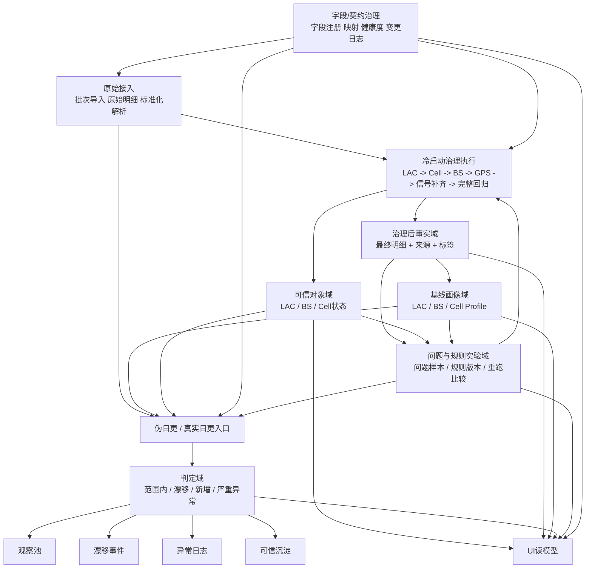
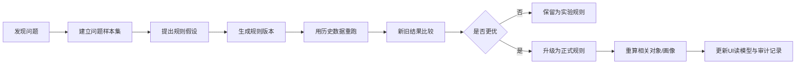

# 本地治理闭环中间方案（含字段治理、异常研究与 UI 观察平台）

根据 2026-03-18 的项目文档，你当前在本地 PostgreSQL 上已经跑通 Layer_0 ~ Layer_5 的冷启动链路，项目目标是构建可信基线、实现日常增量比对，并保留质量门控能力；同时文档也明确指出，当前主要问题是冷启动与日常未分离、完整回归不显式、UI/API/Obs Mart 与核心逻辑混合、特例缺少独立旁路。【38:1†README.md†L16-L22】【20:0†02_项目现状与逻辑梳理_外部评审版.md†L11-L18】【15:5†02_项目现状与逻辑梳理_外部评审版.md†L174-L188】

这意味着，当前最合理的方向不是立即迁到“正式数仓”，而是在本地 PG 上先搭建一套**治理闭环平台**：既保留你已经验证过的冷启动逻辑，又补上字段治理、规则迭代、异常研究、重跑比对和 UI 观察能力，再把这套成熟能力迁到云端。

## 1. 方案定位

这不是“正式数仓一期”，而是**本地治理闭环一期**。

目标有四个：
1. 保留并整理现有冷启动逻辑，不推翻你已经验证过的治理哲学；
2. 在本地把“冷启动 + 伪日常运营”闭环跑通；
3. 增加字段注册/元数据、数据流转、规则重跑与异常研究能力；
4. 为后续云端迁移提供清晰、稳定、可复用的逻辑契约。

其底层原则仍然完全沿用现有文档：`有效 cell_id = 有效上报`、`修正优于丢弃`、`LAC → Cell → BS → GPS` 的正向收敛、`BS → Cell` 的反向纯化、以及“完整回归 + 基线驱动”的日常运营模型。【15:9†00_业务逻辑与设计原则.md†L11-L38】【20:1†02_项目现状与逻辑梳理_外部评审版.md†L102-L152】【38:0†00_业务逻辑与设计原则.md†L214-L257】

## 2. 这次需要补进来的三块能力

### 2.1 字段/元数据治理系统

这块我认为你提得非常对，而且应该前移，不要等真正上云之后再补。原因有两个：

- 现有链路从一开始就依赖“原始数据标准化、PLMN/LAC/Cell 解析”，说明字段解析本身就是治理入口，而不是附属工作。【17:15†01_数仓构建可行性与总体方案.md†L17-L28】
- 现有总体方案已经把“元数据管理”放进后续自动化与监控阶段，说明这本来就是长期必须补齐的一块，只是当前文档还没有把它前移为本地阶段的核心模块。【42:4†01_数仓构建可行性与总体方案.md†L197-L203】

所以，本地闭环阶段就应该建立一个轻量但独立的字段治理子系统，至少管理：
- 原始字段注册
- 标准字段定义
- 原始字段 → 标准字段映射
- 必填/可选/衍生字段分类
- 字段解析规则版本
- 字段健康度（有值率、异常值率、波动）
- 字段变更记录（新增、删除、改名、类型变化、枚举变化）
- 下游影响范围（哪些流程、画像、规则依赖了该字段）

这块不是为了“字段多不多”，而是为了后续采集变化时，系统能可视化地告诉你：
- 哪个字段变了；
- 会影响冷启动哪一步；
- 会影响哪些画像指标；
- 哪些规则需要重跑验证。

### 2.2 异常研究 / 规则实验 / 重跑比较系统

文档已经非常清楚：GPS 漂移不能简单丢弃，要修正；碰撞 BS、全室内 BS、移动 Cell 等特例需要独立旁路；日常运营还要识别漂移、新增和严重异常。【17:3†00_业务逻辑与设计原则.md†L113-L140】【42:5†02_项目现状与逻辑梳理_外部评审版.md†L81-L95】【38:0†00_业务逻辑与设计原则.md†L214-L257】

这意味着，系统不能只有“跑流程”，还必须有一个明确的“研究—固化”闭环：
- 发现问题
- 生成问题样本集
- 假设新规则
- 版本化规则
- 用历史数据重跑
- 比较新旧结果
- 决定是否固化

也就是说，GPS 漂移、异常 Cell、Cell 变动、碰撞 BS，不应该只是流水线里的临时判断，而应该进入一个可追踪、可对比、可复验的规则实验体系。

### 2.3 UI 观察与运营系统

现有文档已经说明：当前 UI/API/Obs Mart 是为了调试和可视化而建，但它们不应该和核心逻辑混在一起。【15:5†02_项目现状与逻辑梳理_外部评审版.md†L182-L188】

所以 UI 不应直接绑定 Step 表，而应该围绕以下稳定对象建立读模型：
- 运行
- 字段
- 对象（LAC / BS / Cell）
- 问题
- 规则
- 基线
- 日更模拟结果
- 审计与版本

## 3. 本地治理闭环的完整结构

我建议本地 PG 阶段按下面 8 个逻辑域组织，而不是直接套正式 ODS/DWD/DIM/DWS/ADS 名称。

### 3.1 meta_contract：字段与契约治理域

作用：管理“数据是怎么被系统理解的”。

建议包含：
- 数据源注册
- 表注册
- 字段注册
- 字段映射
- 解析规则注册
- 衍生字段定义
- 字段健康度快照
- 字段变更日志
- 下游依赖关系
- 输出契约版本

这是你新增要求里最重要的一块，也是后续 UI 能做“字段变化可视化”的前提。

### 3.2 raw_source：原始接入域

作用：保留原始批次与标准化输入。

建议包含：
- 原始批次表
- 原始明细表
- 标准化解析表（PLMN/LAC/Cell 解析后的记录）
- 批次级质量摘要

这层要保留，因为完整回归要求始终能从全量原始数据重新处理，不能只依赖中间产物。【15:9†00_业务逻辑与设计原则.md†L172-L185】

### 3.3 work_run：运行中间域

作用：承接当前探索逻辑里所有中间步骤，但明确只作为“运行态”和“研究态”存在。

建议包含：
- LAC 候选
- Cell 统计中间表
- BS 聚合中间表
- GPS 修正中间结果
- 信号补齐 donor 中间结果
- 特例识别中间结果
- 完整回归临时结果
- 对比评估中间结果

这层可以继续保留大量 Step 产物，但不再把它们视为长期核心结构。

### 3.4 core_entity：可信对象域

作用：沉淀当前已相对稳定的治理对象。

建议包含：
- 可信 LAC
- 可信 BS
- Cell 统计 + Cell 状态注册
- 对象状态（trusted / observe / changed / anomaly / retired）
- 当前有效版本

这里要注意：
- LAC、BS 可以比较早沉淀为主对象；
- Cell 更适合先走“统计 + 状态注册”，不要过早做成僵硬的正式维表。

### 3.5 fact_governed：治理后事实域

作用：沉淀真正给后续分析和画像使用的“最终明细”。

建议包含：
- GPS 修正后的记录
- 信号补齐后的记录
- 修正来源
- 补齐来源
- 命中规则标签
- 运行版本 / 基线版本 / 规则版本

这层本质上对应你现有文档里的 Step 4、Step 5、Step 7 最终落地结果，是整个系统的事实底盘。【17:16†02_项目现状与逻辑梳理_外部评审版.md†L122-L145】

### 3.6 baseline_profile：画像与基线域

作用：沉淀 LAC / BS / Cell 画像，用作冷启动成果与日常对比参照。

建议包含：
- LAC Profile
- BS Profile
- Cell Profile
- 基线版本表
- 基线窗口与刷新记录

这些画像在现有设计里就是“基线”，日常运营要拿它们去对比新数据。【15:9†00_业务逻辑与设计原则.md†L189-L257】

### 3.7 issue_rule_lab：问题与规则实验域

作用：把“研究异常、增加规则、重跑验证”独立出来。

建议包含：
- 问题事件表
- 问题对象快照
- 问题样本集
- 规则定义表
- 规则版本表
- 重跑任务表
- 新旧结果对比表
- 审批/固化记录

这层是本地阶段特别关键的新增能力。

### 3.8 decision_ops：日常判定与运营域

作用：承接伪日更和未来真实日更的判定结果。

建议包含：
- 每日来数快照
- 对比判定结果
- 观察池
- 漂移事件
- 新增事件
- 异常日志
- 对象晋升/降级记录

日常四分流逻辑已经在文档中非常清楚：已知范围内、已知但漂移、新增、严重异常。【38:0†00_业务逻辑与设计原则.md†L214-L257】【20:1†02_项目现状与逻辑梳理_外部评审版.md†L154-L164】

## 4. 完整流程图

## 5. 字段治理系统应该怎么做

这里不建议做成“大而全的数据资产平台”，而是做成**够用、够清晰、能支持当前治理闭环**的轻量系统。

### 5.1 核心对象

最少需要有 6 类对象：
- 数据源
- 表
- 字段
- 映射
- 解析规则
- 输出契约

### 5.2 字段生命周期

建议字段生命周期至少包含：
- registered：已注册，尚未纳入主流程
- active：已被主流程使用
- deprecated：不再推荐使用，但保留历史追溯
- missing：最近批次缺失
- drifted：值域/类型/枚举特征发生明显变化
- retired：正式下线

### 5.3 你真正需要看到的不是“字段列表”，而是 4 种变化

1. 结构变化：字段新增、删除、改名、类型变化
2. 健康变化：空值率、异常值率、分布明显变化
3. 语义变化：解析规则变化、枚举变化、来源变化
4. 影响变化：哪些画像指标、规则、页面会受影响

### 5.4 它和主流程的关系

字段治理系统不是旁枝，而是主流程入口的“前置控制面”：
- 冷启动跑前先确定契约版本
- 伪日更跑前确认字段是否符合预期
- 异常研究时能快速定位问题是字段层还是对象层
- UI 中可直接看到“这次规则异常是否其实是字段变了”

## 6. 异常研究与规则重跑应该怎么嵌进去

这块我建议做成一个明确的闭环，而不是临时 patch。

### 6.1 问题来源

问题来源至少有四类：
- 冷启动运行中发现的异常桶
- 日常模拟中发现的漂移 / 新增 / 严重异常
- 字段健康度变化触发的问题
- 人工在 UI 中标记的问题对象

### 6.2 问题分类

本项目至少应先支持：
- GPS 漂移问题
- 碰撞 BS
- 全室内 BS
- 移动 Cell
- Cell 多 LAC 映射异常
- 信号补齐异常
- 画像不收敛 / 基线偏移
- 字段变化导致的异常

### 6.3 规则实验闭环

### 6.4 这里最关键的不是“规则表”，而是“比较能力”

任何一条新规则都应该能回答：
- 它修复了哪些问题；
- 是否引入了新的误伤；
- 会影响多少 LAC / BS / Cell；
- 对画像收敛是否更好；
- 是否只适用于特定区域/特定制式。

否则规则只会越来越多，但系统不会越来越稳。

## 7. UI 观察平台应该有哪些页面

UI 的目的不是替代 SQL，而是把治理闭环“看清楚”。

### 7.1 运行中心

看什么：
- 每次 run 的输入窗口
- 运行阶段进度
- 每阶段行数变化
- 使用的规则版本、基线版本、契约版本
- 告警和失败原因

### 7.2 字段治理中心

看什么：
- 字段列表
- 字段健康度
- 字段映射关系
- 字段变更日志
- 下游影响范围
- 最近批次字段异常

这是你新增要求里最应该成为一级入口的页面。

### 7.3 数据流转 / 血缘页

看什么：
- 从 raw 到标准化，再到对象、事实、画像、判定的流向
- 每个阶段输入/输出行数
- 每个关键字段在哪一步被解析、修正、衍生
- 哪些页面/规则依赖某字段或某对象

它不是为了做企业级血缘，而是为了让团队快速定位“问题发生在哪一层”。

### 7.4 对象观察页

按 LAC / BS / Cell 查询：
- 当前状态
- 当前画像
- 历史轨迹
- 关联问题
- 是否命中特例
- 最近沉淀与异常记录

### 7.5 问题中心

集中看：
- 碰撞 BS 队列
- 全室内 BS 队列
- 移动 Cell 队列
- 多 LAC 映射异常队列
- 信号补齐异常队列
- 字段变化引起的问题队列

### 7.6 规则实验室

看什么：
- 规则列表
- 规则版本
- 规则命中样本
- 历史重跑结果
- 新旧版本比较
- 是否已批准进入正式流程

### 7.7 基线中心

看什么：
- 当前基线版本
- 各级画像摘要
- 基线刷新记录
- 基线前后差异
- 哪些对象被重新定义了

### 7.8 日更模拟 / 差异审查页

看什么：
- 当天范围内沉淀
- 漂移对象
- 新增对象
- 严重异常
- 观察池晋升候选

这是本地阶段最重要的运营页，因为它把“历史数据回放”变成了“伪日更”。

### 7.9 审计与版本页

看什么：
- run 记录
- 规则版本
- 基线版本
- 契约版本
- 发布/回滚记录
- 谁修改了什么

## 8. 是否按数仓逻辑构建

我的建议是：

**要用数仓的逻辑组织，但不要急着用数仓的正式形态约束自己。**

换句话说：
- 你现在应该有 raw / fact / entity / profile / decision 这些清晰角色；
- 但不必急着把所有东西都强制做成 ODS/DWD/DIM/DWS/ADS 的正式生产命名；
- 先在本地把闭环、观察、重跑、规则实验跑顺，再决定哪些结构迁云。

这也符合你文档当前状态：一方面，本地 PG 已跑通核心链路；另一方面，正式数仓方案和 MaxCompute 迁移仍在讨论中，且 MaxCompute 当前还存在调度与表演进限制。【38:1†README.md†L16-L22】【42:4†01_数仓构建可行性与总体方案.md†L151-L203】

## 9. 本地如何模拟日常运营

这一步完全可以先用历史数据完成。

建议方式：
1. 取 14 天做冷启动，产出 `baseline_v1`
2. 把后续历史数据按天切成“模拟日增量”
3. 每天拿增量撞 `baseline_v1`
4. 输出四类结果：范围内 / 漂移 / 新增 / 异常
5. 观察池连续多天稳定后再晋升
6. 沉淀一段时间后生成 `baseline_v2`
7. 继续回放后续日期

这样你在本地就能先把文档中的“冷启动 + 日常运营”两阶段闭环跑通，而不必等线上真实数据流全部接好。【15:9†00_业务逻辑与设计原则.md†L36-L38】【38:0†00_业务逻辑与设计原则.md†L214-L257】

## 10. 技术栈建议

你提的技术栈：
- PostgreSQL
- FastAPI
- Next.js
- 定时任务（cron / APScheduler）
- 单独 worker 进程

我认为是合理的，而且适合这个阶段。

### 10.1 我建议保持不变的

- **PostgreSQL**：非常适合本地研究、重跑、比对、物化读模型和快速 patch 验证。
- **FastAPI**：适合把“运行控制 + 读模型接口 + 规则实验接口”做清楚。
- **Next.js**：足够支撑治理 UI、问题中心、对比页、对象详情页。
- **独立 worker**：很有必要。冷启动、重跑、日更模拟不应阻塞 API。

### 10.2 调度建议

本地阶段：
- 单机就用 `APScheduler` 或系统 `cron` 都可以；
- 关键不是选哪个，而是**所有任务都必须带 run_id / rule_version / baseline_version / contract_version**；
- 如果未来多实例部署，再引入独立 scheduler 或 leader 机制，避免重复调度。

### 10.3 我建议补的不是“大组件”，而是两个小能力

1. **读模型层**：
   UI 不要直连核心表，应该通过 API 读稳定的 read model。

2. **artifact / 审计落盘**：
   每次 run 至少保留：
   - 参数
   - 版本信息
   - 行数变化
   - 问题样本
   - 对比结果
   - 关键统计摘要

### 10.4 现在不建议急着引入的

- 不建议现在为了“像数仓”而引入过重的编排框架
- 不建议现在为了“像平台”而做复杂权限体系
- 不建议现在为了“像生产”而把规则实验直接塞进线上链路

本阶段最重要的是把逻辑跑顺、可观察、可对比、可回放。

## 11. 建议的阶段路线

### P0：先立骨架（必须先做）

1. 建 `run/version/contract` 体系
2. 明确 8 个逻辑域
3. 把完整回归显式化
4. 把字段治理独立出来
5. 把问题/规则实验独立出来
6. UI 先做运行中心、字段治理中心、问题中心、对象页、日更模拟页

### P1：把本地闭环跑顺

1. 冷启动反复可重跑
2. 历史数据伪日更跑顺
3. 观察池 / 漂移 / 异常 / 晋升口径稳定
4. 规则重跑比较可用
5. 字段变化可视化上线

### P2：为云端迁移做准备

1. 固化稳定的对象层、事实层、画像层、判定层
2. 把 UI 改为只依赖稳定读模型
3. 再决定哪些表迁云，哪些只留本地研究
4. 最后才做 PG → MaxCompute 的生产迁移

## 12. 最终判断

我现在给你的完整结论是：

你这类项目，确实不应该只把“治理主流程”本身看作系统；还必须补上：
- 字段/契约治理
- 数据流转与影响追踪
- 异常研究与规则实验
- 重跑比较与固化
- 面向观察和运营的 UI

而且这些不是以后再说，它们正是你从“探索式 SQL 工程”走向“本地可闭环治理平台”的中间桥梁。

所以我建议你现在的目标定为：

**在本地 PostgreSQL 上建设一个可反复回放、可研究异常、可版本化规则、可模拟日更、可供 UI 观察的治理闭环平台。**

等这套平台把当前数据里的问题、规则和日常闭环都跑顺了，再迁云，迁的是成熟能力，而不是仍在探索中的步骤堆叠。
