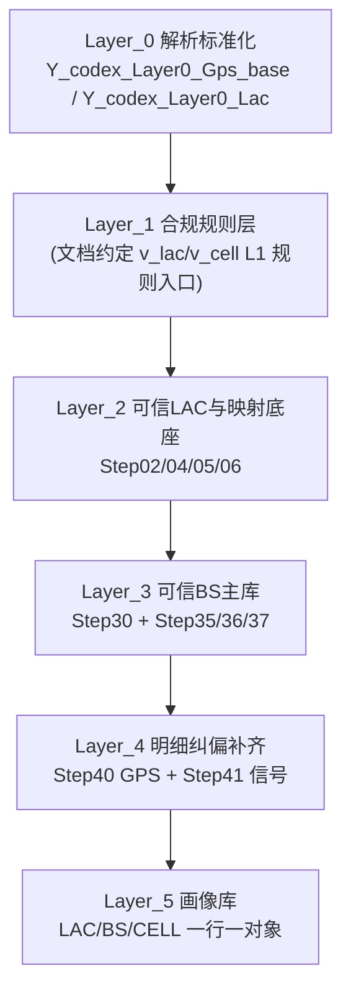

# Phase1 基础审计与工程化方案（2026-02-25）

## 1. 执行摘要（10行内）
1. 已完成 Layer_0→Layer_5 的文档、SQL、DB 三层核查；主干对象齐全，主链路可复跑。  
2. DB 事实：`Layer4_Final` 精确行数 `30,491,963`，`Layer5` 三表分别为 `878/163,778/493,651`。  
3. 主键一致性通过：Layer4 去重键数与 Layer5 行数一致（LAC/BS/CELL 完全对齐）。  
4. 无效 LAC 边界通过：Layer5 三表无 `NULL/<=0/FFFF系/2147483647` 泄漏。  
5. 碰撞/严重碰撞/动态标签闭环通过：Layer4 对象数与 Layer5 对象数一致。  
6. 发现 P0：`Step40_Gps_Metrics_All` 与事实表口径不一致，且 Step43 脚本与当前 schema 漂移，无法直接复跑。  
7. 发现 P0：Layer5 的 BS/CELL 画像未落 `is_bs_id_lt_256` 与 `is_multi_operator_shared/shared_operator_*`，违反交付契约。  
8. 发现 P1：文档约定的 `v_lac_L1_stage1` 不存在；`v_cell_l1_stage1` 为旧链路视图，易误导接手。  
9. 发现 P1：Step30 仍有 `bs_id<=0` 的 103 个桶，和文档“入口止血”口径不一致。  
10. 已给出本周/2-6周/6周+ 的可执行工程化与实时化落地方案（含门禁 SQL 与回滚策略）。

## 2. 端到端流程图（Mermaid）


## 3. 文档-SQL-DB 一致性矩阵

| 核查项 | 文档口径 | SQL实现 | DB事实 | 结论 |
|---|---|---|---|---|
| Layer_1 入口对象 | `Phase_1_Engineering_Handoff.md` 指定 `v_lac_L1_stage1/v_cell_L1_stage1`（`lac_enbid_project/Phase_1/Phase_1_Engineering_Handoff.md:45`） | 主链路实际从 `Layer2 Step00/02` 开始（`lac_enbid_project/Layer_2/sql/00_step0_std_views.sql:96`，`lac_enbid_project/Layer_2/sql/02_step2_compliance_mark.sql:81`） | `to_regclass`: `v_lac_l1_stage1=NULL`，`v_cell_l1_stage1`存在且来自旧表`网优cell项目_清洗补齐库_v1` | 部分一致 |
| 无效 LAC 入口拦截 | 文档要求 Layer_1 拦截、Layer_5 不得出现（`...Handoff.md:79,90,416`） | Step02 过滤 sentinel + cell overflow（`02_step2...sql:92-99,112,136`） | `step02_compliant_sentinel_lac=0`; Layer5 三表 invalid LAC 均为 `0` | 一致 |
| `lac_dec < 0x0101` 口径 | 文档要求判无效（`...Handoff.md:86-88`） | Step02 未显式写 `<257` 条件 | DB 结果：Step02/Step06/Layer5 中 `<257` 均为 `0` | 部分一致（效果一致，规则未显式化） |
| 多LAC监测与收敛 | 文档要求 Step05 监测、Step06 收敛（`...Handoff.md:246-257`） | Step05 `HAVING count(distinct lac_dec)>1`（`05_step5...sql:119-133`）；Step06 `MULTI_LAC_OVERRIDE/KEEP`（`06_step6...sql:282-296`） | Step05 多LAC `79`；Step06 `MULTI_LAC_KEEP=14,557`、`OVERRIDE=2,104` | 一致 |
| Step30 碰撞与共建 | 文档：`p90>1500` 或多LAC命中；共建 `shared_operator_cnt>1`（`...Handoff.md:282-290`） | `collision_if_p90_dist_m_gt=1500` 与 `is_multi_operator_shared`（`30_step30...merge_psql.sql:93,132,104`） | Step30：碰撞 `6,854`，共建 `25,693` | 一致 |
| Step30 入口止血 | 文档要求 `bs_id=0/cell_id=0` 不进入主库（`...Handoff.md:267`） | prepare 仅 `bs_id IS NOT NULL`，未 `>0`（`30_step30...prepare.sql:77`） | Step30 `bs_id<=0` 有 `103` 桶 | 不一致 |
| 严重碰撞策略 | Handoff：严重碰撞“回填+强标注”（`...Handoff.md:69-77,316-321`） | Step40 确实 `Augmented_from_BS_SevereCollision`（`40_step40...sql:269-281`） | Step40 severe 回填行 `2,867` | 一致（相对 Handoff） |
| Layer_4 RUNBOOK 描述 | RUNBOOK写“严重碰撞不回填GPS”（`lac_enbid_project/Layer_4/Layer_4_执行计划_RUNBOOK_v1.md:22`） | Step40 SQL 与该描述相反（`40_step40...sql:269-281`） | DB 已回填 severe `2,867` | 不一致（文档冲突） |
| Layer4→Layer5 键一致性 | 文档要求 LAC/BS/CELL 主键一致（`...Handoff.md:359-365`） | Step50/51/52 均按对象键聚合（`50_step50...sql:111-113`; `51_step51...sql:103-104`; `52_step52...sql:102-103`） | L4去重键 = L5行数：LAC `878`、BS `163,778`、CELL `493,651`；且 Layer5 重复行为 `0` | 一致 |
| 异常标签闭环（碰撞/严重/动态） | 文档要求明细→画像闭环（`...Handoff.md:350-357,403-407`） | Step51/52 汇总碰撞与动态字段（`51_step51...sql:180-187`; `52_step52...sql:179-186`） | 对象数完全对齐：碰撞 BS `8,277`/CELL `36,244`；严重 BS `21`/CELL `51`；动态 BS/CELL 都为 `5` | 一致 |
| bs_id异常进画像 | 文档要求画像可见（`...Handoff.md:322,355,406`） | Layer4有 `is_bs_id_lt_256`（`40_step40...sql:229`） | Layer5 BS/CELL 无 `is_bs_id_lt_256` 字段（`information_schema` 查询 exists=0） | 不一致 |
| 多运营商共建进画像 | 文档要求 BS/CELL 保留 `is_multi_operator_shared/shared_operator_*`（`...Handoff.md:356,407,420`） | Layer4有 `is_multi_operator_shared/shared_operator_*`（`40_step40...sql:165-167`） | Layer5 BS/CELL 缺相关字段；仅 LAC 有“多运营商BS标记”且口径为跨组共站（19） | 不一致 |
| 指标表与事实表一致性 | 文档要求可验收、可解释（`...Handoff.md:415-424`） | Step40 指标源表含 severe fill 字段（`40_step40...sql:315`） | `Step40_Gps_Metrics_All.gps_not_filled_cnt=122,294` vs 事实 `Not_Filled=119,427`，差值 `2,867`；且 Step43 逻辑可触发 `UNION` 列数不一致报错 | 不一致 |

## 4. 关键问题清单（P0/P1/P2，含证据与影响）

### P0-1：Step43 指标聚合脚本与现网 schema 漂移，指标表失真且不可稳定复跑
- 已验证事实：  
  `Y_codex_Layer4_Step40_Gps_Metrics` 有 12 列（含 `gps_fill_from_bs_severe_collision_cnt`、`bs_id_lt_256_row_cnt`）；`Y_codex_Layer4_Step40_Gps_Metrics_All` 仅 10 列。  
  事实核对：`metric_not_filled=122,294`，事实 `Not_Filled=119,427`，差值 `2,867`（正好等于 severe 行）。  
  验证 SQL 触发：按 Step43 逻辑做 `UNION` 报错“每一个 UNION 查询必须有相同的字段个数”。
- 证据：  
  `lac_enbid_project/Layer_4/sql/43_step43_merge_metrics.sql:47-57`  
  `lac_enbid_project/Layer_4/sql/40_step40_cell_gps_filter_fill.sql:314-320`
- 影响：门禁指标存在误报风险，且 Step43 复跑链路不可靠。
- 推断：若上线后依赖 `_All` 表做自动告警，会持续偏大统计 `Not_Filled` 并干扰策略判断。

### P0-2：Layer5 未承接关键异常契约字段（bs_id异常、多运营商共建明细）
- 已验证事实：  
  Layer4 有 `is_bs_id_lt_256/is_multi_operator_shared/shared_operator_cnt/shared_operator_list`；Layer5 BS/CELL 缺失这些字段。  
  文档明确要求画像可见这些异常。
- 证据：  
  `lac_enbid_project/Phase_1/Phase_1_Engineering_Handoff.md:355-357,406-407,420`  
  `lac_enbid_project/Layer_4/sql/40_step40_cell_gps_filter_fill.sql:165-167,229`
- 影响：下游只看 Layer5 会丢失关键风险维度，难以做默认过滤/降权策略。
- 推断：这会导致“画像可消费但风险不可见”的隐性误用。

### P1-1：Layer_1 交付对象口径与现网对象不一致
- 已验证事实：  
  `v_lac_L1_stage1` 不存在；`v_cell_l1_stage1` 存在但来源为旧表 `网优cell项目_清洗补齐库_v1`，非 Layer0 标准链路。  
  主链路 SQL 实际用的是 `Y_codex_Layer2_Step00/02`。
- 证据：  
  `lac_enbid_project/Phase_1/Phase_1_Engineering_Handoff.md:45,189`  
  `lac_enbid_project/Layer_2/sql/00_step0_std_views.sql:96-104`  
  `pg_get_viewdef('public.v_cell_l1_stage1')` 片段
- 影响：接手方会被双入口误导，排障路径不唯一。

### P1-2：Step30 主库仍存在 `bs_id<=0` 桶，违背“入口止血”规则
- 已验证事实：Step30 中 `bs_id<=0` 有 `103` 桶（4G:13, 5G:90）。
- 证据：  
  `lac_enbid_project/Phase_1/Phase_1_Engineering_Handoff.md:267`  
  `lac_enbid_project/Layer_3/sql/30_step30_master_bs_library_v4_prepare.sql:77`（仅 `IS NOT NULL`）
- 影响：BS 主库质量边界与文档不一致，增加解释成本。
- 推断：虽 Layer4 已过滤 `bs_id_final>0`，但 Step30 直接用于报表时仍可能引入噪声。

### P1-3：Layer_4 RUNBOOK 与 Handoff/SQL 在 severe 策略上冲突
- 已验证事实：RUNBOOK 写“不回填”；Handoff+SQL+DB 都是“回填+强标注”。
- 证据：  
  `lac_enbid_project/Layer_4/Layer_4_执行计划_RUNBOOK_v1.md:22`  
  `lac_enbid_project/Phase_1/Phase_1_Engineering_Handoff.md:69-77,316-321`  
  `lac_enbid_project/Layer_4/sql/40_step40_cell_gps_filter_fill.sql:269-281`
- 影响：运维按 RUNBOOK 操作会得出错误预期，导致验收争议。

### P2-1：Step41 指标字段命名与业务语义有歧义
- 已验证事实：`filled_by_cell_nearest_row_cnt` 统计的是“source=cell_nearest”的行，不等于“实际发生补齐”的行。  
  例：source=cell_nearest 行 `30,140,602`，但实际 `signal_filled_field_cnt>0` 的仅 `3,259,756`。
- 证据：  
  `lac_enbid_project/Layer_4/sql/41_step41_cell_signal_fill.sql:312-313`  
  DB 事实对比 SQL（source 行 vs 真补齐行）
- 影响：指标解读门槛高，容易误判补齐收益。

## 5. 工程化改造方案（本周/2-6周/6周+）

### 本周（必须落地）
1. 修复 Step43 与 Step40 指标 schema 一致性。  
实施：补齐 `gps_fill_from_bs_severe_collision_cnt` 与 `bs_id_lt_256_row_cnt` 汇总列；重建 `_All` 表。  
验收：`metric_not_filled == fact_not_filled`，并新增 severe fill 单列核对。
2. 补齐 Layer5 BS/CELL 异常字段契约。  
实施：在 Step51/52 或 `_EN` 视图至少暴露 `is_bs_id_lt_256`、`is_multi_operator_shared`、`shared_operator_cnt/list`。  
验收：字段存在性门禁 SQL 全绿。
3. 统一入口口径文档。  
实施：明确“生产主入口=Layer2 Step00/Step02”，将 `v_lac/v_cell_L1_stage1` 标记为 legacy 或补建同口径视图。  
验收：`docs` 与 `to_regclass` 一致。
4. 修正文档冲突。  
实施：更新 Layer4 RUNBOOK severe 描述为“回填+强标注”。

### 2-6 周（工程稳态）
1. 参数配置化：将运营商白名单、阈值、窗口、占位值从 SQL 常量迁移到参数表。  
2. 版本化契约：新增 `pipeline_contract` 与 `pipeline_run_audit` 表，记录每次跑批版本与门禁结果。  
3. 门禁自动化：把第 7 节 SQL 做成 CI/定时任务，失败阻断“画像发布”。  
4. 统一指标字典：修复 Step41 命名歧义（`source_*` vs `filled_*` 双指标）。

### 6 周+（实时化）
1. 增量改造：按 `report_date + seq_id` 做 watermark 增量，支持重放。  
2. 近实时分层：Step40/41 小时级，Step50/51/52 日级增量刷新。  
3. 双轨校验：离线全量与增量结果并行对账，异常自动回滚到上一个稳定快照。

## 6. 可视化页面方案（页面结构、组件、图表、接口字段）

### 页面结构
1. 总览页：链路健康、行数守恒、门禁状态。  
2. LAC 收敛页：Step05 多LAC清单、Step06 收敛状态分布。  
3. GPS 纠偏页：`gps_status/gps_source` 漏斗、severe 桶趋势。  
4. 信号补齐页：`source` 与 `filled_field_sum` 双轴图。  
5. 异常闭环页：碰撞/动态/bs_id异常/多运营商共建的明细穿透。  
6. 运行审计页：每次 run 的参数、耗时、失败点、回滚点。

### 关键组件与图表
1. KPI 卡片：Layer 行数、L5 对象数、invalid LAC 泄漏数。  
2. Sankey：`gps_status -> gps_fix_strategy -> gps_source`。  
3. Heatmap：按 `operator_id_raw + tech_norm` 的异常密度。  
4. 明细表：`seq_id` 可点击钻取 before/after/source/reason。  
5. Diff 面板：指标表 vs 事实表自动差异告警。

### 接口字段（建议）
1. `GET /api/phase1/overview`：`row_cnt_l0/l2/l4/l5`, `gate_status`, `run_id`。  
2. `GET /api/phase1/lac-enrich`：`lac_enrich_status`, `row_cnt`, `pct`。  
3. `GET /api/phase1/gps-funnel`：`gps_status`, `gps_fix_strategy`, `gps_source`, `row_cnt`。  
4. `GET /api/phase1/signal-fill`：`signal_fill_source`, `source_row_cnt`, `filled_row_cnt`, `filled_field_sum`。  
5. `GET /api/phase1/anomaly-closure`：`tag_type`, `l4_obj_cnt`, `l5_obj_cnt`, `diff_cnt`。  
6. `GET /api/phase1/trace/{seq_id}`：返回 before/after/source/reason 全字段。

## 7. 调试与验收清单（含建议门禁SQL）

### A. 主干对象与行数
```sql
SELECT
  to_regclass('public."Y_codex_Layer2_Step06_L0_Lac_Filtered"') AS step06,
  to_regclass('public."Y_codex_Layer3_Step30_Master_BS_Library"') AS step30,
  to_regclass('public."Y_codex_Layer4_Final_Cell_Library"') AS l4_final,
  to_regclass('public."Y_codex_Layer5_Lac_Profile"') AS l5_lac,
  to_regclass('public."Y_codex_Layer5_BS_Profile"') AS l5_bs,
  to_regclass('public."Y_codex_Layer5_Cell_Profile"') AS l5_cell;
```

### B. 行数守恒（Step40=Final）
```sql
SELECT
  (SELECT COUNT(*) FROM public."Y_codex_Layer4_Step40_Cell_Gps_Filter_Fill") AS step40_cnt,
  (SELECT COUNT(*) FROM public."Y_codex_Layer4_Final_Cell_Library") AS final_cnt;
```

### C. 主键一致性（Layer4 去重键 vs Layer5 行数）
```sql
SELECT
  (SELECT COUNT(*) FROM (SELECT operator_id_raw,tech_norm,lac_dec_final FROM public."Y_codex_Layer4_Final_Cell_Library" WHERE lac_dec_final>0 GROUP BY 1,2,3) t) AS l4_lac_keys,
  (SELECT COUNT(*) FROM public."Y_codex_Layer5_Lac_Profile") AS l5_lac_rows,
  (SELECT COUNT(*) FROM (SELECT operator_id_raw,tech_norm,lac_dec_final,bs_id_final FROM public."Y_codex_Layer4_Final_Cell_Library" WHERE lac_dec_final>0 AND bs_id_final>0 GROUP BY 1,2,3,4) t) AS l4_bs_keys,
  (SELECT COUNT(*) FROM public."Y_codex_Layer5_BS_Profile") AS l5_bs_rows,
  (SELECT COUNT(*) FROM (SELECT operator_id_raw,tech_norm,lac_dec_final,cell_id_dec FROM public."Y_codex_Layer4_Final_Cell_Library" WHERE lac_dec_final>0 AND cell_id_dec>0 GROUP BY 1,2,3,4) t) AS l4_cell_keys,
  (SELECT COUNT(*) FROM public."Y_codex_Layer5_Cell_Profile") AS l5_cell_rows;
```

### D. Layer5 无效 LAC 泄漏门禁
```sql
SELECT
  (SELECT COUNT(*) FROM public."Y_codex_Layer5_Lac_Profile"  WHERE "LAC" IS NULL OR "LAC"<=0 OR "LAC" IN (65534,65535,16777214,16777215,2147483647)) AS l5_lac_invalid,
  (SELECT COUNT(*) FROM public."Y_codex_Layer5_BS_Profile"   WHERE "LAC" IS NULL OR "LAC"<=0 OR "LAC" IN (65534,65535,16777214,16777215,2147483647)) AS l5_bs_invalid,
  (SELECT COUNT(*) FROM public."Y_codex_Layer5_Cell_Profile" WHERE "LAC" IS NULL OR "LAC"<=0 OR "LAC" IN (65534,65535,16777214,16777215,2147483647)) AS l5_cell_invalid;
```

### E. 标签闭环门禁（碰撞/严重/动态）
```sql
SELECT
  (SELECT COUNT(*) FROM (SELECT operator_id_raw,tech_norm,lac_dec_final,bs_id_final FROM public."Y_codex_Layer4_Final_Cell_Library" WHERE is_collision_suspect=1 GROUP BY 1,2,3,4) t) AS l4_collision_bs,
  (SELECT COUNT(*) FROM public."Y_codex_Layer5_BS_Profile" WHERE "疑似碰撞标记" IS TRUE) AS l5_collision_bs,
  (SELECT COUNT(*) FROM (SELECT operator_id_raw,tech_norm,lac_dec_final,cell_id_dec FROM public."Y_codex_Layer4_Final_Cell_Library" WHERE is_severe_collision IS TRUE GROUP BY 1,2,3,4) t) AS l4_severe_cell,
  (SELECT COUNT(*) FROM public."Y_codex_Layer5_Cell_Profile" WHERE "严重碰撞桶标记" IS TRUE) AS l5_severe_cell,
  (SELECT COUNT(*) FROM (SELECT operator_id_raw,tech_norm,lac_dec_final,cell_id_dec FROM public."Y_codex_Layer4_Final_Cell_Library" WHERE is_dynamic_cell=1 GROUP BY 1,2,3,4) t) AS l4_dynamic_cell,
  (SELECT COUNT(*) FROM public."Y_codex_Layer5_Cell_Profile" WHERE "移动CELL标记" IS TRUE) AS l5_dynamic_cell;
```

### F. 指标表一致性门禁（Step40 _All vs 事实）
```sql
WITH m AS (
  SELECT * FROM public."Y_codex_Layer4_Step40_Gps_Metrics_All" WHERE shard_id=-1 LIMIT 1
), f AS (
  SELECT
    COUNT(*) FILTER (WHERE gps_source='Not_Filled') AS fact_not_filled,
    COUNT(*) FILTER (WHERE gps_source='Augmented_from_BS_SevereCollision') AS fact_severe_fill
  FROM public."Y_codex_Layer4_Step40_Cell_Gps_Filter_Fill"
)
SELECT m.gps_not_filled_cnt, f.fact_not_filled, f.fact_severe_fill,
       (m.gps_not_filled_cnt - f.fact_not_filled) AS diff_not_filled
FROM m CROSS JOIN f;
```

### G. 契约字段存在性门禁（Layer5）
```sql
SELECT table_name, column_name
FROM information_schema.columns
WHERE table_schema='public'
  AND table_name IN ('Y_codex_Layer5_BS_Profile','Y_codex_Layer5_Cell_Profile')
  AND column_name IN ('is_bs_id_lt_256','is_multi_operator_shared','shared_operator_cnt','shared_operator_list');
```

## 8. 实时数据对接准备清单

### 8.1 数据与主键
1. 固定增量主键：`seq_id + ts_fill`；对象键沿用 LAC/BS/CELL 三套。  
2. 固定水位线：`report_date` 日水位 + `ts_fill` 小时水位。  
3. 固定幂等策略：同主键 upsert，重复消息不重复入库。

### 8.2 计算与编排
1. Step40/41 做小时级增量；Step50/51/52 做日级增量。  
2. 保留分片键：`bs_shard_key`；每个 shard 独立重试。  
3. 新增运行审计表：记录参数、版本、输入行数、输出行数、门禁结果。

### 8.3 回滚与兜底（必须先设计）
1. 回滚粒度：按 `run_id` 回滚到上一个稳定快照。  
2. 兜底发布：门禁失败则冻结 Layer5 发布，仅保留 Layer4 明细审计。  
3. 双轨校验：增量结果与全量基线抽样对账，不一致触发自动降级。

### 8.4 上线前门禁
1. Step43 修复完成并可重复执行。  
2. Layer5 契约字段齐全（bs_id异常、多运营商共建）。  
3. 文档与 SQL 无冲突（尤其 severe 策略）。  
4. 至少连续 7 天跑批门禁全绿后，再切准实时。
