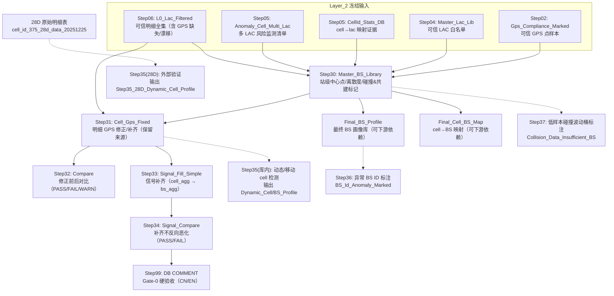

# Layer_3（基站库 → GPS 修正/补齐 → 信号补齐）Technical Manual

> Version: 1.1  
> Date: 2025-12-25  
> Scope: Layer_2 冻结输出 → Layer_3 Step30~34 + Gate-0 Comments  
> Status: In-use

## 1. 概述（Overview）

Layer_3 的定位：在 Layer_2 的“严格过滤可信集合”之上，产出可用于画像/建模的 **站级主库 + 明细修正库 + 信号补齐库**。

- 输入（冻结，必须存在）：
  - `public."Y_codex_Layer2_Step02_Gps_Compliance_Marked"`
  - `public."Y_codex_Layer2_Step04_Master_Lac_Lib"`
  - `public."Y_codex_Layer2_Step05_CellId_Stats_DB"`
  - `public."Y_codex_Layer2_Step05_Anomaly_Cell_Multi_Lac"`
  - `public."Y_codex_Layer2_Step06_L0_Lac_Filtered"`（必须 TABLE）
- 输出（固定命名）：
  - Step30：`public."Y_codex_Layer3_Step30_Master_BS_Library"`（基站主库）
  - Step31：`public."Y_codex_Layer3_Step31_Cell_Gps_Fixed"`（GPS 修正明细）
  - Step32：`public."Y_codex_Layer3_Step32_Compare"`（修正前后对比，PASS/FAIL/WARN）
  - Step33：`public."Y_codex_Layer3_Step33_Signal_Fill_Simple"`（信号补齐明细）
  - Step34：`public."Y_codex_Layer3_Step34_Signal_Compare"`（信号补齐对比，PASS/FAIL）
  - Step99：DB COMMENT（Gate-0 硬验收）
  - Step35（可选附加，异常分层）：动态/移动 cell 标记（时间相关多质心）
    - 库内异常桶检测（基于 Step31，额外执行）：`public."Y_codex_Layer3_Step35_Dynamic_Cell_Profile"` / `public."Y_codex_Layer3_Step35_Dynamic_BS_Profile"`
    - 28 天外部验证（基于你提供的 28D 原始明细）：`public."Y_codex_Layer3_Step35_28D_Dynamic_Cell_Profile"`
  - Step36（可选附加，异常标注）：疑似异常 BS ID 标注（bs_id=0/1/过短 hex 等）
  - Step37（可选附加，异常标注）：低样本碰撞波动桶标注（7 天内不强结论）

工程约束：
- 不改业务口径，只把“可解释性、鲁棒性、止损策略”落到可复跑 SQL。
- 本层的 WARN 不等于失败：WARN=可继续，但必须解释并给 TopN 抽样。

## 2. 核心架构（Architecture）

Layer_3 = “站级画像 + 站级回填 + 信号补齐 + 可审计验收”：

1) Step30：基于可信 GPS 点聚合 **基站中心点** 与离散度指标，标记风险/碰撞
2) Step31：把“缺失/漂移/越界” GPS 在明细上回填为站点中心点，并记录来源
3) Step32：量化收益与风险规模（不吞 WARN）
4) Step33：对缺失信号字段做补齐（cell_agg 优先，退化到 bs_agg）
5) Step34：信号补齐是否“反向恶化”（硬验收 after<=before）
6) Step99：COMMENT 双语覆盖（Gate-0 硬阻断）
7) Step35（可选附加）：对异常桶做“多质心 + 时间相关性”检测，命中则标记为动态cell/动态bs，用于把“周期性变化”从混桶样本里剥离出来

### 2.1 流程图（Flowchart）

### 2.2 每一步的目的（速览）

| Step | 输入（核心） | 输出（核心） | 目的（1 句话） |
|---:|---|---|---|
| 30 | Step02/04/05/06 | `Y_codex_Layer3_Step30_Master_BS_Library` | 构建可信 BS 桶中心点与质量画像，并标记共建/碰撞/结构性风险。 |
| 31 | Step06 + Step30 | `Y_codex_Layer3_Step31_Cell_Gps_Fixed` | 用 BS 中心点对明细 GPS 做修正/补齐，保留回溯字段与来源标记。 |
| 32 | Step31（及 Step06 对照） | `Y_codex_Layer3_Step32_Compare` | 量化修正收益与风险规模，输出 PASS/FAIL/WARN 以便验收拍板。 |
| 33 | Step31 | `Y_codex_Layer3_Step33_Signal_Fill_Simple` | 对信号字段缺失做补齐（优先 cell 画像，退化到 bs 画像）。 |
| 34 | Step33 | `Y_codex_Layer3_Step34_Signal_Compare` | 硬验收信号补齐不“反向变差”（after<=before）。 |
| 99 | Step30~34 | COMMENT 写入 | 把可读性固化为 Gate-0（CN/EN COMMENT 100%）。 |
| 35（库内） | Step31 + 异常桶 | Dynamic_Cell/BS/Profile | 在异常桶内识别“时间相关多质心”的动态/移动 cell，用于异常样本剥离。 |
| 35（28D） | 28 天原始明细表 | `Y_codex_Layer3_Step35_28D_Dynamic_Cell_Profile` | 用更长窗口复核动态/移动 cell（解决 7 天稳定性不足问题）。 |
| 36 | Final_BS_Profile | `Y_codex_Layer3_Step36_BS_Id_Anomaly_Marked` | 标注疑似异常 BS ID（bs_id=0/1/过短 hex），先标注再评估。 |
| 37 | Step30 | `Y_codex_Layer3_Step37_Collision_Data_Insufficient_BS` | 标注“低样本导致波动”的碰撞疑似桶，7 天内不强结论。 |

## 3. 执行顺序（Execution Order）

服务器侧建议用 `psql -f`，按顺序执行：

1. `lac_enbid_project/Layer_3/sql/30_step30_master_bs_library.sql`
2. `lac_enbid_project/Layer_3/sql/31_step31_cell_gps_fixed.sql`
3. `lac_enbid_project/Layer_3/sql/32_step32_compare.sql`
4. `lac_enbid_project/Layer_3/sql/33_step33_signal_fill_simple.sql`
5. `lac_enbid_project/Layer_3/sql/34_step34_signal_compare.sql`
6. `lac_enbid_project/Layer_3/sql/99_layer3_comments.sql`
7. （可选）`lac_enbid_project/Layer_3/sql/35_step35_dynamic_cell_bs_detection.sql`
7.1 （可选）`lac_enbid_project/Layer_3/sql/35_step35_dynamic_cell_28d_validation.sql`（仅在你已准备 28D 原始明细表时执行）
8. （可选）`lac_enbid_project/Layer_3/sql/36_step36_bs_id_anomaly_mark.sql`
9. （可选）`lac_enbid_project/Layer_3/sql/37_step37_collision_data_insufficient_mark.sql`

说明：
- `lac_enbid_project/Layer_3/sql/00_layer3_placeholders.sql` 为 no-op 占位文件，不需要执行。
- Step35 不属于主链路的 Gate-0 硬验收；它是“异常数据附加处理”，用于后续治理与分析。

## 4. 分步说明（Step-by-Step）

### Step30：基站主库（Master BS Library）

- 文件：`lac_enbid_project/Layer_3/sql/30_step30_master_bs_library.sql`
- 目的：
  1) 以 `Step06_L0_Lac_Filtered` 定义“基站桶全集”
  2) 从 `Step02_Gps_Compliance_Marked` 提取可信 GPS 点，聚合站点中心
  3) 输出站点中心 + 离散度 + 碰撞/风险标记，供 Step31 回填使用
- 关键分桶键：`wuli_fentong_bs_key = tech_norm|bs_id|lac_dec_final`

#### Step30 核心算法（必须与实现一致）

0) **硬过滤（占位键止血）**
- `bs_id=0` / `cell_id_dec=0` 视为非法占位：不应进入“可信 BS 库”口径
- 实现上同时约束：
  - 桶全集（Step06）侧：不纳入 `bs_id=0/cell_id_dec=0` 的桶
  - 可信点集（Step02）侧：不纳入 `cell_id_dec=0` 的点

1) **点集定义（可信 GPS 点）**
- 仅使用 `is_compliant=true AND has_gps=true`
- 排除 `(0,0)` 与明显越界；本轮口径：仅保留中国粗框  
  `lon BETWEEN 73 AND 135 AND lat BETWEEN 3 AND 54`

2) **LAC 归一（确保点落到“最终 LAC”桶）**
- 若 LAC 在 Step04 可信白名单中：用原始 `lac_dec`
- 否则：用 Step05 映射证据（仅在 `lac_choice_cnt=1` 时使用 `lac_dec_from_map`）

3) **中心点估计：信号优先（你已确认）**
- 先清洗 RSRP：`sig_rsrp IN (-110,-1) OR sig_rsrp>=0` 视为无效
- 对每个桶，按“有效信号点数”选择种子口径：
  - 有效信号点 `>=50`：取 Top50（近似为“高信号分位阈值”以上）
  - 有效信号点 `>=20`：取 Top20
  - 有效信号点 `<20 且 >=1`：取 Top80%（丢弃最差 20%）
  - 有效信号点不足（<5）：回退到全量点的中位数中心
- 种子中心点：经纬度中位数（`percentile_cont(0.5)`）

4) **点级离群点剔除（一次）**
- 用种子中心计算每点距离（haversine）
- 若桶内最大距离 `> 2500m`，则剔除 `dist>2500m` 的点；否则不剔除（避免误伤）
- 剔除后重算中心点（仍使用“信号优先”口径；若信号不足则回退全量）

5) **离散度指标与碰撞疑似**
- `gps_p50_dist_m/gps_p90_dist_m/gps_max_dist_m`：点到中心距离分布
- `gps_valid_level`（站点可用性）：
  - Unusable：有效 cell 数=0
  - Risk：有效 cell 数=1
  - Usable：有效 cell 数>1
- `is_collision_suspect`：
  - `anomaly_cell_cnt>0`（多 LAC 异常监测清单命中）⇒ 1
  - 或 `gps_p90_dist_m > 1500m` ⇒ 1

### Step31：GPS 修正与补齐（Cell GPS Fixed）

- 文件：`lac_enbid_project/Layer_3/sql/31_step31_cell_gps_fixed.sql`
- 目的：把 Step06 明细中“缺失/漂移/越界”的 GPS 修正为基站中心点，并记录来源与风险

关键口径：
- **非中国坐标**：不删行，直接按 `Missing` 处理；后续可由站点中心回填
- Drift 判定：若原始点与站点中心距离 `> 1500m` ⇒ `gps_status='Drift'`

止损策略（防止错误回填）：
- 严重碰撞/多团聚类（启发式）：`is_collision_suspect=1 AND anomaly_cell_cnt=0 AND point>=50 AND p50>=5km`
  - 命中时：禁止回填/纠偏（保持为 Missing/原值），避免把错中心覆盖到明细

输出关键字段：
- `gps_status`：Verified/Missing/Drift（原始判定）
- `gps_status_final`：Verified/Missing（回填后）
- `gps_source`：Original_Verified / Augmented_from_BS / Augmented_from_Risk_BS / Not_Filled

### Step32：修正前后对比（Compare）

- 文件：`lac_enbid_project/Layer_3/sql/32_step32_compare.sql`
- 目的：量化本次修正的收益与风险规模，输出 PASS/FAIL/WARN（允许 WARN，但不可吞）

### Step33：信号补齐（Simple Fill）

- 文件：`lac_enbid_project/Layer_3/sql/33_step33_signal_fill_simple.sql`
- 目的：对信号字段缺失做补齐，并记录补齐来源（cell_agg/bs_agg/none）

关键点：
- `sig_rsrp` 先清洗（无效置 NULL），避免把占位值聚合进画像
- 补齐优先级：cell 中位数画像 > bs 中位数画像 > none

### Step34：信号补齐对比（Signal Compare）

- 文件：`lac_enbid_project/Layer_3/sql/34_step34_signal_compare.sql`
- 目的：硬验收“补齐后缺失数不应变多”（after<=before），本轮采用方案 A：只输出 PASS/FAIL

### Step99：DB COMMENT（Gate-0 硬验收）

- 文件：`lac_enbid_project/Layer_3/sql/99_layer3_comments.sql`
- 目的：把“可读性”固化成可机器校验的硬门禁（CR-01）
- 要求：所有表/字段 COMMENT 必须包含 `CN:` 与 `EN:`

### Step35（可选）：动态 Cell / 动态 BS 检测（异常数据附加处理）

- 文件：`lac_enbid_project/Layer_3/sql/35_step35_dynamic_cell_bs_detection.sql`
- 目的：
  - 针对 Step30 标记为异常/疑似碰撞的桶，做一次“多质心 + 时间相关性”检测；
  - 若发现某些 cell 的主导质心随时间呈现清晰切换/周期切换，则标记为 **动态 cell**；
  - 同时输出 **动态 BS**（哪些桶被动态 cell 命中）；
  - 排除动态 cell 后若异常仍严重，再进入下一轮定位（引入更多参数/规则），避免在当前参数体系里反复死磕。

#### Step35 判定口径（刻意简化，便于快速分层）

1) 异常桶集合：
- 默认只对 `is_collision_suspect=1` 的桶计算；
- 默认再收敛：仅关注 `gps_p90_dist_m >= 5000m` 的“重异常桶”（可在 SQL 顶部 `params` 调整）。

2) 多质心与“时间-质心相关性”：
- 从 Step31 取 `lon_raw/lat_raw`（原始点，非回填）；
- 坐标按 `round(..., 3)`（~100m 级）落到网格；
- 对每个 cell 的每一天：取“点数最多的网格”为 **当日主导质心**；
- 将时间窗按天分成前半/后半：
  - 若两半的主导质心不同；
  - 且两半各自主导一致性足够高（按“天占比”阈值）；
  - 且两半主导质心距离足够大（默认 >=10km）；
  - 则判为 `is_dynamic_cell=1`。

> 这一步的策略取向是：只要检测到明显“周期/切换”，就优先认为不是混桶（用于异常样本剥离），准确度不是本轮重点。

3) 输出（实体表）：
- `public."Y_codex_Layer3_Step35_Dynamic_Cell_Profile"`：cell 级标记与原因（含两半主导质心、距离、切换次数等）
- `public."Y_codex_Layer3_Step35_Dynamic_BS_Profile"`：桶/站级被动态 cell 命中的统计
- `public."Y_codex_Layer3_Step35_Dynamic_Impact_Bucket"`：排除动态 cell 后的 p50/p90/max 对比（快速判断异常是否已被解释）

### Step35（补充）：28 天外部验证（针对 375 scoped cells）

背景：7 天窗口下，“动态/移动 cell”往往因为天级稳定性不足而无法判定；因此使用你准备的 28 天原始明细表做复核，直接回答“是否存在时间相关多质心切换”，用于把这类样本从疑似混桶中先剥离。

本次验证的落表与报告（2025-12-25）：

- 输入表：`public.cell_id_375_28d_data_20251225`
- 文件：`lac_enbid_project/Layer_3/sql/35_step35_dynamic_cell_28d_validation.sql`
- 结果表：`public."Y_codex_Layer3_Step35_28D_Dynamic_Cell_Profile"`
- 报告：`lac_enbid_project/Layer_3/reports/Step35_dynamic_cell_validation_28d_20251225.md`

结论摘要：

- 28 天窗口内参与判定 scoped cell：577
- 判为动态/移动：7（用于异常样本剥离；不改主链路产物）

### Step36（可选）：疑似异常 BS ID 标注（bs_id=0/1/过短 hex）

目的：虽然主链路已经避免 bs_id=0 的回填污染，但在桶全集/中间表中仍可能残留极少量 `bs_id=0`、`bs_id=1` 或 `bs_id_hex` 过短（通常意味着 bs_id 过小、疑似解析异常）的问题样本。该类本轮不强行修复口径，只做标注，后续拿更多数据/回到上游再评估。

- 文件：`lac_enbid_project/Layer_3/sql/36_step36_bs_id_anomaly_mark.sql`
- 输出（建议表）：`public."Y_codex_Layer3_Step36_BS_Id_Anomaly_Marked"`

### Step37（可选）：数据不足导致的碰撞波动桶标注

目的：在 7 天窗口内，部分桶因用于建中心的“可信 GPS 点”过少（低样本）而导致离散度指标波动，从而被 Step30 标为 `is_collision_suspect=1`。该类不适合在 7 天内强行做混桶结论，建议先标注，等待更长窗口复核（例如 28 天）。

- 文件：`lac_enbid_project/Layer_3/sql/37_step37_collision_data_insufficient_mark.sql`
- 输出（建议表）：`public."Y_codex_Layer3_Step37_Collision_Data_Insufficient_BS"`

## 5. 冒烟测试（Smoke Test）

用途：只验证“SQL 能跑通 + 关键不变量成立”，不用于生产结果。

在同一会话中设置：
- `SET codex.is_smoke='true';`
- `SET codex.smoke_report_date='2025-12-01';`
- `SET codex.smoke_operator_id_raw='46015';`（数据量最小）

然后按 Step30→31→32→33→34→99 依次 `psql -f` 执行即可。

说明：
- 本项目的冒烟属于“按 operator/date 切片”，仍然会创建正式表名（会先 DROP 再 CREATE），因此冒烟只应在“临时库/或事务里回滚”执行。

## 6. 验收清单（Acceptance Checklist）

最低验收（建议每次全量重跑后执行）：

1) Step30 主键唯一：dup_cnt=0
2) Step31/33 行数一致：`Step33_cnt == Step31_cnt == Step06_valid_cnt`（必须剔除 `bs_id=0` / `cell_id_dec=0` 的占位行，避免污染画像与映射）
3) Step32：FAIL=0（允许 WARN，但必须解释与给 TopN）
4) Step33：不存在 `signal_missing_after_cnt > signal_missing_before_cnt`
5) Gate-0：COMMENT 双语覆盖 100%（RUNBOOK v3 Gate-0 SQL）
6) 下游使用表不含占位键：`public."Y_codex_Layer3_Final_BS_Profile"` / `public."Y_codex_Layer3_Final_Cell_BS_Map"` 中 `bs_id=0 OR cell_id_dec=0` 必须为 0

权威验收来源：
- `lac_enbid_project/Layer_3/Layer_3_执行计划_RUNBOOK_v3.md`
- `lac_enbid_project/Layer_3/Layer_3_验收报告模板_v3.md`

## 7. 异常分层与处置建议（2025-12-25 对齐版）

本节用于“把异常说清楚”：我们构建可信 BS 库并实施 GPS 修正的同时，明确三类已识别的异常，并给出是否需要治理的结论与后续动作。

### 7.1 异常类型 1：动态/移动 cell 导致的 BS 异常（时间相关多质心）

判定目标：若同一 scoped cell `(operator_id, tech, cell_id)` 在时间上呈现“主导质心切换/周期切换”，更像移动/动态，而不是混桶。

处置策略：

- 先用 28 天验证把“明显动态”的 cell 标出来并剥离；
- 剥离后若桶级异常仍严重，再进入“混桶路径”做更深入治理（引入更多参数/规则）。

当前进度：

- 28 天外部验证已完成，标注 7 个动态/移动 scoped cell：见 `lac_enbid_project/Layer_3/reports/Step35_dynamic_cell_validation_28d_20251225.md`。

### 7.2 异常类型 2：数据不足导致的波动异常（7 天内不可判定）

典型形态：7 天窗口内用于建中心的可信点数太少（低样本），导致 p90/max 对单点极其敏感，从而出现“看起来很异常”的桶；但在更长窗口（例如 28 天）复核后往往恢复稳定。

处置策略：

- 7 天窗口：不做强结论，只做标注（Step37），并要求更长窗口复核；
- 28 天窗口：若点云稳定（例如 `p90` 在几百米内、无时间相关切换），则可视为“无需治理”。

当前可量化规模（基于 Step30，2025-12-25）：

- `is_collision_suspect=1` 的桶总数：6854
- 其中用于建中心的可信点数 `<20` 的桶：1793（建议归为“数据不足/波动异常候选”，优先等待更长窗口复核）

### 7.3 异常类型 3：疑似异常 BS ID（bs_id=0/1/过短 hex 等）

现象：即使主链路避免了 `bs_id=0` 的回填污染，桶全集/中间表中仍可能残留极少量 `bs_id=0`、`bs_id=1`、或 `bs_id_hex` 过短（通常意味着 bs_id 过小、疑似解析异常）的记录。

处置策略：

- 不在本轮强行修复上游解析/口径（避免扩大影响面）；
- 先通过 Step36 统一标注；后续拿更多天数据或回到 Layer_2/解析口径再评估是否需要剔除/修复。

参考现状（用于你快速判断规模是否“很小”，2025-12-25）：

- Step30 中 `bs_id=0` 的桶：103
- Step30 中 `bs_id in [1,999]` 的桶：35（其中 `bs_id=1` 为 1）
- Step06/Step31/Step33 过程中仍可见占位键：当前库内约 258 行；最终交付表（Final_*）已保证不含占位键
- Step36 标注表（最终 BS 画像视角）当前命中：41 个 `wuli_fentong_bs_key`（35 个 4G + 5 个 5G + 1 个 bs_id=1）：`public."Y_codex_Layer3_Step36_BS_Id_Anomaly_Marked"`

> 实战建议：对下游（画像/建模/Layer_4）只使用 `public."Y_codex_Layer3_Final_BS_Profile"` 与 `public."Y_codex_Layer3_Final_Cell_BS_Map"`；中间过程表（Step31/33）允许保留极少量占位键用于追溯，但必须可被一致地识别与排除。

### 7.4 （补充）结构性异常：Step05 multi-LAC cell（非“动态/数据不足/BS_ID”三类）

现象：同一 `cell_id` 在 Layer_2 Step05 被标记为“多 LAC 异常”（`public."Y_codex_Layer2_Step05_Anomaly_Cell_Multi_Lac"`），这类更像“结构性口径风险”，不等价于动态/移动，也不等价于低样本波动。

当前实现中的落点：

- Step30：`collision_reason` 可能为 `STEP05_MULTI_LAC_CELL`（或与其它原因拼接）
- Step30：`anomaly_cell_cnt>0` 作为监测字段（用于后续止损/解释）

建议：该类异常不在本轮强行治理，优先作为“结构性风险标签”携带到后续分析（或回到 Layer_2 解析/映射口径处修复）。
