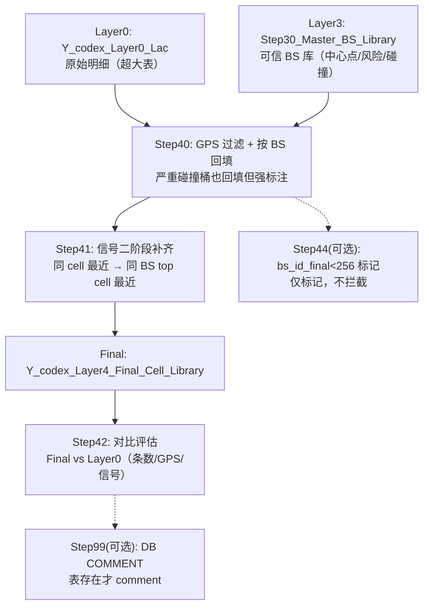

# Layer_4（按 BS 纠偏 GPS → 补齐 cell 信号 → 最终 cell_id 明细库）Technical Manual

> Version: 1.1  
> Date: 2025-12-26  
> Scope: 基于 `public."Y_codex_Layer0_Lac"` 构建 Layer_4 最终 cell 明细库（Step40~44 + Step99）  
> Status: In-use

## 1. 概述（Overview）

Layer_4 的定位：在 Layer_3 已构建的 **可信 BS 库** 基础上，对 Layer0 超大明细做“按 BS 的 GPS 纠偏/补齐 + 信号补齐”，产出一个可用于下游画像/建模的 **补齐后的 cell 明细库**，并用对比表量化收益。

输入（必须存在）：

- 原始明细库：`public."Y_codex_Layer0_Lac"`（超大表）
- 可信 BS 主库（Layer_3 产物）：`public."Y_codex_Layer3_Step30_Master_BS_Library"`
- LAC/映射支撑（用于 `lac_dec_final`）：
  - `public."Y_codex_Layer2_Step04_Master_Lac_Lib"`
  - `public."Y_codex_Layer2_Step05_CellId_Stats_DB"`

输出（固定命名）：

- Step40：`public."Y_codex_Layer4_Step40_Cell_Gps_Filter_Fill"`（GPS 过滤+按 BS 回填后的明细）
- Step40 指标：`public."Y_codex_Layer4_Step40_Gps_Metrics"`
- Step41（Final）：`public."Y_codex_Layer4_Final_Cell_Library"`（信号补齐后的最终明细库）
- Step41 指标：`public."Y_codex_Layer4_Step41_Signal_Metrics"`
- Step42：`public."Y_codex_Layer4_Step42_Compare_Summary"`（最终库 vs 原始库对比汇总）
- Step43（可选）：`public."Y_codex_Layer4_Step40_Gps_Metrics_All"` / `public."Y_codex_Layer4_Step41_Signal_Metrics_All"`（shard 汇总 + rollup）
- Step44（可选）：`public."Y_codex_Layer4_Step44_BsId_Lt_256_Detail"` / `public."Y_codex_Layer4_Step44_BsId_Lt_256_Summary"`（bs_id_final<256 异常标记）
- Step99（可选）：DB COMMENT（可读性闭环；已做“表存在才 comment”）

参考报告（本轮全量已生成，DB=`ip_loc2`）：

- `lac_enbid_project/Layer_4/reports/Layer_4_Report_补齐效果_ip_loc2_20251226.md`

工程约束：

- 主链路不引入“全局大 JOIN 回填”：以 BS 为单位，尽量靠分桶/分片实现可扩展。
- 严重碰撞桶策略：为保证“可解释（看得到原因）”，本轮**仍回填**但强标注（`is_severe_collision/collision_reason/gps_source`）；下游若要严格过滤，用标签拦截即可。
- 信号补齐：本轮策略是“能补就补（逐字段 COALESCE）”，后续再评估字段清洗与强约束。

## 2. 核心架构（Architecture）

Layer_4 = “GPS 纠偏/补齐（按 BS） + 信号补齐（按时间最近） + 可审计对比”：

1) Step40：以可信 BS 中心点为参照，过滤离群 GPS，并按 BS 回填（严重碰撞桶也回填但强标注）
2) Step41：信号字段二阶段补齐（同 cell 最近 → 同 BS top cell 最近）
3) Step42：Final vs Raw 汇总对比（条数/GPS/信号）
4) Step44：标记 `bs_id_final<256`（仅标记，不拦截）
5) Step99：COMMENT 闭环（可选）

### 2.1 流程图（Flowchart）

### 2.2 每一步的目的（速览）

| Step | 输入 | 输出 | 目的 |
|---:|---|---|---|
| 40 | `Y_codex_Layer0_Lac` + `Layer3_Step30_Master_BS_Library` | `Y_codex_Layer4_Step40_Cell_Gps_Filter_Fill` | 以 BS 中心点为参照，过滤离群 GPS 并按 BS 回填，保留来源标记与异常标注（含严重碰撞桶）。 |
| 41 | Step40 | `Y_codex_Layer4_Final_Cell_Library` | 对信号字段做二阶段补齐：同 cell 时间最近优先，不足则退化到同 BS 的 top cell。 |
| 42 | Layer0 + Final | `Y_codex_Layer4_Step42_Compare_Summary` | 输出“原始库 vs 最终库”的对比汇总，回答是否补齐有效、是否引入异常。 |
| 43（可选） | Step40/41 metrics | `*_Metrics_All` | 汇总 shard 指标 + rollup（shard_id=-1），便于一眼查看全量结果。 |
| 44（可选） | Step40 | `Step44_*` | 标记 `bs_id_final<256` 的疑似编码异常样本（仅标记）。 |
| 99（可选） | 主链路产物 | COMMENT | 为关键表补齐 CN/EN 注释，提升可读性与可交付性。 |

## 3. 执行顺序（Run Order）

主链路（必须）：

1. `lac_enbid_project/Layer_4/sql/40_step40_cell_gps_filter_fill.sql`
2. `lac_enbid_project/Layer_4/sql/41_step41_cell_signal_fill.sql`
3. `lac_enbid_project/Layer_4/sql/42_step42_compare.sql`

可选附加：

4. `lac_enbid_project/Layer_4/sql/43_step43_merge_metrics.sql`（仅在 `shard_count>1` 或需要 rollup 时跑）
5. `lac_enbid_project/Layer_4/sql/44_step44_bs_id_lt_256_mark.sql`（异常标记）
6. `lac_enbid_project/Layer_4/sql/99_layer4_comments.sql`（COMMENT 闭环）

## 4. 关键口径（对齐版）

### 4.1 GPS 过滤阈值（城市模式）

当前研究场景为城市：

- 4G：`dist_threshold_m = 1000`
- 5G：`dist_threshold_m = 500`

未来扩展（预留）：阈值应按 `lac` 决定（非城市 lac 放大阈值）；本轮在 SQL `params` 中保留参数位，不引入额外表依赖。

### 4.2 严重碰撞桶策略（回填但强标注）

当桶满足“严重碰撞”的启发式条件时：

- 仍按 BS 中心点进行回填（避免最终库出现大量 NULL 导致“看不懂为什么空”）。
- 同时强标注：`is_severe_collision=true` + `collision_reason` + `gps_source`（区分是否来自严重碰撞桶回填）。
- 下游若要严格过滤/降权：直接用 `is_severe_collision/is_collision_suspect/gps_status` 做策略即可。

### 4.3 信号补齐策略（二阶段）

对每条记录：若存在可补齐信号字段（任一为 NULL）：

1) 同 `cell_id_dec`：选择 **时间最近** 的一条 donor 记录（只要求 donor 至少有一个信号值可用），用 `coalesce(target, donor)` 逐字段补齐。
2) 若同 cell 无任何 donor：在同 BS 桶（`bs_group_key = COALESCE(wuli_fentong_bs_key, bs_shard_key)`）下选“数据量最多且存在信号的 cell_id”作为 donor_cell，仍按“时间最近”找 donor 记录补齐。

输出：最终信号字段以 `sig_*_final` 形式落表（不覆盖原始 `sig_*`），并记录 `signal_fill_source/signal_donor_seq_id` 便于追溯。

指标口径说明：

- `need_fill_row_cnt`：信号字段（本轮共 8 个）中**至少有 1 个为空**的行数。由于某些字段（例如 `sig_ss`）天然缺失较多，实际运行中该值可能非常接近总行数；更建议用 `missing_field_before_sum → missing_field_after_sum` 或 `filled_field_sum` 评估补齐收益。

说明：信号字段本轮先“能补就补”（全字段），后续再评估哪些字段需要强约束/清洗规则。

### 4.4 ENBID/gNB 编码异常（仅标记）

本轮对 `bs_id_final BETWEEN 1 AND 255` 的样本只做标记，不拦截（原因与规则见 `lac_enbid_project/Layer_1/Enbid/Enbid_Filter_Rules_v1.md`）。

## 5. 分步说明（Step-by-Step）

### Step40：GPS 过滤 + 按 BS 回填（严重碰撞桶也回填但强标注）

- 文件：`lac_enbid_project/Layer_4/sql/40_step40_cell_gps_filter_fill.sql`
- 关键点：
  - 明细输入来自 Layer0：不依赖 Layer_2 Step06（避免“城市研究”被 Layer2 口径约束住）
  - `bs_id_final`：优先取原始 `bs_id`，否则由 `cell_id_dec` 推导（4G `/256`，5G `/4096`）
  - `lac_dec_final`：若 LAC 在可信白名单中用原值，否则尝试用 Step05 的唯一映射
  - Join BS 库键：`wuli_fentong_bs_key = tech_norm|bs_id_final|lac_dec_final`（lac 为空时会导致无法关联 BS 库）

输出关键字段（用于审计）：

- `gps_status`：Verified/Missing/Drift（基于原始点与 BS 中心距离）
- `gps_fix_strategy`：keep_raw / fill_bs_severe_collision / fill_bs / fill_risk_bs / not_filled
- `gps_source`：Original_Verified / Augmented_from_BS_SevereCollision / Augmented_from_BS / Augmented_from_Risk_BS / Not_Filled
- `is_severe_collision`：命中严重碰撞桶则 true（仍回填，但建议下游降权/过滤）

### Step41：信号二阶段补齐（时间最近）

- 文件：`lac_enbid_project/Layer_4/sql/41_step41_cell_signal_fill.sql`
- donor 选择（简化但可解释）：
  - 同 cell：只在窗口内找“前一条 donor / 后一条 donor”，选更近的作为时间最近
  - 若同 cell 无 donor：在同 BS 桶（`bs_group_key=COALESCE(wuli_fentong_bs_key, bs_shard_key)`）选“数据量最多且有信号”的 cell 作为 donor_cell，再找其时间最近 donor
- 输出：
  - 保留原始 `sig_*`，补齐结果写入 `sig_*_final`
  - `signal_fill_source/signal_donor_seq_id` 可追溯补齐来源
  - 追加动态/移动 Cell 标注（来自 Layer_3 Step35 结果映射）：`is_dynamic_cell/dynamic_reason/half_major_dist_km`

### Step42：Final vs Raw 对比汇总

- 文件：`lac_enbid_project/Layer_4/sql/42_step42_compare.sql`
- 输出：`public."Y_codex_Layer4_Step42_Compare_Summary"`
- 当 `codex.shard_count>1` 时自动 `UNION ALL` 汇总 Final shard 表（无需先物理合并）

### Step43（可选）：汇总 shard 指标

- 文件：`lac_enbid_project/Layer_4/sql/43_step43_merge_metrics.sql`
- 输出：`*_Metrics_All`（包含 rollup 行 `shard_id=-1`）

### Step44（可选）：bs_id_final<256 标记

- 文件：`lac_enbid_project/Layer_4/sql/44_step44_bs_id_lt_256_mark.sql`
- 输出：`Step44_*`（仅用于复核/降权，不影响主链路）

### Step99（可选）：DB COMMENT（可读性闭环）

- 文件：`lac_enbid_project/Layer_4/sql/99_layer4_comments.sql`
- 特性：已做“表存在才 comment”，允许在不同执行阶段重复跑

## 6. 冒烟测试（Smoke Test）

### 6.1 psql 冒烟（支持 DO 块）

在同一会话中设置（示例）：

- `SET codex.is_smoke='true';`
- `SET codex.smoke_date='2025-12-01';`
- `SET codex.smoke_operator_id_raw='46000';`
- `SET codex.shard_count='1'; SET codex.shard_id='0';`

然后按 40→41→42 依次执行即可。

### 6.2 MCP/DBHub 冒烟（不支持 DO 块）

DBHub MCP 的 `execute_sql` 可能无法执行 `DO $$...$$`。如需用 MCP 做快速验证，请使用无 DO 版本（固定输出到 `__MCP_SMOKE` 表）：

- `lac_enbid_project/Layer_4/sql/mcp_smoke/40_step40_cell_gps_filter_fill__mcp_smoke.sql`
- `lac_enbid_project/Layer_4/sql/mcp_smoke/41_step41_cell_signal_fill__mcp_smoke.sql`
- `lac_enbid_project/Layer_4/sql/mcp_smoke/42_step42_compare__mcp_smoke.sql`

## 7. 验收清单（Acceptance Checklist）

最低验收（建议每次全量重跑后检查）：

1) 产物表存在：Step40 / Final / Step42  
2) 行数不变量：`count(Final) == count(Step40)`  
3) GPS 不变量：`Final.gps_missing_cnt == Step40.gps_not_filled_cnt`（同口径下）  
4) 信号收益：`missing_field_after_sum <= missing_field_before_sum` 且 `filled_field_sum > 0`  
5) Step42 能回答 before/after（条数、GPS 缺失、信号缺失）  
6) （可选）Step44 标记规模很小且可解释（本轮为“仅标记”）  
7) （可选）COMMENT 存在（便于交付）  

## 8. 性能与分片（Sharding Notes）

主链路 SQL（Step40/41/42/43）支持通过 session setting 分片：

- `SET codex.shard_count='N'`
- `SET codex.shard_id='k'`（0..N-1）

分片键：

- `bs_shard_key = tech_norm|bs_id_final`（按 BS 维度分片，避免按全局表扫）

说明：

- 当 `shard_count>1` 时，Step40/41 会输出到 shard 表（表名带 `__shard_XX`）。
- Step42 在 `shard_count>1` 时会自动 `UNION ALL` Final shard 表出对比汇总，无需先合并成单表。
- Step43 可把各 shard 的指标表做汇总并给 rollup 行（`shard_id=-1`）。

## 9. 异常分层与处置建议（Layer_4 视角）

本节用于把 Layer_4 运行时仍可能遇到的“剩余缺失/异常”说清楚，并给出不改变主链路口径的处置路径。

### 9.1 GPS 仍缺失（`gps_source='Not_Filled'`）

常见原因（优先级从高到低）：

1) 无法关联到 Layer_3 BS 库（`gps_valid_level is null`）：通常是 `lac_dec_final` 缺失或桶不在 BS 库覆盖范围  
2) BS 中心点缺失（`bs_center_lon/bs_center_lat is null`）：即使关联到 BS 库也无法回填  
3) BS 画像存在但不可回填（`gps_valid_level` 非 Usable/Risk）

建议动作：

- 若原因 1 占比高：优先检查 `lac_dec_final` 生成逻辑、或扩展 BS 库覆盖（更长窗口/更多数据）
- 若碰撞/漂移标注占比高：优先复核异常桶（拆分/修正）并在下游用 `is_severe_collision/is_collision_suspect/gps_status` 做降权或过滤

### 9.2 信号无法补齐（`signal_fill_source='none'`）

含义：当前行所在的“同 cell”与“同 BS top cell”路径均找不到任何 donor（`signal_donor_seq_id is null`）。

建议动作：

- 若规模可忽略：保持为缺失（本轮不强行生成伪信号）
- 若规模不可忽略：优先在更长窗口复核是否存在 donor；或明确哪些字段允许用聚合画像回退（未来评估）

### 9.3 bs_id 编码异常（`bs_id_final<256`）

本轮只做标记不拦截：

- 规则与解释：`lac_enbid_project/Layer_1/Enbid/Enbid_Filter_Rules_v1.md`
- 标记表：`public."Y_codex_Layer4_Step44_BsId_Lt_256_Detail"` / `public."Y_codex_Layer4_Step44_BsId_Lt_256_Summary"`
