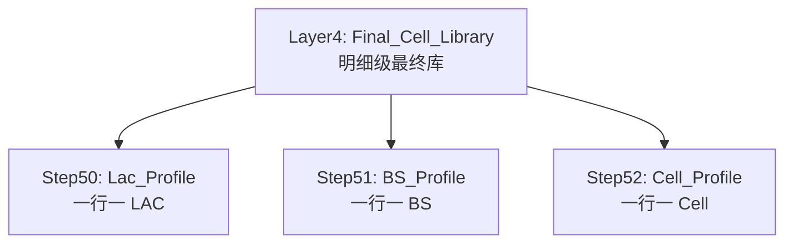

# Layer_5（LAC / BS / CELL 汇总画像库）Technical Manual

> Version: 1.0  
> Date: 2025-12-26  
> Scope: 从 `public."Y_codex_Layer4_Final_Cell_Library"` 产出 LAC/BS/CELL 三套画像汇总表  
> Status: Draft (In-use)

## 1. 概述（Overview）

Layer_5 的定位：把 Layer_4 的“明细级最终库”压缩成三类对象的“画像表”（一行一对象），用于：

- 下游建模/画像直接消费（避免重复扫明细）
- 作为“新进入数据”的初步筛选/降噪逻辑底座（先看画像是否可信/稳定）

输入：

- `public."Y_codex_Layer4_Final_Cell_Library"`

输出：

- LAC：`public."Y_codex_Layer5_Lac_Profile"`
- BS：`public."Y_codex_Layer5_BS_Profile"`
- CELL：`public."Y_codex_Layer5_Cell_Profile"`

字段命名约定（重要）：

- 三张画像表的**底表字段名为中文**（避免字段过多时阅读误解）。
- 同时提供英文视图（可选）：`public."Y_codex_Layer5_*_Profile_EN"`，便于后续 SQL/程序复用英文列名。

每张表的字段说明（独立文件，便于逐个修改）：

- `lac_enbid_project/Layer_5/tables/Y_codex_Layer5_Lac_Profile_字段说明.md`
- `lac_enbid_project/Layer_5/tables/Y_codex_Layer5_BS_Profile_字段说明.md`
- `lac_enbid_project/Layer_5/tables/Y_codex_Layer5_Cell_Profile_字段说明.md`

## 2. 核心架构（Architecture）

Layer_5 = “按对象聚合 → 输出可用于筛选的稳定指标/范围指标/覆盖指标”：

1) Step50：以 `(operator_id_raw, tech_norm, lac_dec_final)` 为键构建 LAC Profile
2) Step51：以 `(operator_id_raw, tech_norm, bs_id_final, lac_dec_final)` 为键构建 BS Profile
3) Step52：以 `(operator_id_raw, tech_norm, cell_id_dec, lac_dec_final)` 为键构建 CELL Profile

### 2.1 流程图（Flowchart）

## 3. 统计口径与字段标准（建议对齐版）

### 3.1 过滤口径（建议固定）

- `tech_norm IN ('4G','5G')`
- `operator_id_raw IN ('46000','46001','46011','46015','46020')`
- `cell_id_dec > 0`，`bs_id_final > 0`

### 3.2 时间口径

- 由于 `cell_ts_std` 可能存在异常值（会把活跃天数拉到几万天），本层统一使用 **`ts_fill`** 作为统计时间：
  - `event_ts_utc = ts_fill AT TIME ZONE 'UTC'`
- `first_cell_ts_utc / last_cell_ts_utc`：min/max(`event_ts_utc`)（timestamptz）
- `active_days_utc`：`count(distinct date(event_ts_utc at time zone 'UTC'))`

### 3.3 GPS 口径（范围/稳定性）

GPS 使用 Layer_4 的 `lon_final/lat_final`：

- 覆盖：`gps_present_cnt/gps_missing_cnt`
- 覆盖率：`gps_present_ratio` 以 **百分比（0~100）** 输出，保留 2 位小数
- 中心：推荐 `percentile_cont(0.5)`（中位数中心），作为鲁棒中心点
- 范围：对“点到中心距离”计算 `p50/p90/max`（单位米），输出保留 2 位小数
- 辅助：输出 `bbox`（min_lon/max_lon/min_lat/max_lat）便于快速 sanity check

> 未来扩展：GPS 范围阈值应按 `lac`（城市/非城市）动态调整；本轮先把范围指标落表，不在 Layer_5 强行给出硬阈值。

### 3.4 信号口径（覆盖/分布）

对 `sig_*_final` 输出：

- 每字段 `nonnull_cnt` 与 `null_cnt`
- 关键字段覆盖率：`sig_rsrp_nonnull_ratio/sig_rsrq_nonnull_ratio/sig_sinr_nonnull_ratio/sig_dbm_nonnull_ratio` 以 **百分比（0~100）** 输出，保留 2 位小数
- 可选：中位数（`percentile_cont(0.5)`）作为代表值

### 3.5 信号来源口径（原生 vs 补齐来源）

本轮**不做信号质量评分/加权**（需要独立公式才能评估），只把“原生 vs 补齐”的可解释统计落表，便于后续评估：

- `native_any_signal_row_cnt`：原始报文中 **任一** `sig_*` 非空的行数（原生有信号）
- `native_no_signal_row_cnt`：原始报文中 `sig_*` 全空的行数（原生无信号）
- `need_fill_row_cnt`：原始报文中信号字段存在缺失（`signal_missing_before_cnt>0`）的行数
- `filled_row_cnt`：本轮补齐后确实补上字段（`signal_filled_field_cnt>0`）的行数
- `filled_by_cell_nearest_row_cnt`：补齐来源为“同 Cell 时间最近”且补齐成功的行数（`signal_fill_source='cell_nearest' AND signal_filled_field_cnt>0`）
- `filled_by_bs_top_cell_nearest_row_cnt`：补齐来源为“同 BS 下数据量最大 Cell 的时间最近”且补齐成功的行数（`signal_fill_source='bs_top_cell_nearest' AND signal_filled_field_cnt>0`）
- `fill_failed_row_cnt`：需要补齐但失败的行数（`signal_missing_before_cnt>0 AND signal_filled_field_cnt=0`）
- `missing_field_before_sum / missing_field_after_sum / filled_field_sum`：字段级缺失/补齐总量（用于衡量补齐强度）

### 3.6 可用于筛选的标记字段（建议）

本层先提供“通用、可解释”的基础标记，避免过早定死业务阈值：

- `is_low_sample`：样本量不足（例如 `row_cnt < min_rows_for_profile`）
- `is_gps_unstable`：GPS 范围过大（例如 `gps_p90_dist_m > threshold_m`；阈值先参数化）
- `is_signal_sparse`：关键字段缺失率过高（如 `sig_rsrp_final` nonnull 率过低）

同时，为了让异常桶/异常 Cell “可解释（看得到为什么）”，在 BS/CELL 画像中补充异常标注字段（来自 Layer_4 明细与 Layer_3 动态 Cell 结果）：

- 碰撞/漂移：
  - `疑似碰撞标记 / 严重碰撞桶标记 / 碰撞原因`
  - `GPS漂移行数 / GPS漂移占比`（`gps_status='Drift'` 聚合）
- 动态/移动 Cell：
  - BS：`移动CELL去重数 / 含移动CELL标记`
  - CELL：`移动CELL标记 / 移动原因 / 移动半长轴KM`

### 3.7 多运营商（按两组）

本轮增加 LAC 级别的“多运营商共站”标记（用于快速识别跨组共享 BS）：

- 组1：`{46000,46015,46020}`
- 组2：`{46001,46011}`
- LAC 表新增：
  - `多运营商BS去重数`：该 `(运营商ID,制式,LAC)` 下，去重 BS 后跨组共享的数量
  - `多运营商BS标记`：`多运营商BS去重数>0`

## 4. 用于“新进入数据初筛”的推荐用法（建议）

典型用法：对新进入的明细（结构类似 Layer0/Layer4 明细）先做标准化（operator/tech/lac/cell→bs 推导），再分别 JOIN 到 Layer_5 的画像表，得到可解释的质量标记用于“先过滤/先降权/先分流”。

推荐 JOIN 键（与本层主键一致）：

- LAC：`(operator_id_raw, tech_norm, lac_dec_final)`
- BS：`(operator_id_raw, tech_norm, bs_id_final, lac_dec_final)`
- CELL：`(operator_id_raw, tech_norm, cell_id_dec, lac_dec_final)`

推荐初筛字段（示例，先软后硬）：

- GPS：`has_gps_profile=false` / `is_gps_unstable=true` / `gps_present_ratio` 过低
- 样本：`is_low_sample=true`
- 信号：`sig_rsrp_nonnull_ratio` / `sig_dbm_nonnull_ratio` 过低

> 注意：阈值建议按城市/非城市（lac）动态调整；本层默认只输出“范围指标 + 标记”，不把业务阈值写死。

## 5. 分步说明（Step-by-Step）

### Step50：LAC Profile

- 文件：`lac_enbid_project/Layer_5/sql/50_step50_lac_profile.sql`
- 输出：`public."Y_codex_Layer5_Lac_Profile"`

### Step51：BS Profile

- 文件：`lac_enbid_project/Layer_5/sql/51_step51_bs_profile.sql`
- 输出：`public."Y_codex_Layer5_BS_Profile"`

### Step52：CELL Profile

- 文件：`lac_enbid_project/Layer_5/sql/52_step52_cell_profile.sql`
- 输出：`public."Y_codex_Layer5_Cell_Profile"`

## 6. MCP 冒烟（可选）

如需用 MCP 快速验证 SQL 是否可跑（不建议 MCP 全量扫 30M+ 明细），可执行：

- `lac_enbid_project/Layer_5/sql/mcp_smoke/50_step50_lac_profile__mcp_smoke.sql`
- `lac_enbid_project/Layer_5/sql/mcp_smoke/51_step51_bs_profile__mcp_smoke.sql`
- `lac_enbid_project/Layer_5/sql/mcp_smoke/52_step52_cell_profile__mcp_smoke.sql`

它们会以“单日 + 单运营商”生成三张临时画像表（`Y_codex_Layer5_Smoke_*`），用于校验字段/口径与统计关系是否正常。

## 7. 口径确认（本轮结论）

本轮已确定：

1) **主键必须带 `lac_dec_final`**（LAC/BS/CELL 三套画像都按 `lac_dec_final` 分桶，不跨 LAC 合并）。  
2) **GPS 范围阈值可以参数化**：4G=1000m、5G=500m（城市口径）；未来补充“非城市 lac 放大阈值”的规则后再落硬阈值。  
3) **信号暂不做质量评分**：只输出 `sig_*_final` 覆盖统计 + “原生 vs 补齐来源”统计，用于后续评估与加权公式落地。
