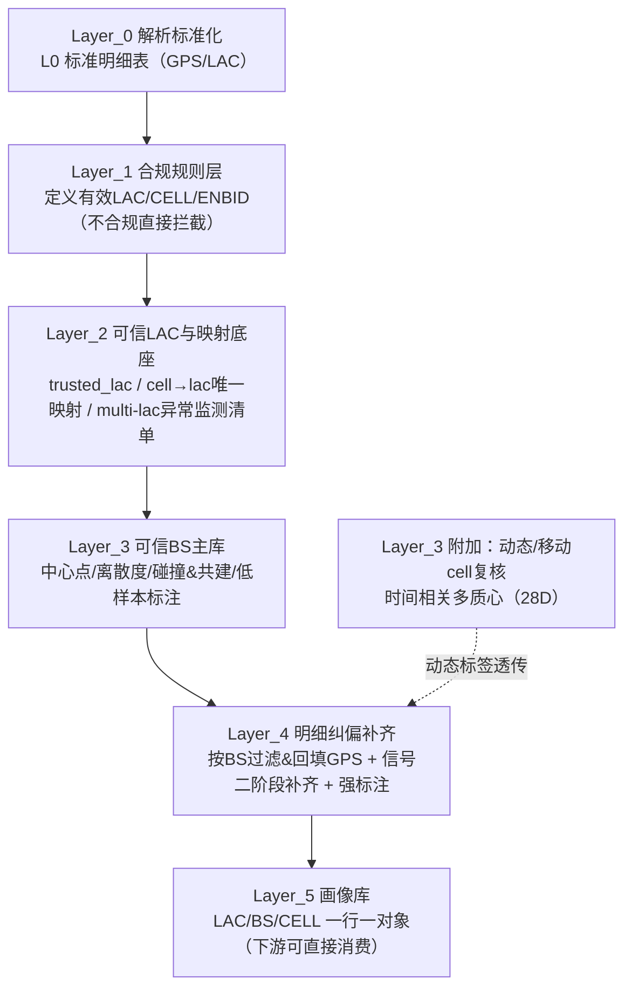

# Phase_1 工程交付版：端到端流程图 + 数据契约 + 验收口径（Layer_0 → Layer_5）

> Version: 1.0  
> Date: 2025-12-29  
> Audience: 工程团队 / 交接复跑  
> 目标：把“研究性跑通”的 Phase_1，固化为工程可实现、可复用、可验收的一套清洗补齐流程与数据标准（以“看懂优先”，不做代码细节优化）

---

## 0. Phase_1 要解决什么问题（一句话）

从原始超大明细出发，构建**可信 BS 主库**作为锚点，对明细实施 **GPS 纠偏/回填 + 信号补齐**，最终沉淀三套画像汇总表（LAC/BS/CELL）与一张可审计的补齐明细表，供下游筛选与评估。

本阶段交付的工程化关键不是“把 SQL 写得更快”，而是：

- 流程层：每一层为什么存在、解决什么问题、输入输出是什么
- 口径层：哪些值有效/无效、异常如何标注、阈值是什么、哪些是未来研究项
- 数据层：字段契约一致（尤其是跨 Layer 的字段对齐），并可穿透审计（before/after + 来源/原因）

---

## 1. 总体流程图（主干链路）

---

## 2. 主干产物清单（工程需落表/落视图）

| 层 | 主干产物（表/视图名） | 工程用途 |
|---:|---|---|
| L0 | `Y_codex_Layer0_Gps_base` / `Y_codex_Layer0_Lac` | 稳定解析后的统一输入（后续不再读源表） |
| L1 | `v_lac_L1_stage1` / `v_cell_L1_stage1`（规则视图） | 合规集合入口（无效值必须在此拦截） |
| L2 | `Y_codex_Layer2_Step04_Master_Lac_Lib` / `Y_codex_Layer2_Step05_CellId_Stats_DB` | trusted_lac 与 cell→lac 映射底座 + 异常监测清单 |
| L3 | `Y_codex_Layer3_Step30_Master_BS_Library` | BS 中心点/离散度/碰撞&共建（作为纠偏锚点） |
| L4 | `Y_codex_Layer4_Final_Cell_Library`（建议视为最终明细交付表） | 可审计补齐明细：GPS before/after + 补齐来源/原因 + 异常标签 |
| L5 | `Y_codex_Layer5_Lac_Profile` / `Y_codex_Layer5_BS_Profile` / `Y_codex_Layer5_Cell_Profile` | 画像汇总表：下游筛选/评估入口 |

---

## 3. 拍板口径（来自 `read.md` 的决策固化）

### 3.0 运营商分组与多运营商共建（必须落标）

运营商按两组理解与呈现（用于解释差异、以及“跨组共建”识别）：

- 组1（移动系）：`{46000,46015,46020}`
- 组2（联通 + 电信）：`{46001,46011}`

工程要求（必须）：

- BS 侧必须落标“多运营商共建/共用”：
  - `shared_operator_cnt/shared_operator_list`
  - `is_multi_operator_shared = (shared_operator_cnt > 1)`
- LAC 画像侧必须提供“跨组共站”快速识别标记（用于快速识别组1↔组2 的共享 BS）。

### 3.1 严重碰撞桶（Severe Collision Bucket）

- 策略：**回填 + 强标注**（保持可见，用于观测规模与随数据量变化的趋势）
- 下游默认：**不要求默认过滤**（但必须提供“可选过滤/降权”的推荐用法）
- 工程要求：最终明细与画像均必须可定位以下标签/原因：
  - 疑似碰撞标记（`is_collision_suspect`）
  - 严重碰撞桶标记（`is_severe_collision`）
  - 碰撞原因（`collision_reason`）
  - GPS 来源（`gps_source`，例如 `Augmented_from_BS_SevereCollision`）

### 3.2 无效 LAC（必须在 Layer_1 拦截，Layer_5 不得出现）

本项目口径下，以下属于**无效/占位 LAC**（示例，不限于）：

- 缺失：`NULL` / 空串
- 数值占位：`-1` / `0` / `1`
- 溢出/占位（十六进制）：`FFFF`、`FFFFFF`、`FFFE`、`FFFFFE`、`7FFFFFFF`
- 过小值：`lac_dec < 0x0101`（含 `0x0000`、`0x0001` 等）

工程要求：

- Layer_1 明确“有效 LAC”定义；无效 LAC **不进入可信集合/画像库**。
- 若后续由 `cell_id` 映射回补引入 LAC，则必须回补为**有效值**；仍无法回补的记录可以保留在明细表中（用于审计），但 Layer_5 画像必须按“有效 LAC”入库。

### 3.3 城市/非城市阈值（Phase_2 研究项）

- Phase_1 暂使用固定阈值（城市研究口径）：4G=1000m，5G=500m
- Phase_2 拟研究：不是简单“城市/非城市”二分类，而是基于密度/特征识别“长程/非城市型 LAC”，并在 LAC 画像中落标与调参

### 3.4 BS ID 异常（必须全链路可见）

- 结论：BS ID 编码/解析异常必须进入最终明细与 Layer_5 画像的显式标签字段（不只停留在单独标注表）

### 3.5 信号补齐评估（先标注，后续补齐）

- Phase_1：只要求“补齐过程可追溯 + 指标字段预留/标注”
- Phase_2：待数据到位后，再固定关键字段集合并做质量评估口径

### 3.6 字段命名规范（中文优先 + 跨 Layer 一致）

硬要求：

- 字段解释与文档表头必须**中文一致**（跨 Layer 同一语义必须用同一中文名）
- 如需英文标识，统一采用：`中文名（english_identifier）` 的写法，避免不同阶段出现“看似合理但难对齐”的新字段名

---

## 4. 异常治理的“补丁式迭代”（去噪 vs 归因）

Phase_1 的“碰撞/异常处理”不是一次性定死的静态规则，而是研究推进过程中持续**打补丁**的结果：每识别出一种结构性噪点/异常模式，就新增一条（或一组）**可解释、可追溯**的规则或标记，把问题从“混在一起看不懂”拆成“可定位、可治理”的子问题。

为避免工程实现时把“去噪”与“归因”混成一件事，这里做统一约定：

- **去噪/收敛补丁（会改变归属/结果）**：目标是让主键、分桶与回填锚点更稳定（例如把同一 cell 收敛到一个更可信的 LAC；剔除明显离群点参与中心估计）。
- **归因/标注补丁（不强行修复，只让问题可见）**：目标是让下游知道“为什么会这样”，便于筛选/降权/后续治理（例如严重碰撞桶、动态 cell、低样本波动、bs_id 异常）。

本阶段已落地/明确的关键补丁（工程交付需保留其“字段落点”）：

1) **多 LAC cell 收敛（去噪 + 可追溯）**  
   - 位置：Layer_2 Step06（`lac_dec_final` + `lac_enrich_status`）  
   - 目的：当同一 `(operator,tech,cell)` 出现多个 LAC 时，用“出现证据/信号质量/置信度”做优先级收敛，回答“cell 应该挂在哪个 LAC 下”。  
2) **动态/移动 cell 判定（归因 + 异常样本剥离）**  
   - 位置：Layer_3 Step35（`is_dynamic_cell/dynamic_reason/half_major_dist_km`）  
   - 目的：把“时间相关多质心切换”的样本从疑似混桶/碰撞桶里先剥离出来，避免在碰撞规则里死磕。  
3) **低样本碰撞波动桶标注（归因）**  
   - 位置：Layer_3 Step37（低点数阈值）  
   - 目的：7D 窗口下点数太少导致 p90/max 被单点放大时，不强结论，先标注等待长窗口复核。  
4) **严重碰撞桶策略（归因优先，保持可见）**  
   - 位置：Layer_4 Step40（`is_severe_collision/collision_reason/gps_source/gps_fix_strategy`）  
   - 目的：本期选择“回填但强标注”，用于观测规模与趋势；不要求下游默认过滤，但必须可定位。  
5) **多运营商共建标记（归因）**  
   - 位置：Layer_3 Step30（BS 库）→ Layer_4 明细 → Layer_5 画像  
   - 目的：明确“跨运营商数值复用/共建”的现实，避免把共建误当碰撞。  
6) **编码异常标记（归因）**  
   - 位置：Layer_3 Step36 / Layer_4 Step44（例如 `is_bs_id_lt_256`）  
   - 目的：先让问题可见，后续再决定是否拦截或回到上游修复。

工程落地原则：

- 每个补丁必须有明确的“字段落点”（before/after + 来源/策略 + 原因），否则下游无法审计。
- 新增补丁允许迭代，但不得破坏既有字段契约（见第 6 节）。

---

## 5. 各层做什么（工程视角的最小可实现逻辑）

### 5.1 Layer_0：解析与字段标准化

- 输入（北京明细源表）：
  - `public."网优项目_gps定位北京明细数据_20251201_20251207"`
  - `public."网优项目_lac定位北京明细数据_20251201_20251207"`
- 输出（L0 标准表，后续层只读此处，不再读源表）：
  - `public."Y_codex_Layer0_Gps_base"`
  - `public."Y_codex_Layer0_Lac"`

核心解析规则（工程实现必须保留这些约定）：

- `cell_infos` 解析：每个 JSON 节点拆 1 行；`tech` 映射 `nr→5G`、`lte→4G`；提取 `cell_id/lac/plmn`
- `ss1` 解析：按 `;` 分组、组内按 `&` 分段；第 4 段基站块按 `+` 拆多条；单条按 `,` 取 `cell_id/lac/plmn/tech`；`n→5G`、`l→4G`
- `ss1` 与 `cell_infos` 的继承/保留（避免缺 PLMN/LAC 标签）：
  - 若 `ss1.cell_id` 匹配同报文 `cell_infos.cell_id`：不单独保留 ss1 行，以 `cell_infos` 行为准
  - 若匹配失败：保留 ss1 行并标记 `match_status='SS1_UNMATCHED'`
  - 标签继承优先级：`cell_infos` > `ss1` > 主卡运营商（`plmn_main`）

必备派生字段/公式（跨 Layer 对齐）：

- 基站ID（`bs_id`）与站内小区（`sector_id`）：
  - 4G：`bs_id = floor(cell_id_dec/256)`，`sector_id = cell_id_dec % 256`
  - 5G：`bs_id = floor(cell_id_dec/4096)`，`sector_id = cell_id_dec % 4096`
- 可审计时间字段：`seq_id`、`ts_std`、`cell_ts_std`
- 解析来源与质量标记：`parsed_from`（`cell_infos/ss1`）、`match_status`

建议输出的质量统计（交付可选，但建议作为验收面板的一部分）：

- `ss1_matched_rows/ss1_unmatched_rows/ss1_unmatched_pct`
- `"运营商id"` 为空的规模（用于排查“只有 cell_id 没运营商”问题）

### 5.2 Layer_1：合规规则层（定义有效集合）

- 目标：把“什么能进入可信建库”在入口讲清楚（规则写死/可参数化），避免口径散落
- 输出：合规视图/规则层（示例：`v_lac_L1_stage1`、`v_cell_L1_stage1`、ENBID 派生约定）

核心过滤要求（工程必须显式化）：

- 运营商白名单：`{46000,46001,46011,46015,46020}`
- 制式白名单：`{4G,5G}`
- LAC 合规（必须拦截无效值，见 3.2）：
  - 非空、纯数字
  - 排除占位/溢出：`FFFF/FFFE/FFFFFE/FFFFFF/7FFFFFFF`（十六进制）
  - 排除过小：`lac_dec < 0x0101`
- CELL 合规（与 Layer_2 Step02 口径保持一致）：
  - 非空、纯数字、`cell_id_dec > 0`
  - 排除溢出默认值：`cell_id_dec != 2147483647 (0x7FFFFFFF)`
  - 范围约束：
    - 4G：`cell_id_dec ∈ [1,268435455]`（28-bit ECI）
    - 5G：`cell_id_dec ∈ [1,68719476735]`（36-bit NCI）

运营商分组（必须写入文档与画像，见 3.0）：

- 组1（移动系）：`{46000,46015,46020}`
- 组2（联通 + 电信）：`{46001,46011}`

ENBID/BS 派生（公式固定）：

- 4G：`bs_id_dec = cell_id_dec/256`，`cell_local_id = cell_id_dec%256`
- 5G：`bs_id_dec = cell_id_dec/4096`，`cell_local_id = cell_id_dec%4096`
- 编码异常先标注：`bs_id_dec BETWEEN 1 AND 255` ⇒ `is_bs_id_lt_256=1`（不在 Phase_1 入口强拦截）

### 5.3 Layer_2：可信 LAC / 映射底座 / 异常监测清单

- 目标：把 `lac_dec_final` 的依据做成“可解释的证据链”：
  - trusted_lac：可信继承通道
  - cell→lac 映射：缺失/不可信时的回补通道
  - 多 LAC cell：必须单独监测与收敛（这是碰撞治理的关键补丁之一）

关键步骤与核心参数（工程需要从这里复刻，不要只看表名）：

1) Step02 行级合规（GPS 路入口，is_compliant）：
   - 运营商/制式白名单：见 5.2
   - LAC：`lac_dec > 0` 且排除溢出/占位（`FFFF/FFFE/FFFFFE/FFFFFF/7FFFFFFF`）
   - LAC 十六进制位数（当前研究口径）：
     - 组1（移动系）：`hex_len ∈ {4,6}`
     - 组2（联通/电信）：`hex_len ∈ [4,6]`
   - CELL：`cell_id_dec > 0`、排除 `2147483647`，并满足 4G/5G 范围约束

2) Step04 可信 LAC 白名单（trusted_lac）：
   - 窗口稳定性：`active_days = 7`
   - 剔除溢出/占位：`lac_dec NOT IN (65534,65535,16777214,16777215,2147483647)`
   - 规模门槛（按 op_group+tech 的 P80 动态阈值）：
     - `record_count >= P80(record_count)`
     - `distinct_device_count >= 5`（CU/CT 的 5G 放宽为 `>=3`）
     - 特殊处理：`46015/46020` 仅要求 `active_days=7`（不加规模门槛）
   - 置信度字段（供多 LAC 收敛 tie-break）：`lac_confidence_score = valid_gps_count`

3) Step05 cell→lac 映射统计底座（mapping DB）：
   - 主键：`(operator_id_raw, tech_norm, lac_dec, cell_id_dec)`
   - 必备统计：`record_count/valid_gps_count/active_days/first_seen/last_seen/distinct_device_count`
   - 多 LAC cell 监测清单：同一 `(operator,tech,cell)` 下 `count(distinct lac_dec) > 1`
   - map_unique：仅当 `(operator,tech,cell)` 下 LAC 唯一时，才允许作为回补候选

4) Step06（关键补丁）：多 LAC cell 收敛与 `lac_dec_final` 生成：
   - 当 `lac_choice_cnt > 1`：为每个候选 LAC 计算证据并排序，选择 best_lac_dec（用于回答“cell 该挂在哪个 LAC 下”）
   - 优先级（从高到低，逐级 tie-break）：
     1. `good_sig_cnt`（好信号记录数，示例：`sig_rsrp` 非空且不为占位值且 <0）
     2. `lac_confidence_score`（来自 Step04，默认=valid_gps_count）
     3. `row_cnt`（该 cell 在该 LAC 下的记录数）
     4. `lac_dec ASC`（稳定兜底）
   - 输出必须包含：`lac_dec_final` + `lac_enrich_status`（例如 `MULTI_LAC_OVERRIDE/KEEP_TRUSTED_LAC/BACKFILL_NULL_LAC/...`）

### 5.4 Layer_3：可信 BS 主库（纠偏锚点）

- 目标：把“站级中心点 + 站级质量画像”做成可回填锚点，并显式标注碰撞/共建/低样本等风险
- 主干输出：
  - `public."Y_codex_Layer3_Step30_Master_BS_Library"`（中心点/离散度/碰撞&共建/低样本）
  - `public."Y_codex_Layer3_Step35_28D_Dynamic_Cell_Profile"`（动态/移动 cell 复核，用于标签透传）
  - （可选）`public."Y_codex_Layer3_Step36_BS_Id_Anomaly_Marked"`（bs_id 异常标注）
  - （可选）`public."Y_codex_Layer3_Step37_Collision_Data_Insufficient_BS"`（低样本碰撞波动桶）

核心分桶键（工程必须一致）：

- `wuli_fentong_bs_key = tech_norm|bs_id|lac_dec_final`（物理分桶）
- `bs_shard_key = tech_norm|bs_id`（分片并行键）

核心参数（从当前实现提取，工程实现必须写入/可参数化）：

- 占位键止血：`bs_id=0` / `cell_id_dec=0` 不得进入 BS 主库口径
- 中国粗框（用于过滤越界 GPS 点参与建库）：`lon∈[73,135] AND lat∈[3,54]`
- RSRP 无效值清洗：`sig_rsrp IN (-110,-1) OR sig_rsrp>=0` ⇒ NULL
- 中心点估计（信号优先）：
  - 有效信号点 `>=50`：取 Top50
  - 有效信号点 `>=20`：取 Top20
  - 有效信号点 `<20 且 >=1`：取 Top80%（丢弃最差 20%）
  - 信号不足（<5）：回退全量点的中位数中心
- 离群点剔除（一次）：若桶内 `max_dist>2500m`，则剔除 `dist>2500m` 的点后再算中心
- 碰撞疑似（`is_collision_suspect`）：
  - 多 LAC cell 命中（multi-LAC 监测清单命中）⇒ 1
  - 或 `gps_p90_dist_m > 1500m` ⇒ 1
- 严重碰撞桶启发式（用于分层/止损）：  
  `is_collision_suspect=1 AND gps_valid_level='Usable' AND anomaly_cell_cnt=0 AND gps_valid_point_cnt>=50 AND gps_p50_dist_m>=5000`
- 多运营商共建标记（必须落表）：  
  `shared_operator_cnt = count(distinct operator_id_raw)`，`is_multi_operator_shared = (shared_operator_cnt>1)`
- 动态/移动 cell（Step35，异常附加处理）：  
  默认只对 `is_collision_suspect=1` 且 `gps_p90_dist_m>=5000m` 的重异常桶检测；网格 `round(...,3)`；两半主导质心距离阈值 `>=10km`
- 低样本波动桶（Step37）：默认阈值 `gps_valid_point_cnt < 20`（7D 内不强结论）

### 5.5 Layer_4：明细级 GPS 纠偏/回填 + 信号补齐（最终明细交付）

- 目标：产出 Phase_1 的最终可交付明细：GPS before/after + 信号补齐 before/after + 异常标签（可审计）
- 主干输出：`public."Y_codex_Layer4_Final_Cell_Library"`

Step40（GPS 过滤 + 按 BS 回填）的核心参数（工程必须一致）：

- 输入：`Y_codex_Layer0_Lac` + `Layer_3 Step30 Master_BS_Library` + Layer_2 Step04/05（仅用于 LAC 归一）
- 明细过滤（入口止血）：
  - 运营商/制式白名单：见 5.2
  - `cell_id_dec > 0` 且 `bs_id_final > 0`
- `bs_id_final` 推导：优先用原始 `bs_id`，否则按 `cell_id_dec` 推导（4G `/256`，5G `/4096`）
- `lac_dec_final` 推导（按证据链）：
  - 若原始 LAC 在 Step04 trusted_lac 内 ⇒ 继承原值
  - 否则仅在 cell→lac 唯一时使用 Step05 的 `lac_dec_from_map`
- Join BS 库键：`wuli_fentong_bs_key = tech_norm|bs_id_final|lac_dec_final`（lac 缺失会导致无法关联 BS 库）
- BS 库字段透传（必须）：`gps_valid_level/bs_center_lon/bs_center_lat/is_collision_suspect/collision_reason/is_multi_operator_shared/shared_operator_*`（用于解释与画像汇总）
- 中国粗框：`lon∈[73,135] AND lat∈[3,54]`（越界按 Missing 处理）
- 城市阈值（本期固定，Phase_2 再研究动态化）：
  - 4G：`dist_threshold_m = 1000`
  - 5G：`dist_threshold_m = 500`
- `gps_status` 判定：Missing（缺失/越界）/ Drift（dist>threshold）/ Verified（否则）
- 严重碰撞桶启发式（来自 BS 库字段，回填但强标注）：  
  `is_collision_suspect=1 AND gps_valid_level='Usable' AND bs_anomaly_cell_cnt=0 AND bs_gps_valid_point_cnt>=50 AND bs_gps_p50_dist_m>=5000`
- 回填策略（必须可穿透）：
  - `gps_fix_strategy`：`keep_raw/fill_bs/fill_risk_bs/fill_bs_severe_collision/not_filled`
  - `gps_source`：`Original_Verified/Augmented_from_BS/Augmented_from_Risk_BS/Augmented_from_BS_SevereCollision/Not_Filled`
  - `lon_before_fix/lat_before_fix` → `lon_final/lat_final` + `gps_status_final`
- bs_id 异常标记：`is_bs_id_lt_256 = (bs_id_final BETWEEN 1 AND 255)`（必须落在最终明细，供画像汇总）
- 信号最小清洗（当前实现）：`sig_rsrp IN (-110,-1) OR sig_rsrp>=0` ⇒ NULL（其余字段先不强清洗）

Step41（信号二阶段补齐）的核心参数：

- 信号字段集合（本期共 8 个）：`sig_rsrp/sig_rsrq/sig_sinr/sig_rssi/sig_dbm/sig_asu_level/sig_level/sig_ss`
- donor 选择：
  1) 同 cell（`operator+tech+lac_dec_final+cell_id_dec`）时间最近
  2) 若同 cell 无 donor：同 BS 桶下选“数据量最多且存在信号”的 top cell，再取时间最近 donor
- 输出必须可追溯：`sig_*_final` + `signal_fill_source/signal_donor_seq_id/...`
- 动态/移动标签透传：从 Step35 结果映射落表 `is_dynamic_cell/dynamic_reason/half_major_dist_km`

### 5.6 Layer_5：画像库（下游入口）

- 目标：把最终明细压缩成“一行一对象”的 LAC/BS/CELL 画像库，供下游快速筛选与评估
- 输入：`public."Y_codex_Layer4_Final_Cell_Library"`
- 输出：
  - `public."Y_codex_Layer5_Lac_Profile"`
  - `public."Y_codex_Layer5_BS_Profile"`
  - `public."Y_codex_Layer5_Cell_Profile"`

入库边界（必须明确）：

- Layer_5 必须按“有效 LAC”入库（无效 LAC 不允许进入画像；见 3.2）
- 主键与 JOIN 键必须与第 6 节一致（避免跨 Layer 对不齐）

画像必须汇总的核心指标/标签（工程至少要做到这些）：

- GPS 画像：覆盖率（0~100）+ 中位数中心 + 距离 `p50/p90/max`
- 信号画像：字段覆盖统计 + 补齐来源统计（本期不做质量评分/加权）
- 异常标注闭环（明细→画像）：
  - 碰撞/漂移：`is_collision_suspect/is_severe_collision/collision_reason` + `GPS漂移行数/占比`
  - 动态/移动：BS 侧“移动CELL去重数/含移动CELL标记”；CELL 侧“移动原因/半长轴KM”
  - 编码异常：`is_bs_id_lt_256` 汇总
  - 多运营商共建：BS/CELL 画像保留 `is_multi_operator_shared/shared_operator_*`；LAC 画像提供“跨组共站”标记（见 3.0）

推荐下游 JOIN 键（与画像主键一致）：

- LAC：`(operator_id_raw, tech_norm, lac_dec_final)`
- BS：`(operator_id_raw, tech_norm, bs_id_final, lac_dec_final)`
- CELL：`(operator_id_raw, tech_norm, cell_id_dec, lac_dec_final)`

---

## 6. 数据契约（Data Contract：跨 Layer 必须对齐的字段）

> 约定：以下字段用 `中文名（identifier）` 表达；工程实现时必须保证跨 Layer 同一语义字段一致命名（中文一致，identifier 一致或可映射）。

### 6.1 主键与分桶键（对象可定位）

- 明细行主键：序列ID（`seq_id`）+ 统计时间（`ts_fill`）
- 对象主键（建议）：
  - CELL：运营商（`operator_id_raw`）+ 制式（`tech_norm`）+ 最终LAC（`lac_dec_final`）+ cell_id（`cell_id_dec`）
  - BS：运营商（`operator_id_raw`）+ 制式（`tech_norm`）+ 最终LAC（`lac_dec_final`）+ bs_id（`bs_id_final`）
  - LAC：运营商（`operator_id_raw`）+ 制式（`tech_norm`）+ 最终LAC（`lac_dec_final`）
- 物理分桶键：物理分桶（`wuli_fentong_bs_key`）
- 分片键：基站分片（`bs_shard_key`）

### 6.2 GPS 可穿透字段（before/after + 解释）

- 原始点：原始经纬度（`lon`/`lat`）或 纠偏前经纬度（`lon_before_fix`/`lat_before_fix`）
- 锚点：BS中心经纬度（`bs_center_lon`/`bs_center_lat`）+ 可信等级（`gps_valid_level`）
- 过程解释：
  - GPS状态（`gps_status`）
  - 距离阈值（`dist_threshold_m`）
  - 到BS距离（`gps_dist_to_bs_m`）
- 最终点：纠偏后经纬度（`lon_final`/`lat_final`）+ 策略（`gps_fix_strategy`）+ 来源（`gps_source`）+ 最终状态（`gps_status_final`）

### 6.3 信号补齐可穿透字段（补齐来源可审计）

- 原始信号字段：信号（`sig_*`）
- 最终信号字段：信号最终值（`sig_*_final`）
- 过程解释：
  - 补齐前缺失数（`signal_missing_before_cnt`）
  - 补齐后缺失数（`signal_missing_after_cnt`）
  - 本行补齐字段数（`signal_filled_field_cnt`）
  - 补齐来源（`signal_fill_source`：cell_nearest / bs_top_cell_nearest / none）
  - donor 追溯：donor序列（`signal_donor_seq_id`）/ donor时间（`signal_donor_ts_fill`）/ donor cell（`signal_donor_cell_id_dec`）

### 6.4 异常标签字段（必须跨 Layer 可见）

- 碰撞类：疑似碰撞（`is_collision_suspect`）/ 严重碰撞（`is_severe_collision`）/ 碰撞原因（`collision_reason`）
- 漂移类：GPS漂移（`gps_status='Drift'`）→ 画像聚合漂移行数/占比
- 动态类：移动标记（`is_dynamic_cell`）/ 移动原因（`dynamic_reason`）/ 半长轴KM（`half_major_dist_km`）
- 编码异常：BS ID 异常（例如 过小标记 `is_bs_id_lt_256`，以及其他工程定义的 bs_id 异常标签）
- 共建类：多运营商共建（`is_multi_operator_shared`）+ 共建运营商数量/列表（`shared_operator_cnt/shared_operator_list`）

---

## 7. 最小验收清单（工程复跑必过）

- 表存在性：L0/L1/L2/L3/L4/L5 主干产物存在（见 2）
- 口径边界：
  - Layer_1 明确并拦截无效 LAC（见 3.2）
  - Layer_5 画像不允许出现无效 LAC
- 行数与血缘：Layer_4 最终明细可追溯到输入明细（基于 `seq_id` 等稳定键）
- GPS 收益可解释：存在 `gps_source in (Augmented_from_*)` 的行，且 `Not_Filled` 有原因字段可解释
- 严重碰撞桶可见：`is_severe_collision=1` 的规模可统计、可定位、可回看（不默认过滤）
- 多运营商共建可见：BS 库/最终明细/画像可定位 `is_multi_operator_shared/shared_operator_*`；LAC 画像含跨组共站标记（见 3.0）
- 多 LAC cell 可监测：存在多 LAC 监测清单（同一 cell 多个 LAC），且工程实现需能解释/收敛其 `lac_dec_final`（见 5.3）
- 信号补齐收益可审计：补齐字段数（`signal_filled_field_cnt`）汇总 > 0，且补齐来源可追溯
- 异常闭环：碰撞/漂移/动态/bs_id 异常在最终明细与画像均可见
- 字段一致性检查项：中文字段名与括号内 identifier 跨 Layer 对齐（同义字段不允许多套命名）

---

## 8. 附：Phase_2 研究入口（不阻塞 Phase_1 交付）

- LAC 画像侧研究“长程/非城市型 LAC”的识别与阈值动态化策略
- 信号补齐质量评估：待数据到位后固定关键字段集合，并定义可对比指标
