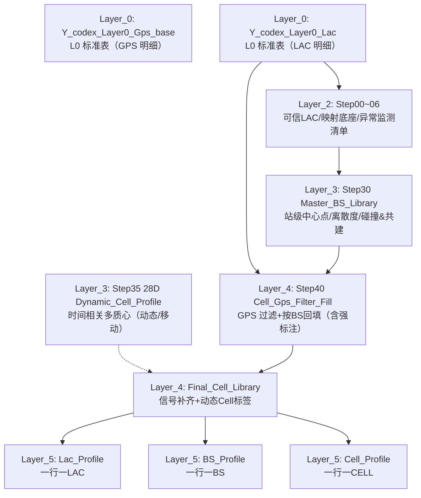

# 第一阶段数据处理逻辑总览（Layer_0 → Layer_5）

> Version: 1.0  
> Date: 2025-12-29  
> Scope: 复盘并固化本项目第一阶段（6 层）端到端处理逻辑、关键产物、关键口径与“解决了什么问题”  
> 强调：数据可穿透（Traceability）= 能一眼看到每一层“字段/口径/质量标记/数量”的变化与收益

---

## 0. 第一阶段目标（Phase Goal）

第一阶段要解决的核心问题可以概括为一句话：

> 从原始超大明细出发，构建**可信 BS 库**，并以此为锚对明细实施 **GPS 纠偏/补齐 + 信号补齐**，最后沉淀三套画像汇总表（LAC/BS/CELL），用于下游筛选与评估。

对应产物链路（主干）：

1) Layer_0：把原始报文解析成两张结构一致的 L0 标准表  
2) Layer_1：定义“什么叫合规”（LAC/CELL/ENBID 规则）  
3) Layer_2：在合规数据上构建可信 LAC/映射底座（并提供对比与异常监测清单）  
4) Layer_3：构建可信 BS 主库（中心点/离散度/碰撞&共建标记 + 动态 cell 附加验证）  
5) Layer_4：以 BS 主库为锚：GPS 过滤/回填 + 信号二阶段补齐，产出最终明细库并对比评估  
6) Layer_5：把最终明细压缩成 LAC/BS/CELL 三套画像库（用于“新进入数据”的初筛底座）

### 0.1 流程图（Flowchart）

### 0.2 主干表血缘（关键表一览）

| 层 | 主干产物（DB 表/视图） | 主要用途 |
|---:|---|---|
| L0 | `Y_codex_Layer0_Gps_base` / `Y_codex_Layer0_Lac` | 统一解析后的标准输入明细 |
| L1 | `v_lac_L1_stage1` / `v_cell_L1_stage1`（规则层视图） | 定义“合规集合”与异常研究约定 |
| L2 | `Step04_Master_Lac_Lib` / `Step05_CellId_Stats_DB` | trusted_lac 与 cell→lac 映射底座 |
| L3 | `Step30_Master_BS_Library` | BS 中心点、离散度、碰撞/共建标记（回填锚点） |
| L4 | `Step40_Cell_Gps_Filter_Fill` / `Final_Cell_Library` | 明细级 GPS 纠偏/回填 + 信号补齐 + 异常标签 |
| L5 | `Layer5_Lac/BS/Cell_Profile` | 汇总画像库（初筛底座） |

---

## 1. Layer_0（原始解析与字段标准化）

**任务目标**

- 把上游“北京明细源表”的复杂字段（`cell_infos`/`ss1` 等）解析成**稳定、统一、可复用**的标准输入表。
- 统一字段类型、单位、基础清洗规则，确保上层不再直接依赖原始源表。

**输入**

- `public."网优项目_gps定位北京明细数据_20251201_20251207"`
- `public."网优项目_lac定位北京明细数据_20251201_20251207"`

**输出（L0 标准表）**

- `public."Y_codex_Layer0_Gps_base"`
- `public."Y_codex_Layer0_Lac"`

**关键点 / 解决的关键问题**

- 解析 `ss1` 的衍生 cell 记录时，尽量继承同报文的 `cell_info` 标签（运营商/原始 LAC），减少后续“无 PLMN/LAC 标签”导致的错补。
- 为后续可追溯与时间最近补齐提供稳定序列/时间字段（`seq_id`、`ts_std`、`cell_ts_std`）。
- 保证 Layer_2 及后续层只面向 `Y_codex_Layer0_*`，不再直接读取原始源表。

**参考文件**

- `lac_enbid_project/Layer_0/Beijing_Source_Parse_Rules_v1.md`
- `lac_enbid_project/Layer_0/Y_codex_Layer0_build_20251201_20251207.sql`

---

## 2. Layer_1（合规规则层：定义“什么叫合规”）

**任务目标**

- 把“原始大表长什么样”变成“哪些记录可被纳入可信分析/建库”的明确规则。
- 形成可复用的合规视图与规则文档，避免口径散落。

**核心子模块**

- L1-LAC：LAC 数值合规与 4G/5G 制式约束  
- L1-CELL：cell_id 格式与无效值过滤  
- L1-ENBID：从 cell_id 派生站级字段（ENBID/gNB），并沉淀站级异常/碰撞研究约定

**关键点 / 解决的关键问题**

- 统一 Cell 级主键建议：`(operator_id_raw, lac_dec, cell_id_dec)`；ENBID/BS 是派生聚合字段，不反向作为 cell 唯一标识。
- 识别并记录“跨运营商复用/共建”的现实：cell_id/bs 不能只看数值，需要结合运营商组与分桶键。
- 把 bs_id 异常（例如过小、疑似解析异常）作为“先标注再评估”的问题类型沉淀到规则层（避免在主链路里误修复）。

**参考文件**

- `lac_enbid_project/Layer_1/Lac/Lac_Filter_Rules_v1.md`
- `lac_enbid_project/Layer_1/Cell/Cell_Filter_Rules_v1.md`
- `lac_enbid_project/Layer_1/Enbid/Enbid_Filter_Rules_v1.md`

---

## 3. Layer_2（可信 LAC / 映射底座 / 对比与异常监测清单）

**任务目标**

- 在合规数据上构建“可用的 LAC 可信集合 + cell→lac 映射底座”，并输出异常监测清单（例如 multi-LAC cell）。
- 提供 Step 级别的可验收对象与对比报表（回答：过滤是否有效、映射是否可信）。

**输入**

- `public."Y_codex_Layer0_Gps_base"` / `public."Y_codex_Layer0_Lac"`

**输出（Step00~Step06 主干）**

- Step00：标准化视图（不改原表）
  - `public."Y_codex_Layer2_Step00_Gps_Std"`
  - `public."Y_codex_Layer2_Step00_Lac_Std"`
- Step02：行级合规标记（进入可信集合的门槛）
  - `public."Y_codex_Layer2_Step02_Gps_Compliance_Marked"`
- Step04：可信 LAC 主库
  - `public."Y_codex_Layer2_Step04_Master_Lac_Lib"`
- Step05：cell_id 统计与异常监测清单（包含 multi-LAC 等）
  - `public."Y_codex_Layer2_Step05_CellId_Stats_DB"`
  - `public."Y_codex_Layer2_Step05_Anomaly_Cell_Multi_Lac"`
- Step06：反哺明细与对比（Layer2 视角的“可用明细库”）
  - `public."Y_codex_Layer2_Step06_L0_Lac_Filtered"`（TABLE）

**关键点 / 解决的关键问题**

- `trusted_lac` 白名单化：为后续 `lac_dec_final` 提供可信“原值继承”通道。
- `map_unique`（cell→lac 唯一映射）：为 LAC 缺失/不可信时提供可解释回填；不唯一则不强行映射（留给异常标注）。
- “异常监测清单”把结构性风险显式化：例如同一 cell 在多个 LAC 出现（multi-LAC）并不等价于动态/移动，需要独立处置策略。

**参考文件**

- `lac_enbid_project/Layer_2/Layer_2_Technical_Manual.md`
- `lac_enbid_project/Layer_2/README_人类可读版.md`

---

## 4. Layer_3（可信 BS 库：中心点/离散度/碰撞&共建 + 动态 cell 复核）

**任务目标**

- 从可信样本聚合出站级对象（BS/ENBID/gNB）中心点与质量画像：这是后续 GPS 纠偏/补齐的锚。
- 把“共建/碰撞/结构性风险/低样本波动/动态 cell”分层标注，避免把不同问题混成一个桶。

**核心输出**

- 站级主库（锚点与质量画像）：
  - `public."Y_codex_Layer3_Step30_Master_BS_Library"`
    - 中心点：`bs_center_lon/bs_center_lat`
    - 可信等级：`gps_valid_level`（Usable/Risk/…）
    - 碰撞标记：`is_collision_suspect`、`collision_reason`、离散度指标
    - 多运营商共建：`is_multi_operator_shared`、`shared_operator_cnt/shared_operator_list`
    - 分桶键：`wuli_fentong_bs_key = tech_norm|bs_id|lac_dec_final`
- 动态/移动 cell（附加处理，解决“时间相关多质心”）：
  - `public."Y_codex_Layer3_Step35_28D_Dynamic_Cell_Profile"`（28D 复核结果：标注 7 个动态/移动 scoped cell）
- BS ID 异常标注（先标注再评估）：
  - `public."Y_codex_Layer3_Step36_BS_Id_Anomaly_Marked"`
- 低样本碰撞波动桶标注：
  - `public."Y_codex_Layer3_Step37_Collision_Data_Insufficient_BS"`

**关键点 / 解决的关键问题**

- 站级“可信中心点 + 离散度”让后续纠偏有可解释锚点（而不是全局乱补）。
- 把异常分层为三类主问题（并允许扩展）：
  1) 动态/移动 cell（时间相关多质心切换）  
  2) 数据不足导致的波动异常（7D 不可强结论，长窗口复核后可能消失）  
  3) bs_id 编码/解析异常（例如过小、疑似非 4 位 hex 等；仅标注）

**参考文件**

- `lac_enbid_project/Layer_3/Layer_3_Technical_Manual.md`
- `lac_enbid_project/Layer_3/reports/Step35_dynamic_cell_validation_28d_20251225.md`

---

## 5. Layer_4（按 BS 纠偏 GPS + 信号二阶段补齐 + 最终明细库与对比）

**任务目标**

- 对 `Y_codex_Layer0_Lac` 的 GPS 做“按 BS 过滤 + 按 BS 回填”，并对信号字段做可追溯补齐，产出最终可用的 **cell 明细库**。
- 输出对比表量化收益（条数/GPS/信号），并提供异常标记方便解释。

**核心输出**

- GPS 过滤+回填后的明细：
  - `public."Y_codex_Layer4_Step40_Cell_Gps_Filter_Fill"`
- 最终明细库（信号补齐 + 动态 cell 标签）：
  - `public."Y_codex_Layer4_Final_Cell_Library"`
- 对比评估：
  - `public."Y_codex_Layer4_Step42_Compare_Summary"`
- BS ID 过小标记（可选）：
  - `public."Y_codex_Layer4_Step44_BsId_Lt_256_*"`

**关键点 / 解决的关键问题**

- 城市阈值（本阶段固定）：4G=1000m，5G=500m（未来按 LAC 城市/非城市放大阈值）。
- GPS 可穿透字段（审计必备）：
  - `lon_before_fix/lat_before_fix`（原始点）
  - `lon_final/lat_final`（纠偏后点）
  - `gps_status`（Verified/Missing/Drift）
  - `gps_fix_strategy`（keep_raw/fill_bs_severe_collision/fill_bs/fill_risk_bs/not_filled）
  - `gps_source`（Original_Verified / Augmented_from_BS_SevereCollision / Augmented_from_BS / Augmented_from_Risk_BS / Not_Filled）
- “严重碰撞桶”处置口径（本阶段最终决策）：
  - 仍回填（避免大量 NULL 导致无法解释），但强标注 `is_severe_collision/collision_reason/gps_source`；下游如需严格过滤直接用标签拦截即可。
- 信号补齐（二阶段）：
  - 同 cell 时间最近优先；无 donor 时退化为同 BS 下 top cell 时间最近；记录 `signal_fill_source/signal_donor_seq_id`。
- 动态/移动 cell 透传：
  - `is_dynamic_cell/dynamic_reason/half_major_dist_km` 落在最终明细（只在 `is_dynamic_cell=1` 时保留原因/距离）。

**参考文件**

- `lac_enbid_project/Layer_4/Layer_4_Technical_Manual.md`
- `lac_enbid_project/Layer_4/reports/Layer_4_Report_补齐效果_ip_loc2_20251226.md`

---

## 6. Layer_5（LAC/BS/CELL 画像库：一行一对象）

**任务目标**

- 把 Layer_4 最终明细压缩成三套画像汇总表（LAC/BS/CELL），用于：
  - 下游快速筛选（避免重复扫明细）
  - 快速评估“补齐是否有效/是否引入异常”
  - 作为“新进入数据”的初筛底座

**输入**

- `public."Y_codex_Layer4_Final_Cell_Library"`

**输出**

- `public."Y_codex_Layer5_Lac_Profile"`
- `public."Y_codex_Layer5_BS_Profile"`
- `public."Y_codex_Layer5_Cell_Profile"`

**关键点 / 解决的关键问题**

- 输出字段为中文表头（减少阅读误解）；同时提供 `*_EN` 英文视图便于程序化消费。
- GPS 画像：覆盖率（0~100，2 位小数）+ 中位数中心 + 距离 p50/p90/max（2 位小数）。
- 信号画像：只做覆盖统计与补齐来源统计（不做质量评分/加权）。
- 异常标注落表（让异常“可解释”）：
  - 碰撞/漂移：`疑似碰撞标记/严重碰撞桶标记/碰撞原因/GPS漂移行数/GPS漂移占比`
  - 动态/移动：BS 侧 `移动CELL去重数/含移动CELL标记`；CELL 侧 `移动CELL标记/移动原因/移动半长轴KM`
  - 多运营商（两组）在 LAC 画像提供跨组共站标记（用于快速识别共建）

**参考文件**

- `lac_enbid_project/Layer_5/Layer_5_Technical_Manual.md`
- `lac_enbid_project/Layer_5/tables/Y_codex_Layer5_*_字段说明.md`

---

## 7. 数据可穿透的统一规范（建议作为“第一阶段数据契约”）

为保证“能一眼看穿每一层变化”，建议把以下字段视为端到端必须可追溯的核心契约（本阶段大部分已实现）：

### 7.1 统一主键与分桶键

- 明细行级：`seq_id`（稳定排序键）+ `ts_fill`（统计时间）  
- 对象主键：
  - CELL：`(operator_id_raw, tech_norm, lac_dec_final, cell_id_dec)`
  - BS：`(operator_id_raw, tech_norm, lac_dec_final, bs_id_final)`
  - LAC：`(operator_id_raw, tech_norm, lac_dec_final)`
- 分桶键（用于共建/分片/桶级质量）：
  - `wuli_fentong_bs_key = tech_norm|bs_id_final|lac_dec_final`
  - `bs_shard_key = tech_norm|bs_id_final`

### 7.2 GPS 字段的“原始→纠偏→解释”

- 原始：`lon/lat` 或 `lon_before_fix/lat_before_fix`
- 锚点：`bs_center_lon/bs_center_lat` + `gps_valid_level`
- 过程解释：
  - `gps_status`（Verified/Missing/Drift）
  - `dist_threshold_m`（城市阈值：4G=1000、5G=500）
  - `gps_dist_to_bs_m`
- 最终：`lon_final/lat_final` + `gps_fix_strategy/gps_source/gps_status_final`

### 7.3 信号补齐的“补齐来源可追溯”

- 原始信号：`sig_*`
- 结果信号：`sig_*_final`
- 过程解释：
  - `signal_missing_before_cnt/signal_missing_after_cnt/signal_filled_field_cnt`
  - `signal_fill_source`（cell_nearest/bs_top_cell_nearest/none）
  - `signal_donor_seq_id/signal_donor_ts_fill/signal_donor_cell_id_dec`

### 7.4 异常标签统一命名与落点

- 碰撞类：`is_collision_suspect/is_severe_collision/collision_reason`
- 漂移类：`gps_status='Drift'`（明细）→ 画像聚合 `GPS漂移行数/占比`
- 动态类：`is_dynamic_cell/dynamic_reason/half_major_dist_km`
- 编码异常：`bs_id_final<256`（Layer_4/Step44）+ Layer_3 Step36 标注（先标注再评估）

---

## 8. 第一阶段“最小验收”建议（面向可复跑交付）

- 对象存在性：各层主输出表存在（Layer0/2/3/4/5 关键表）  
- 行数守恒：Layer_4 `Final == Step40`（同口径）  
- GPS 收益：`gps_source in (Augmented_from_*)` 行数 > 0，且 `Not_Filled` 可解释  
- 信号收益：`missing_field_after_sum <= missing_field_before_sum` 且 `filled_field_sum > 0`  
- 异常可解释：严重碰撞桶/动态 cell/bs_id 异常均能在最终明细与画像表定位到标签  
- 文档闭环：关键表 COMMENT（CN/EN）或字段说明文件齐全，交接可读
