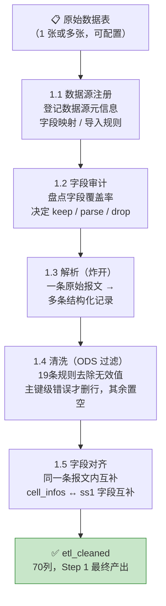
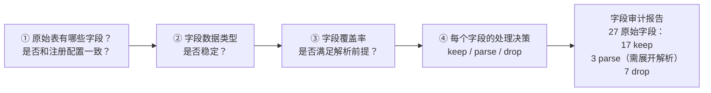
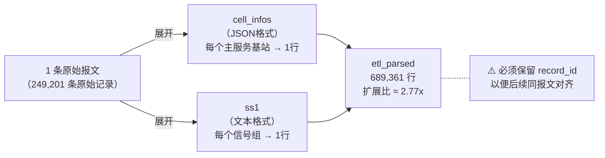
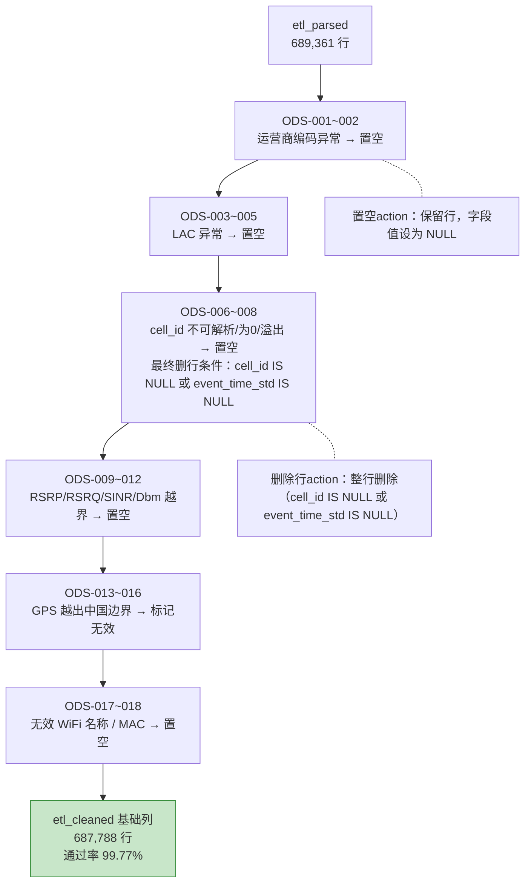
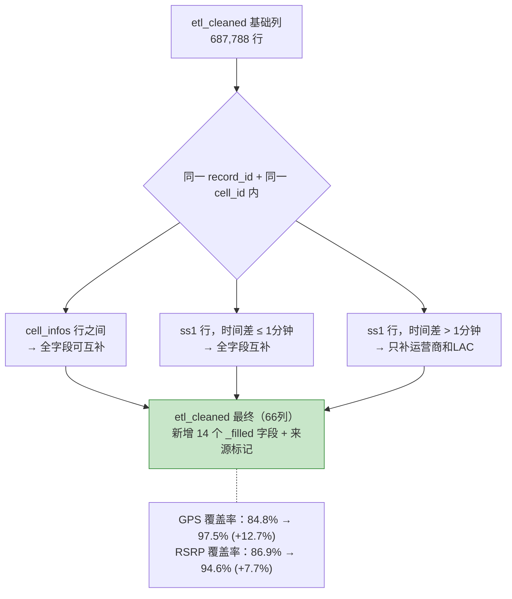

# Step 1：数据源接入

> **核心目标**：把手机 SDK 上报的多种格式原始报文，转换成统一的、干净的结构化数据（`etl_cleaned`），为后续步骤提供唯一输入。

---

## 这一步在整体流程中的位置

**Step 1 的特殊性**：它是整个系统中**唯一不受冻结快照原则约束**的步骤。它只是一个通用 ETL 工具，不读取可信库，不做画像判断，只管"把原始数据转成结构"。

---

## 5 层处理流程

---

## 1.1 数据源注册

系统支持多个数据源（GPS 报文源、LAC 报文源等），每个数据源通过注册表接入，不硬编码表名。

**注册时需要登记的关键信息**：

| 配置项 | 说明 |
|--------|------|
| `source_id` | 数据源唯一标识 |
| `source_name` | 数据源名称 |
| `source_table` | 原始表名 |
| `source_type` | GPS 报文源 / LAC 报文源 / 其他 |
| `cell_infos_field` | JSON 格式的基站字段位置 |
| `ss1_field` | 文本格式的信号字段位置 |
| `status` | 待接入 / 已接入 / 已停用 |
| `row_count` | 记录数 |
| `time_range` | 数据时间范围 |

---

## 1.2 字段审计

在真正开始处理之前，先回答 4 个问题：

---

## 1.3 解析（炸开）

原始报文里有两种复合字段需要展开：

**展开后要保留 `record_id`**，这是后续"同一条报文内互补"的核心依据。

---

## 1.4 清洗（ODS 规则）

19 条 ODS 规则（ODS-001 ~ ODS-018），分 6 类，两种动作：

**清洗原则**：能修正就修正，不能修正才删除。信号值越界→置空；`cell_id` 不可解析（已置空）且 `event_time_std` 为空→删除整行。

清洗阶段还负责派生 7 个字段：`bs_id`、`sector_id`、`operator_cn`、`report_ts`、`cell_ts_std`、`gps_ts`、`has_cell_id`。

---

## 1.5 字段对齐（同报文内互补）

同一次手机上报，`cell_infos` 和 `ss1` 会各产生自己的行，而它们其实描述的是同一个上报事件，字段可以互补：

**重要边界**：字段对齐只在"同一条原始报文内"发生，不跨报文。跨 Cell 的知识补数是 Step 4 的职责。

---

## 产出：etl_cleaned 的 70 列结构

| 分类 | 列数 | 说明 |
|------|------|------|
| 基础结构化列 | 47 | 解析直接产出（含 `dataset_key`、`source_table` 两个上下文字段） |
| 清洗派生列 | 9 | 清洗阶段补加（`bs_id`、`sector_id`、`operator_cn`、`report_ts`、`cell_ts_std`、`gps_ts`、`event_time_std`、`event_time_source`、`has_cell_id`） |
| 字段对齐结果列 | 14 | 同报文对齐阶段补加 |
| **最终输出总列数** | **70** | Step 1 最终 `etl_cleaned` |

**关键约定**：`*_raw` 字段代表原始真相，永远不被覆盖；`*_filled` 字段是对齐或补数后的可用值，供后续步骤使用。

---

## 与 Step 4 的区别（常见混淆点）

| 对比项 | Step 1 字段对齐 | Step 4 知识补数 |
|--------|----------------|----------------|
| 数据来源 | **同一条报文内**的其他字段 | **上一轮可信小区库**的历史知识 |
| 范围 | 仅同 `record_id` 的行 | 任何命中可信库的记录 |
| 可靠性 | 中（依赖原始报文质量） | 高（经过质量评估的可信对象） |
| 触发时机 | 数据入库时（现在） | 可信库建立后的持续运行 |
| 是否受冻结约束 | 否 | 是（只读上一轮发布版本） |

---

## 运行统计（step1_run_stats）

每次 Step 1 运行后记录一条统计快照，记录：
- 解析输入/输出行数、扩展比
- 每条 ODS 规则的命中数
- 字段对齐前后各字段覆盖率
- 补齐来源分布（`raw_gps / ss1_own / same_cell / none`）
