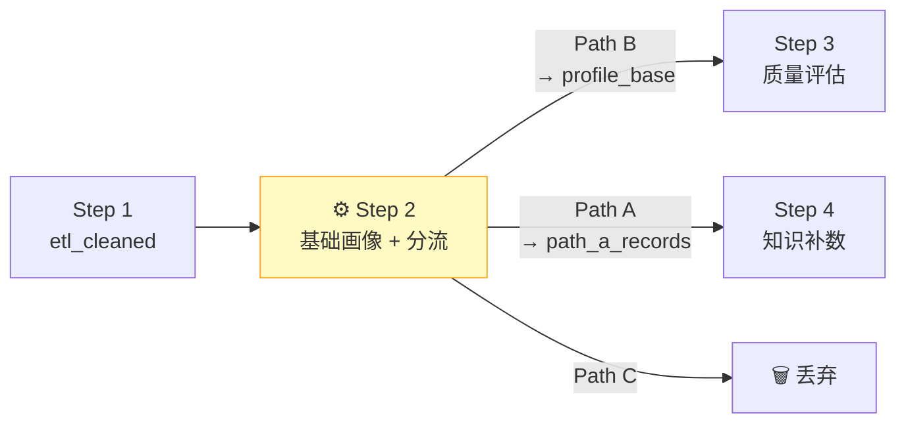
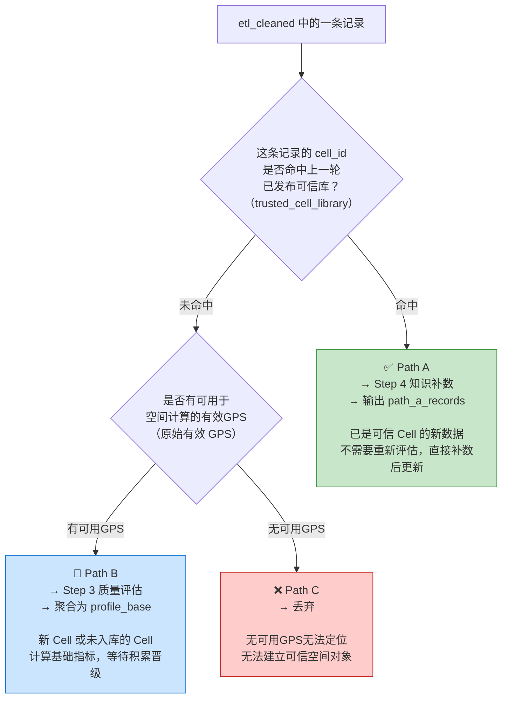
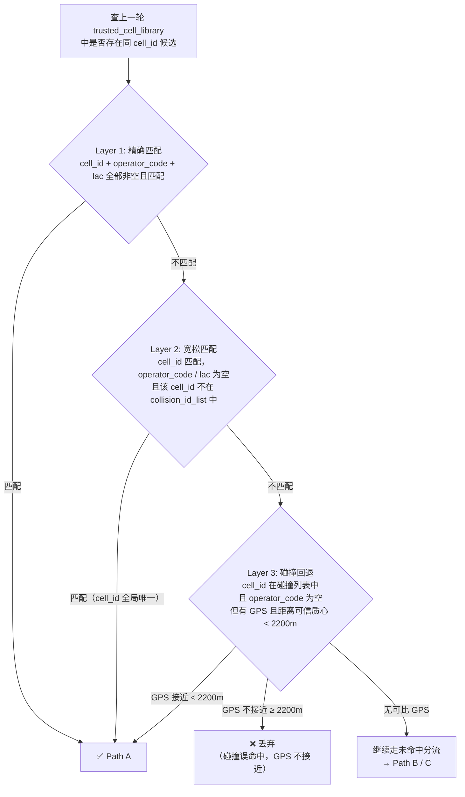
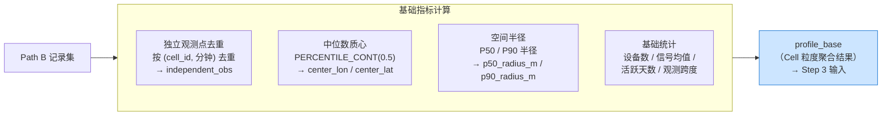
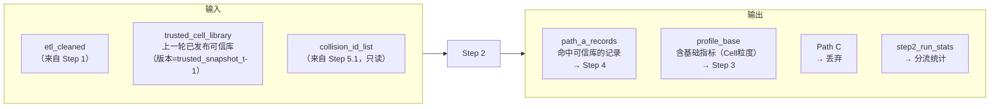

# Step 2：基础画像与分流

> **核心目标**：对 Step 1 产出的 `etl_cleaned` 做可信库命中判断，将数据分成三条路径分别处理，同时为未命中但有 GPS 的记录计算基础画像指标（`profile_base`）。

---

## 这一步在整体流程中的位置

**从这一步开始进入「数据版本上下文」**：所有处理和产出都绑定到当前数据集（如 `sample_6lac`）。Step 1 是通用 ETL，Step 2 开始才和具体数据集挂钩。

---

## 三路分流：一条记录进来，走哪条路？

> 说明：Path B 的"有 GPS"指该 Cell 在本批次未命中记录中存在可用于空间统计的有效 GPS 观测；质心和半径计算只使用原始有效 GPS，不把 Step 1 的结构性补齐 GPS 当作真实定位证据。

---

## Path A 命中：三层匹配策略

命中上一轮可信库并不是简单的 cell_id 相等。Step 2 采用三层逐级放宽的匹配策略：

**Layer 2 的核心价值**：拯救大量缺运营商/LAC 信息的有效记录。对于 cell_id 全局唯一的 Cell，即使原始数据缺运营商也能安全匹配。

> ⚠️ **碰撞列表（collision_id_list）** 由 Step 5.1 产出，在上一批结束时冻结，本批才能读取使用。

---

## Path B：基础指标计算

没有命中可信库但有 GPS 的记录，聚合为 Cell 级的基础画像（`profile_base`），作为 Step 3 的输入：

**去重的意义**：同一分钟同一 Cell 的多条记录，只算一个独立观测点。这样可以防止设备密集上报导致数量虚高。

**质心算法**：固定采用中位数（`PERCENTILE_CONT(0.5)`）而非均值，因为中位数天然抗碰撞和抗噪声。

---

## 分流统计（帮助理解数据质量）

Step 2 输出 `step2_run_stats`，记录以下统计：

| 统计项 | 说明 |
|--------|------|
| `input_record_count` | Step 2 输入总记录数 |
| `path_a_record_count` / `path_a_ratio` | Path A 命中数与占比 |
| `path_b_record_count` / `path_b_cell_count` / `path_b_ratio` | Path B 记录数、Cell 数与占比 |
| `path_c_drop_count` / `path_c_drop_ratio` | Path C 丢弃数与占比 |
| `collision_candidate_count` | 遇到的已标记碰撞 cell_id 记录数 |
| `collision_path_a_match_count` | 碰撞防护后成功进入 Path A 的记录数 |
| `collision_pending_count` | 缺少可比 GPS 未判定的记录数 |
| `collision_drop_count` | 因 GPS 不接近被丢弃的记录数 |

---

## 这一步明确不做的事

| 不做项 | 原因 |
|--------|------|
| 漂移分析 | 需要多日历史轨迹，属于 Step 5 |
| 多质心检测 | 高成本分析，属于 Step 5 异常子集处理 |
| 全局碰撞检测 | 属于 Step 5.1，产出 collision_id_list |
| 分类标签（collision/migration 等） | 属于 Step 5 深度维护标签 |
| 置信度分级、规模分级 | Step 2 只保留 Step 3 必需的基础统计子集 |

Step 2 只回答一件事：**这条数据属于哪条路径？**

---

## 输入 / 输出总结

