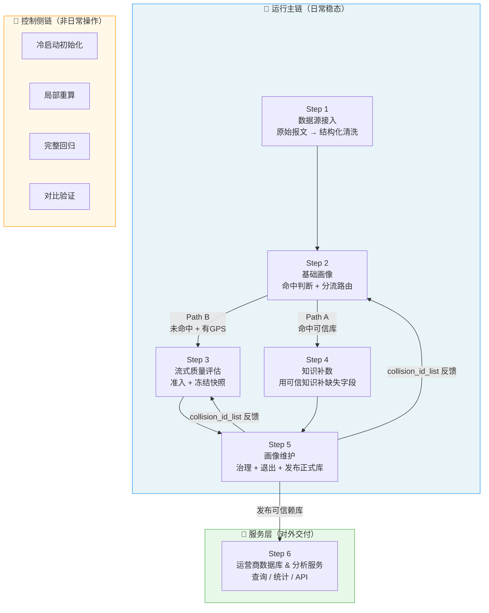
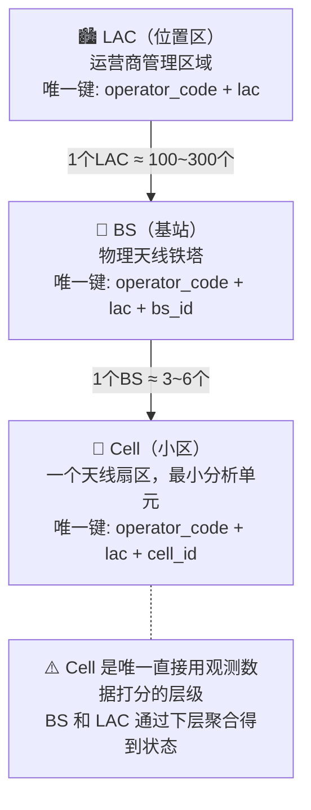
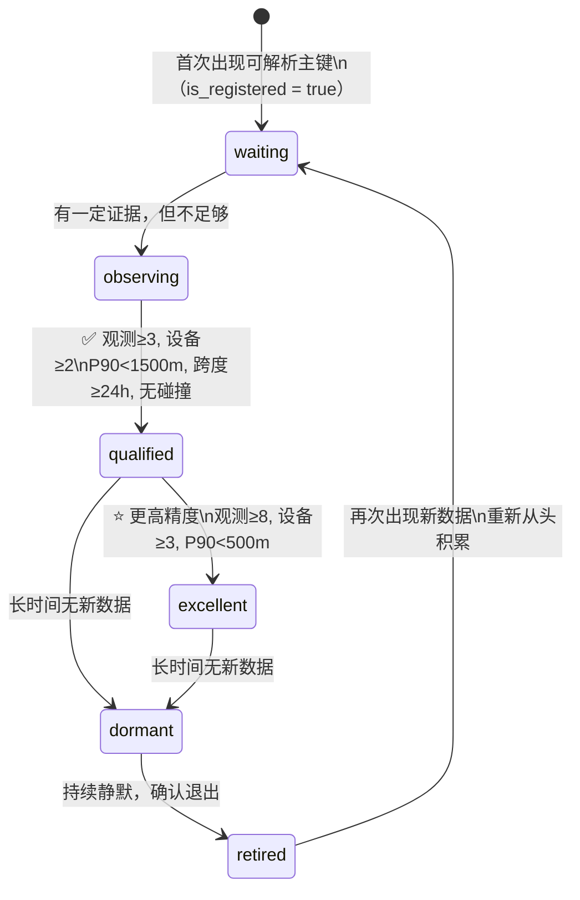
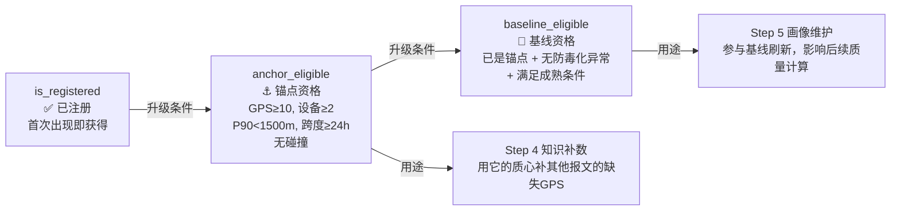
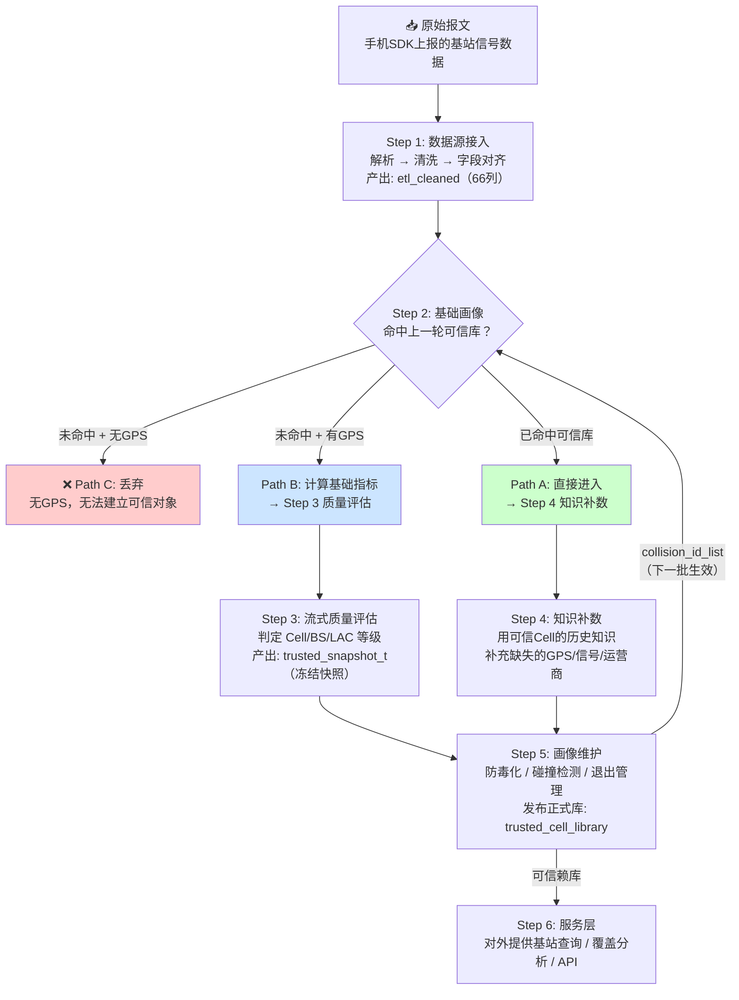

# rebuild5 系统全貌

> **一句话定位**：通过持续处理手机 SDK 上报的基站信号数据，构建和维护一套**可被外部服务消费的、可信赖的运营商基站数据库**。

---

## 系统为什么存在

手机在使用时，SDK 会上报"我正在连接哪个基站（Cell）、GPS 在哪、信号多少"。
这批原始数据是混沌的：有噪声、有缺失、有碰撞、有漂移。

rebuild5 的使命就是把这些混沌的原始报文，变成一张高质量的、**可信赖的运营商基站坐标库**，
最终对外提供"给我一个 cell_id，告诉我这个基站在哪"这样的服务。

---

## 三层架构总览



---

## 实体层级（系统操作的三种对象）



---

## 生命周期状态流转

每个 Cell/BS/LAC 都有一个生命周期状态，表示它当前处于哪个阶段：



**状态颜色约定**（UI 全局一致）：

| 状态 | 颜色 | 含义 |
|------|------|------|
| `excellent` | 🟢 绿 | 高精度，可用于高级服务 |
| `qualified` | 🔵 蓝 | 达到可信门槛，可参与补数 |
| `observing` | 🟡 黄 | 积累中，尚未达标 |
| `waiting` | ⚫ 灰 | 数据不足，等待 |
| `dormant` | 🟠 橙 | 已有质量但长期无新数据 |
| `retired` | 🔴 红 | 退出可信赖库 |

---

## 三层资格（与生命周期独立）

生命周期状态说"对象现在处于什么阶段"，资格说"对象能被用来做什么"：



**关键区分**：一个 Cell 可以是 `qualified`（生命周期合格）但 `anchor_eligible = false`（空间质量不够做锚点）。两者独立，互不替代。

---

## 数据流总览（一条报文的完整旅程）



---

## 最关键的系统约束：冻结快照原则

> ⚠️ 这是整个系统最高优先级的约束，违反它会导致数据质量不可控。

```mermaid
sequenceDiagram
    participant 批次T as 第T批运行
    participant 快照T-1 as trusted_snapshot_t-1（上批冻结）
    participant 快照T as trusted_snapshot_t（本批产出）
    participant 批次T+1 as 第T+1批运行

    批次T->>快照T-1: Step 3 读取（只读）
    批次T->>快照T-1: Step 4 读取（只读）
    Note over 批次T: ❌ 禁止：本批刚晋升的Cell\n立刻参与本批补数

    批次T->>快照T: 批末统一冻结产出
    批次T+1->>快照T: 下一批才能读取和使用
```

**为什么这样设计**：如果第T批刚刚晋升的 Cell A，立刻被拿来补第T批缺 GPS 的报文，这些被补的报文又反过来强化了 Cell A 的观测证据，形成"自我强化"的闭环，数据质量会失控。

---

## 数据集与版本管理

系统支持多个数据集，每次处理都绑定到一个数据集上下文：

| 数据集 | 规模 | 用途 |
|--------|------|------|
| `sample_6lac` | 6个LAC，~42万行，7天 | 开发调试 |
| `beijing_7d` | 北京全区，7天 | 跑通全流程 |
| `beijing_30d` | 北京全区，30天 | 稳定性验证 |
| `national_30d` | 全国，30天 | 生产级验证 |

- **Step 1** 不受数据集版本约束（通用 ETL 工具）
- **Step 2~5** 的所有处理和产出都绑定到当前数据集

---

## 文档导航

| 文档 | 内容 |
|------|------|
| [01_Step1_数据源接入.md](01_Step1_数据源接入.md) | 原始报文如何变成干净结构化数据 |
| [02_Step2_基础画像与分流.md](02_Step2_基础画像与分流.md) | 命中判断与三路分流 |
| [03_Step3_流式质量评估.md](03_Step3_流式质量评估.md) | Cell 如何积累证据并晋级 |
| [04_Step4_知识补数.md](04_Step4_知识补数.md) | 用可信历史知识补充缺失字段 |
| [05_Step5_画像维护.md](05_Step5_画像维护.md) | 可信库的治理、防毒化与退出 |
| [06_核心约束与设计原则.md](06_核心约束与设计原则.md) | 冻结快照、Cell先行等核心设计决策 |
