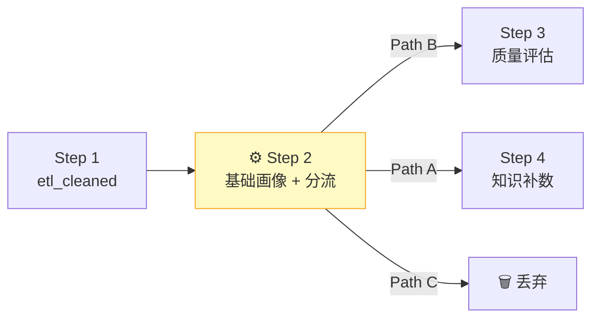
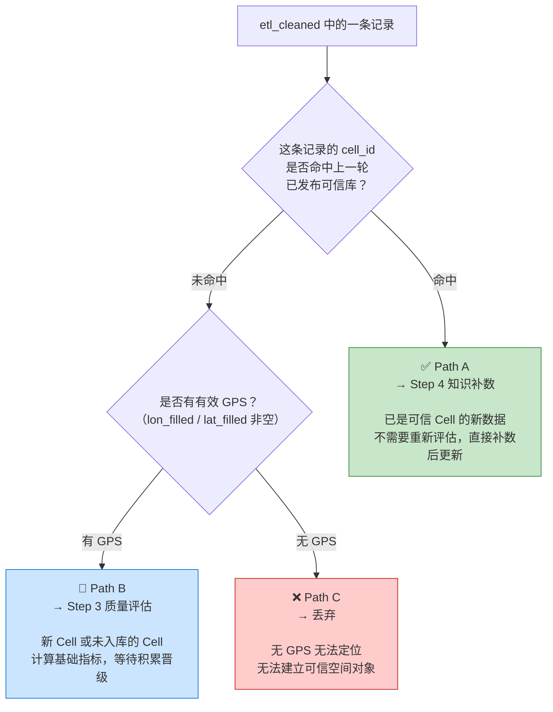
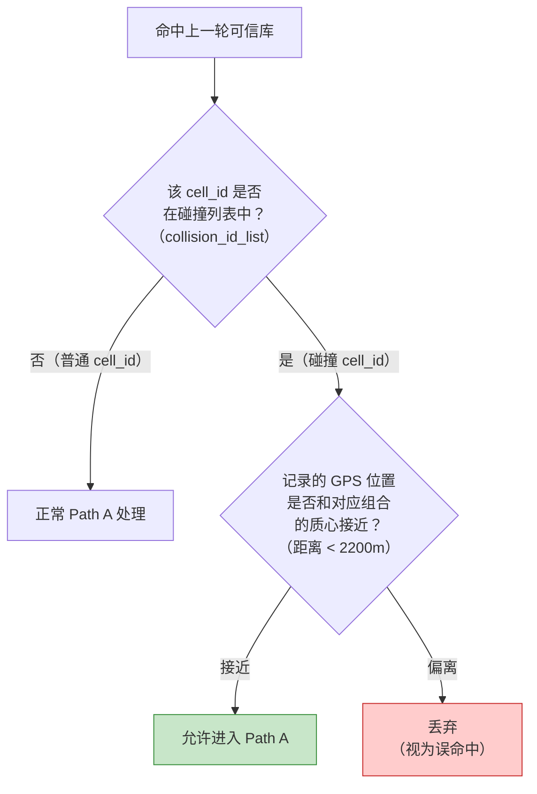
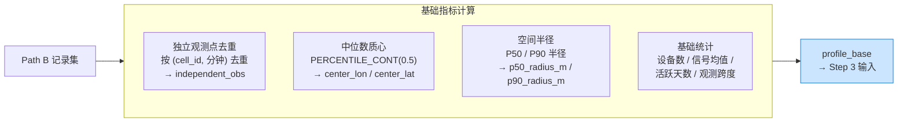
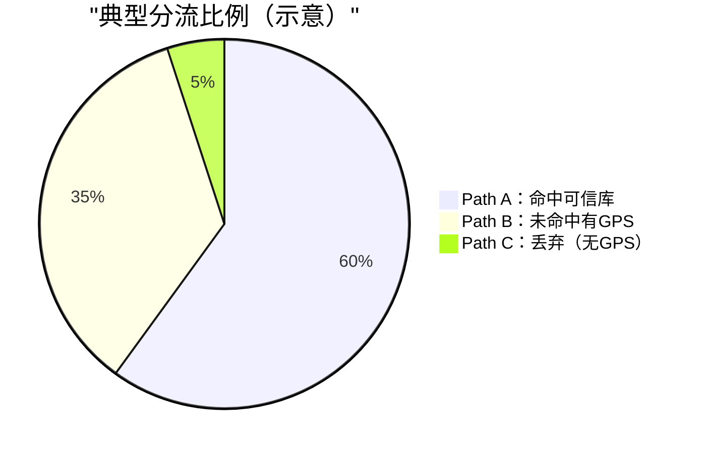
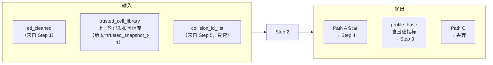

# Step 2：基础画像与分流

> **核心目标**：对 Step 1 产出的 `etl_cleaned` 做命中判断，将数据分成三条路径分别处理，同时为未命中但有 GPS 的记录计算基础画像指标。

---

## 这一步在整体流程中的位置

**从这一步开始进入「数据版本上下文」**：所有处理和产出都绑定到当前数据集（如 `sample_6lac`）。Step 1 是通用 ETL，Step 2 开始才和具体数据集挂钩。

---

## 三路分流：一条记录进来，走哪条路？

---

## 碰撞 cell_id 的特殊防护

当一个 `cell_id` 在历史上被多个不同 `(operator_code, lac)` 组合使用（碰撞），分流规则需要更严格的匹配：

> ⚠️ **碰撞列表（collision_id_list）** 由 Step 5 产出，在上一批结束时冻结，本批才能读取使用。

---

## Path B：基础指标计算

没有命中可信库但有 GPS 的记录，需要计算一组基础指标，作为 Step 3 的输入：

**去重的意义**：同一分钟同一 Cell 的多条记录，只算一个独立观测点。这样可以防止设备密集上报导致数量虚高。

---

## 分流统计（帮助理解数据质量）

Step 2 记录以下统计，用于监控和调试：

| 统计项 | 说明 |
|--------|------|
| 总数据量 | `etl_cleaned` 输入记录数 |
| Path A 命中率 | 系统成熟度的体现，越高说明可信库越完整 |
| Path B 有GPS率 | 新 Cell 数据质量 |
| Path C 丢弃率 | 无法使用的数据比例 |

---

## 这一步明确不做的事

| 不做项 | 原因 |
|--------|------|
| 漂移分析 | 需要多日历史轨迹，属于 Step 5 |
| 多质心检测 | 高成本分析，属于 Step 5 异常子集处理 |
| 全局碰撞检测 | 属于 Step 5.1，产出 collision_id_list |
| 分类标签（collision/migration 等） | 属于 Step 5 深度维护标签 |

Step 2 只回答一件事：**这条数据属于哪条路径？**

---

## 输入 / 输出总结

