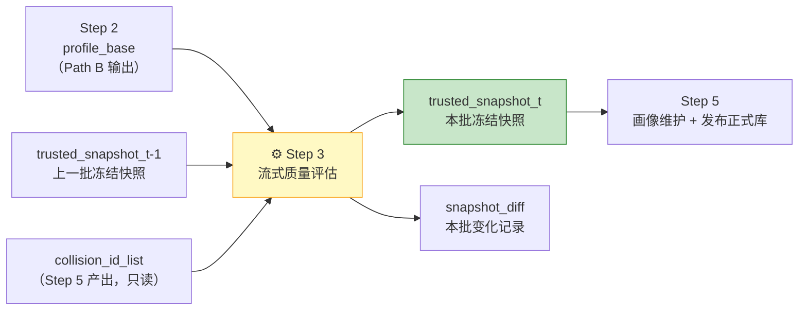
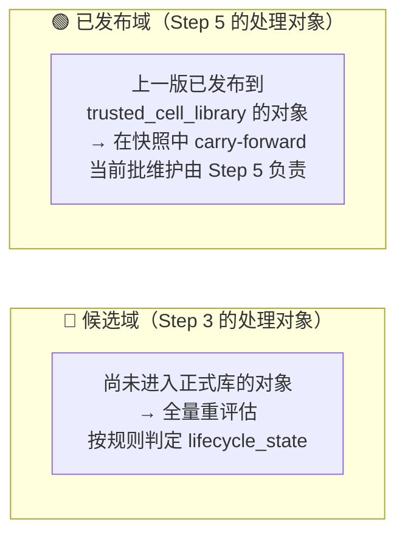
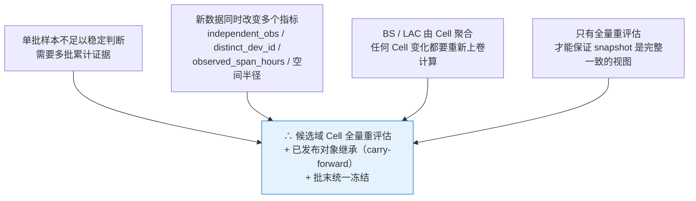
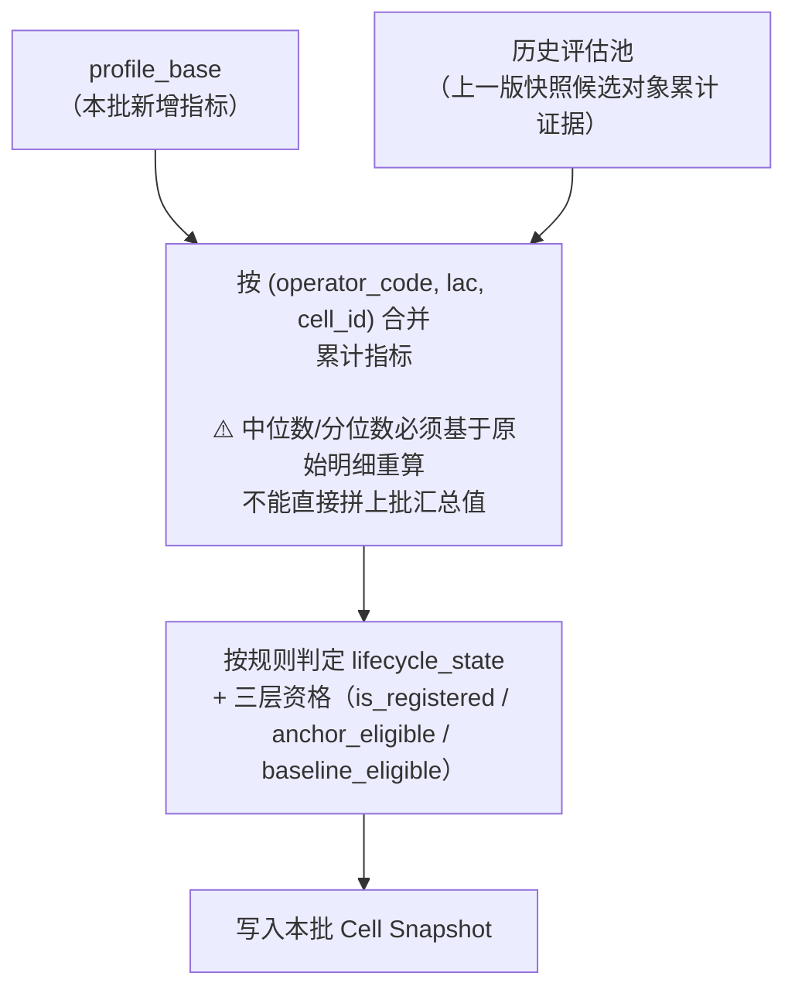
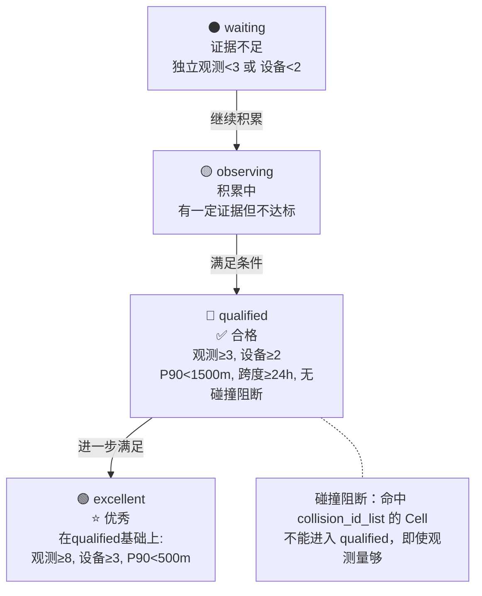
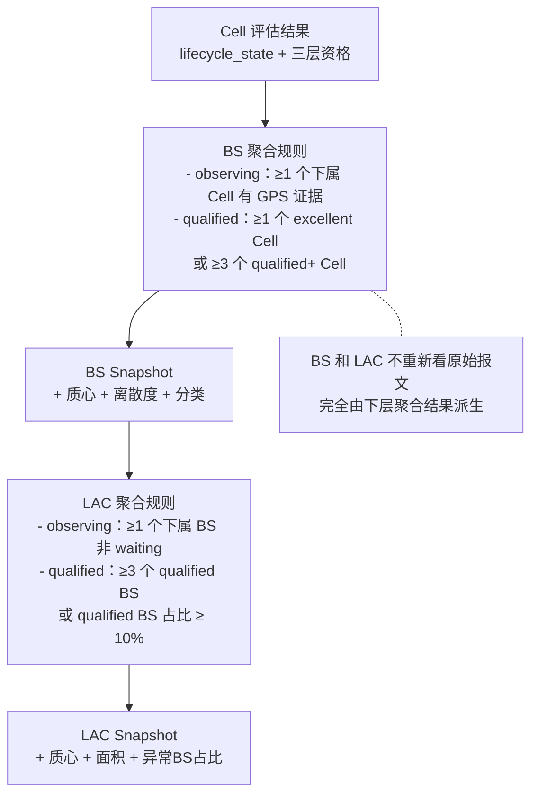
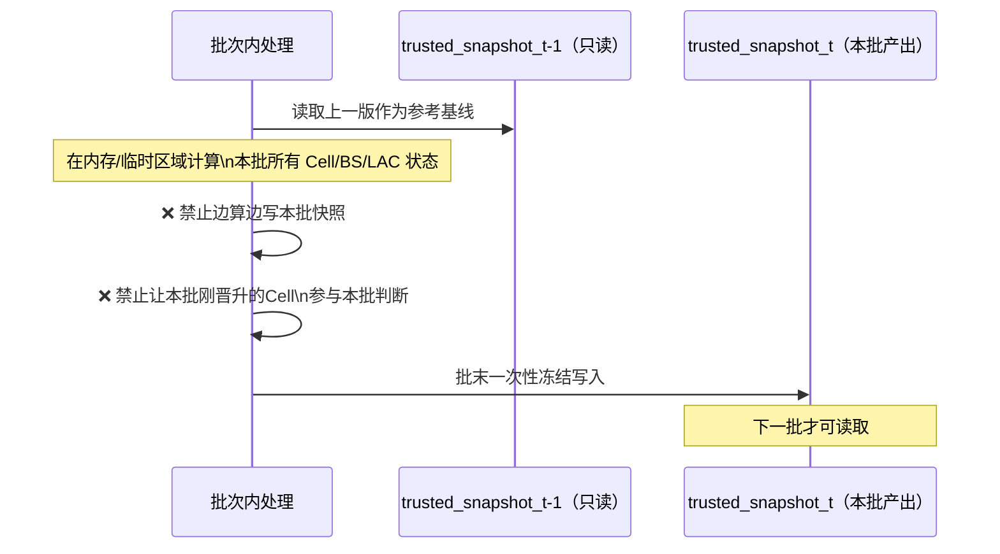
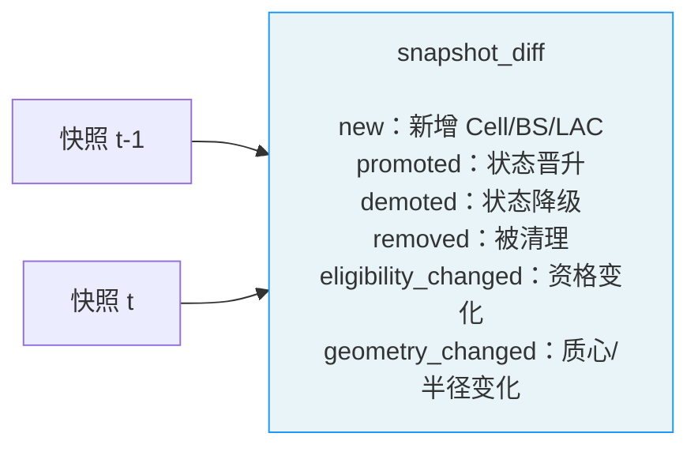
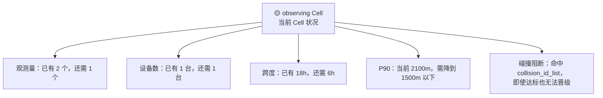

# Step 3：流式质量评估

> **核心目标**：接收 Step 2 输出的 `profile_base`，把当前批次新增的 Cell 证据与历史状态合并，对**候选域**（尚未进入正式发布库的对象）做全量重评估，批末产出冻结快照，供 Step 5 维护并发布正式库。

---

## 这一步在整体流程中的位置

**关键角色分工**：
- Step 3 负责**候选域准入判定**，批末产出冻结快照
- Step 5 才负责**发布正式库**

两者分工明确：Step 3 说谁够格进可信链路，Step 5 才真正把它发出去。

---

## 候选域 vs 已发布域：两个不同的范围

> **为什么这样分**：Path A 命中正式库的记录不进入 Step 3，因此 Step 3 天然不具备对已发布对象做当前批维护的输入条件。

---

## 为什么要"候选域全量重评估"而不是只看新数据

> ⚠️ **注意**：中位数质心、P90 半径、distinct_dev_id 等指标不支持增量拼接，必须基于保留的分钟级原始证据重算，不能直接把上批汇总值和本批增量数值相加。

---

## 入库前置过滤（可配置）

Step 3 在评估前先做过滤，控制哪些对象进入评估池：

| 过滤类型 | 默认配置 | 说明 |
|----------|----------|------|
| 制式过滤 | 只处理 `4G / 5G` | `2G / 3G` 可配置为放行 |
| 地区过滤 | 按当前数据集 LAC 白名单 | 开发阶段可只处理样本 LAC |
| GPS 有效性 | 无有效 GPS 不参与空间评估 | 无 GPS 不能计算质心和半径 |

---

## Cell 质量判定流程

### 合并证据 → 重判

### Cell 晋级规则（可配置阈值来自 profile_params.yaml）

### 三层资格判定（独立于生命周期）

| 资格 | 判定规则 | 阈值来源 |
|------|----------|----------|
| `is_registered` | 首次出现可解析的 `(operator_code, lac, cell_id)` 即注册 | 结构规则 |
| `anchor_eligible` | `gps_valid_count ≥ 10` 且 `distinct_dev_id ≥ 2` 且 `p90_radius_m < 1500` 且 `observed_span_hours ≥ 24` 且无碰撞阻断 | `anchorable.*` |
| `baseline_eligible` | 已 `anchor_eligible=true`，且无防毒化异常，且满足成熟条件 | 逻辑冻结，成熟阈值在 Step 5 执行 |

**关键区分**：
- `is_registered=true` 只表示对象建档成功
- `anchor_eligible=true` 才表示它能被 Step 4 用作可信锚点
- `baseline_eligible=true` 表示它能参与 Step 5 画像刷新

---

## Cell → BS → LAC 三层级联

质量判断永远自下而上：先判 Cell，才能聚合出 BS，才能聚合出 LAC。

---

## 定期清理（防止评估池无限膨胀）

| 清理场景 | 对象 | 处理方式 |
|----------|------|----------|
| 等待超时 | `waiting` 态且从未入库的 Cell，连续 N 天无新数据 | 从评估池删除，不走退出链路 |
| 已入库对象超时 | `qualified+` 对象长期无新数据 | 标记 `dormant`，交给 Step 5.4 接管 |

---

## 冻结快照：批末统一产出

**快照内容（Cell 层核心字段）**：

| 分组 | 字段 |
|------|------|
| 状态 | `lifecycle_state` / `is_registered` / `anchor_eligible` / `baseline_eligible` |
| 异常阻断 | `is_collision_id` |
| 空间 | `center_lon` / `center_lat` / `p50_radius_m` / `p90_radius_m` |
| 信号 | `rsrp_avg` / `rsrq_avg` / `sinr_avg` |
| 统计 | `independent_obs` / `distinct_dev_id` / `active_days` / `observed_span_hours` / `gps_valid_count` |
| 质量 | `position_grade` / `gps_confidence` / `signal_confidence` |

---

## Diff：本批相对上批发生了什么

除快照外，Step 3 还产出一份 `snapshot_diff`，记录变化：

Diff 用于 UI 的"流转总览"和"流转快照"页面，让运维人员一眼看到本批系统状态如何变化。

---

## 等待对象的进度展示

对于仍处于 `waiting / observing` 的 Cell，UI 要展示"还差什么才能晋级"：

---

## 流式评估 = 批量计算（已验证）

rebuild4 实验已验证：**逐天累积的流式评估和全量批量计算在数学上等价**。

| 指标 | Day 7 流式 vs 批量 |
|------|-------------------|
| 质心偏差 | 0.00m |
| 生命周期一致率 | 98.9% |
| P90 差异 | 0.00m |

> Day 3 已达可用水平，Day 5 已达生产水平，Day 7 与批量等价。

这是 rebuild5 采用流式主链而非批量重跑的核心依据。

---

## Step 3 明确不做的事

| 不做项 | 负责步骤 | 原因 |
|--------|----------|------|
| 漂移分类（collision/migration/stable） | Step 5 | 需多日质心轨迹计算 |
| 碰撞确认 | Step 5.1 / 5.5 | 全局键扫描，Step 3 只消费结果 |
| 多质心检测 | Step 5.5 | 高成本，只做异常子集 |
| 防毒化 | Step 5 | 可信库维护逻辑 |
| 发布 trusted_cell_library | Step 5 | Step 3 只产出冻结快照 |
| 退出确认（dormant → retired） | Step 5.4 | 属于长期维护链路 |

**Step 3 只回答一件事**：这个对象现在是否足以进入可信链路，以及它的冻结状态是什么。
