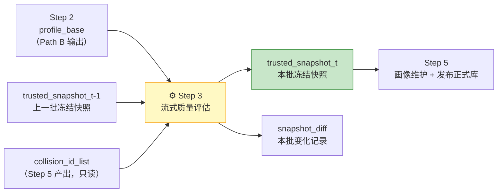
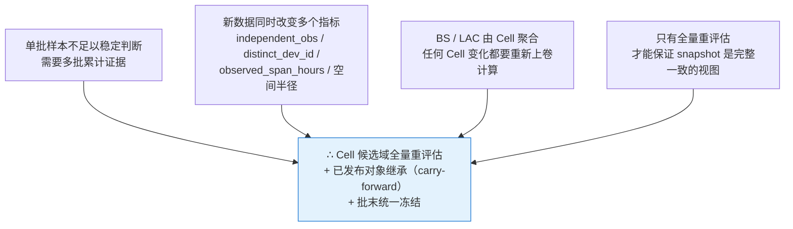
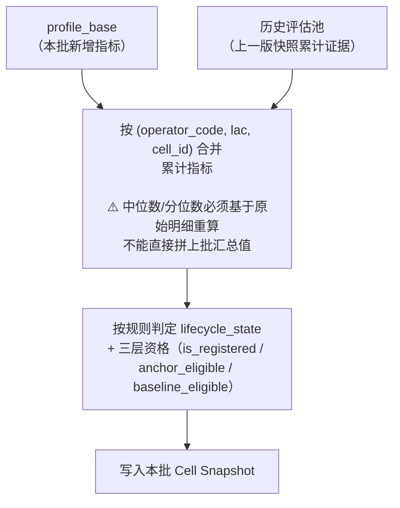
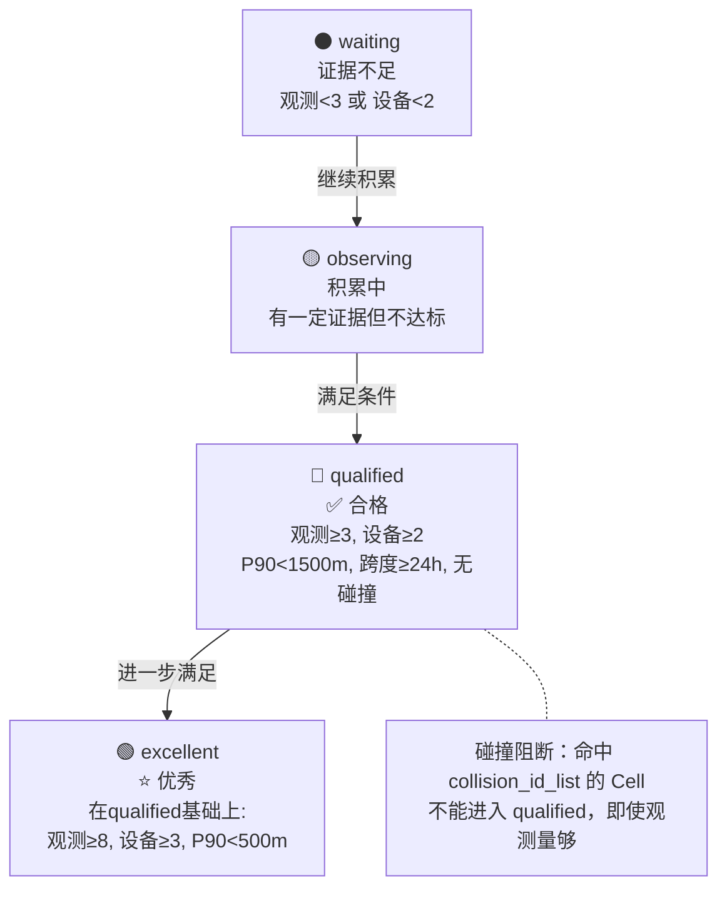
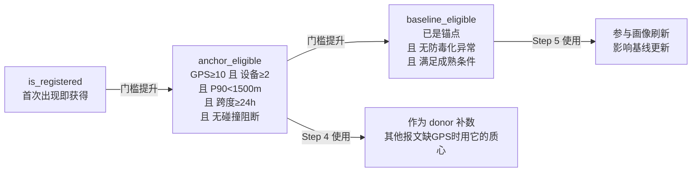
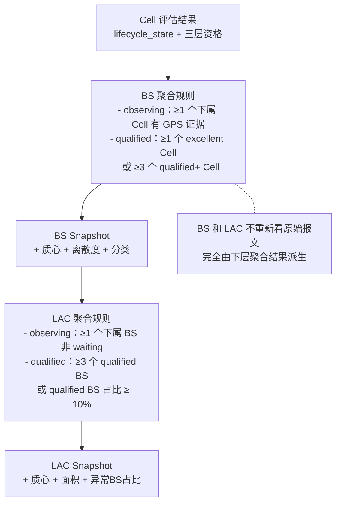
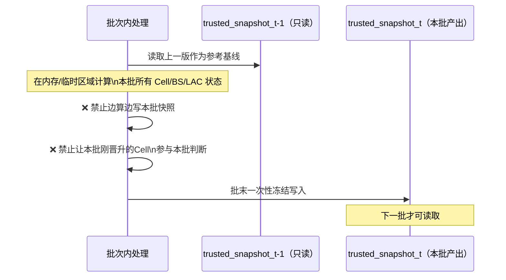
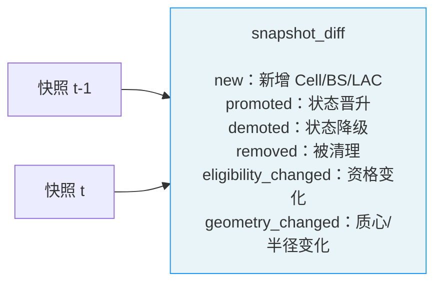
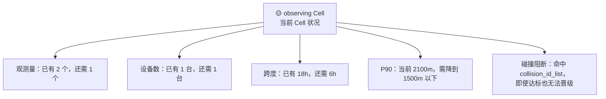

# Step 3：流式质量评估

> **核心目标**：把 Step 2 计算的基础指标，结合历史累计证据，判断每个 Cell/BS/LAC 当前处于哪个质量等级，批末产出冻结快照，供 Step 5 维护并发布正式库。

---

## 这一步在整体流程中的位置

**关键角色**：Step 3 负责"准入判定"，Step 5 才负责"发布正式库"。两者分工明确：Step 3 说谁够格，Step 5 才真正把它发出去。

---

## 为什么要"全量重评估"而不是只看新数据

每批新数据进来，Step 3 必须对**候选域所有已注册 Cell** 重新评估，而不是只看这批新增的：

> **已发布到正式库的对象**不在此重评估范围内，它们以"继承上一版状态"的方式出现在快照中，当前批的维护由 Step 5 负责。

---

## Cell 质量判定流程

### 合并证据 → 重判

### Cell 晋级规则（可配置）

### 三层资格判定（独立于生命周期）

---

## Cell → BS → LAC 三层级联

质量判断永远自下而上：先判 Cell，才能聚合出 BS，才能聚合出 LAC。

---

## 冻结快照：批末统一产出

**快照内容（Cell 层核心字段）**：

| 分组 | 字段 |
|------|------|
| 状态 | `lifecycle_state` / `is_registered` / `anchor_eligible` / `baseline_eligible` |
| 空间 | `center_lon` / `center_lat` / `p50_radius_m` / `p90_radius_m` |
| 信号 | `rsrp_avg` / `rsrq_avg` / `sinr_avg` |
| 统计 | `independent_obs` / `distinct_dev_id` / `active_days` / `observed_span_hours` |

---

## Diff：本批相对上批发生了什么

除快照外，Step 3 还产出一份 `snapshot_diff`，记录变化：

Diff 用于 UI 的"流转总览"和"流转快照"页面，让运维人员一眼看到本批系统状态如何变化。

---

## 等待对象的进度展示

对于仍处于 `waiting / observing` 的 Cell，UI 要展示"还差什么才能晋级"：

---

## 流式评估 = 批量计算（已验证）

rebuild4 实验已验证：**逐天累积的流式评估和全量批量计算在数学上等价**。

| 指标 | Day 7 流式 vs 批量 |
|------|-------------------|
| 质心偏差 | 0.00m |
| 生命周期一致率 | 98.9% |
| P90 差异 | 0.00m |

> Day 3 已达可用水平，Day 5 已达生产水平，Day 7 与批量等价。

这是 rebuild5 采用流式主链而非批量重跑的核心依据。

---

## Step 3 明确不做的事

| 不做项 | 负责步骤 | 原因 |
|--------|----------|------|
| 漂移分类（collision/migration/stable） | Step 5 | 需多日质心轨迹计算 |
| 碰撞确认 | Step 5 | 全局键扫描，Step 3 只消费结果 |
| 多质心检测 | Step 5 | 高成本，只做异常子集 |
| 防毒化 | Step 5 | 可信库维护逻辑 |
| 发布 trusted_cell_library | Step 5 | Step 3 只产出冻结快照 |

**Step 3 只回答一件事**：这个对象现在处于哪个质量等级，快照里记录什么。
