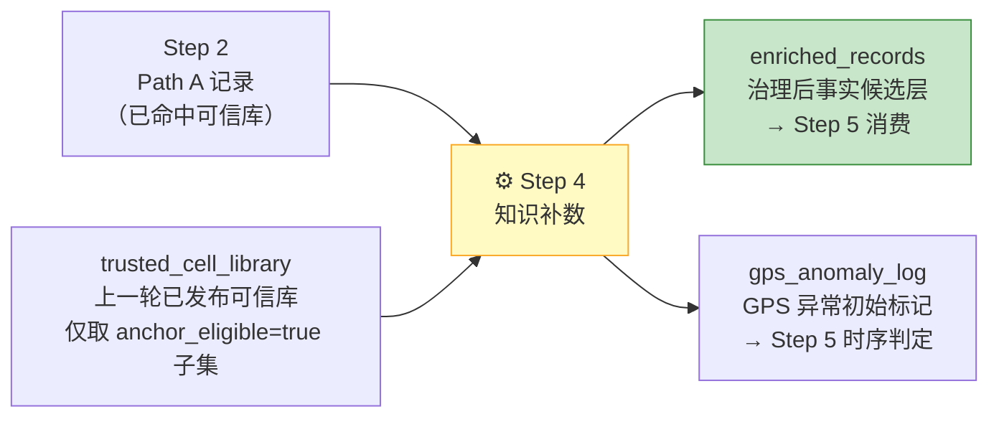
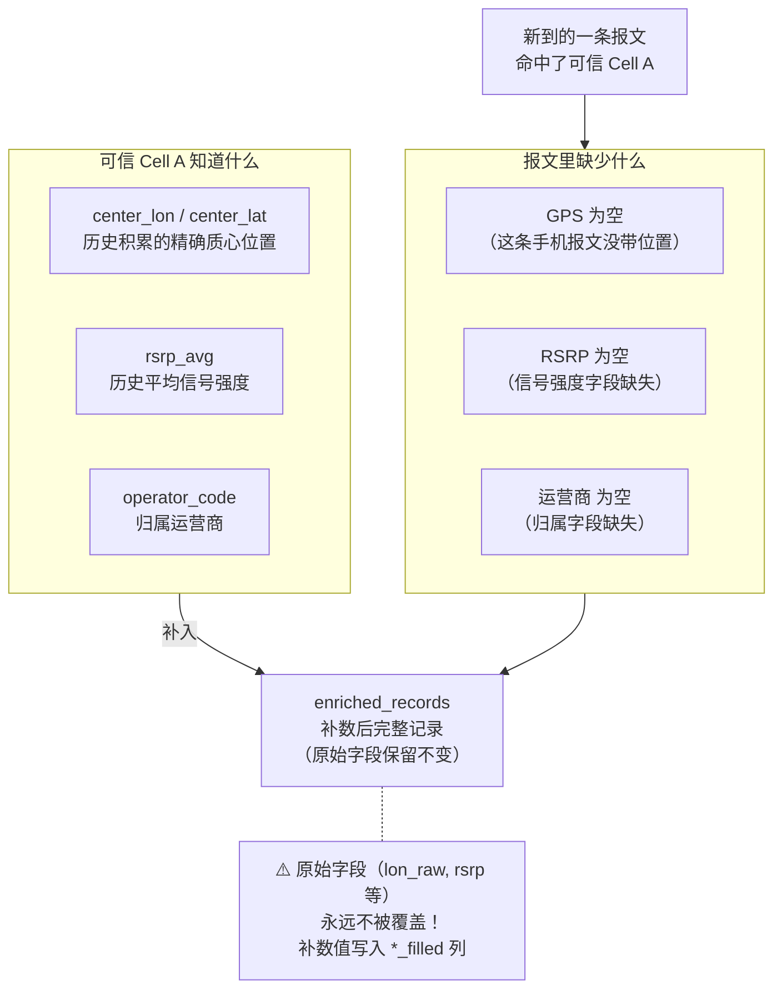
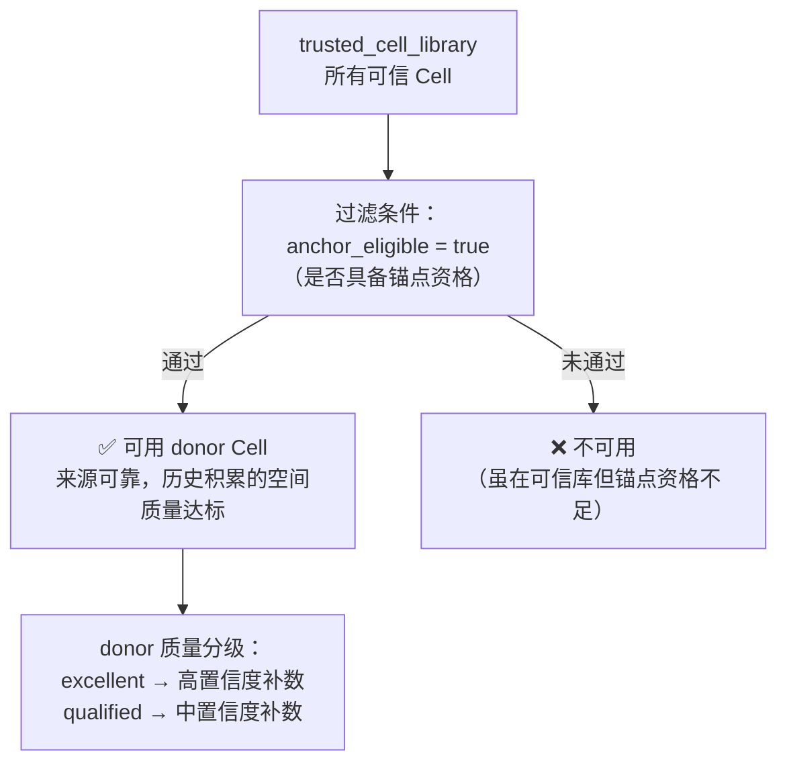
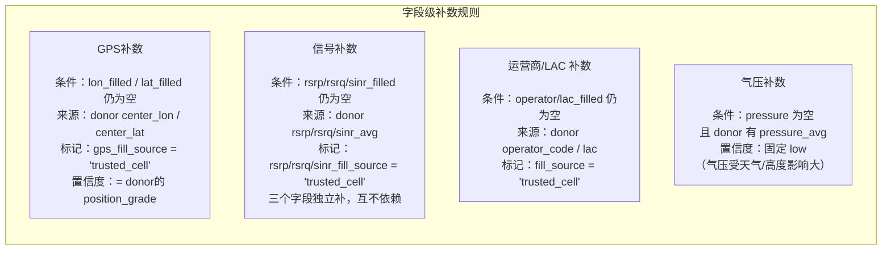
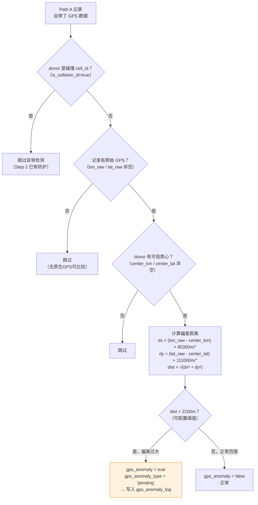
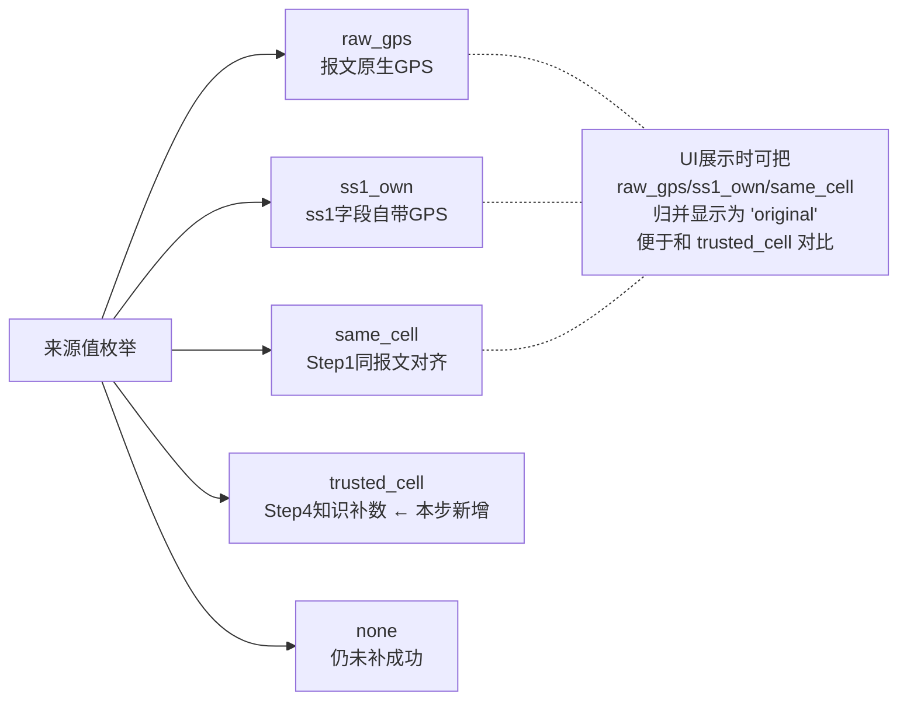
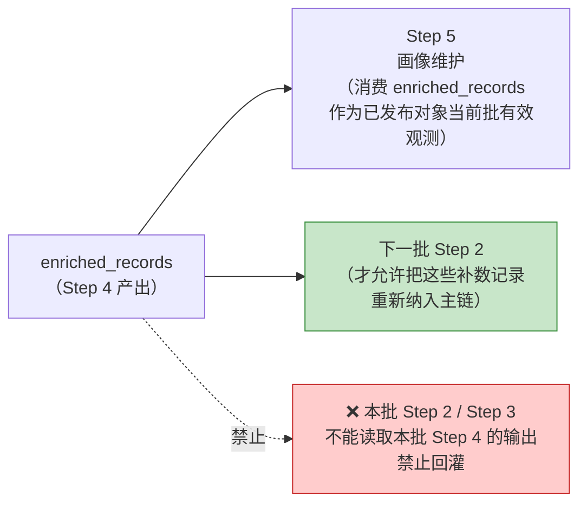

# Step 4：知识补数

> **核心目标**：用上一轮已验证的可信 Cell 库，为命中可信库的新报文补充缺失字段（GPS / 信号 / 运营商），同时对自带 GPS 的记录做初步异常标记。

---

## 这一步在整体流程中的位置

**Step 4 只处理 Path A 记录**（已命中可信库的那批数据）。Path B 的数据去了 Step 3，不经过 Step 4。

---

## 知识补数的本质：用历史可信知识填补当前缺口

---

## 谁可以作为 donor？

不是可信库里所有 Cell 都可以用来补数，需要满足资格：

---

## 各字段补数矩阵

**绝对不补的字段**：`cell_id`（主键）、`dev_id/ip/brand`（设备元数据只能来自报文本身）、时间字段、射频参数（`pci/freq_channel`，变化太快）。

---

## GPS 异常初筛

Step 4 不只补空值，还对"自带 GPS"的记录做一次距离核验：

> **为什么只标记 `pending`，不给最终分类**？因为单条记录的偏差可能是偶发噪声，也可能是迁移的开始。需要多批次时间序列累积后，才能在 Step 5 中判断是漂移/迁移/碰撞。

---

## 补数来源标记体系

每个被补的字段，都要留下来源痕迹，支持完整审计追溯：

---

## 补数不回灌本批主链

---

## 与 Step 1 字段对齐的区别（常被混淆）

| 对比维度 | Step 1 字段对齐 | Step 4 知识补数 |
|----------|----------------|----------------|
| **依据** | 同一条报文内的其他字段 | 历史积累的可信 Cell 画像 |
| **范围** | 只能同 `record_id` | 任何命中可信库的记录 |
| **可靠性** | 中（报文本身质量） | 高（多批次验证的可信对象） |
| **发生时机** | 数据入库时 | 可信库建立后的持续运行 |
| **是否受冻结约束** | 否 | 是（只读上一轮发布版本） |

---

## Step 4 明确不做的事

| 不做项 | 负责步骤 |
|--------|----------|
| GPS 异常最终分类（drift/migration/collision） | Step 5 时序判定 |
| 对象生命周期判定（waiting/qualified 等） | Step 3 |
| 防毒化、基线刷新 | Step 5 |
| 修改原始字段真相（lon_raw 等） | 永远不允许 |

**Step 4 只回答两件事**：①这条命中记录缺什么、能补什么；②它自带的 GPS 是否明显偏离可信质心。
