# Step 5：画像维护

> **核心目标**：对已经进入可信赖库的 Cell/BS/LAC 做持续治理——检测碰撞、防止数据污染、管理退出、更新标签——最终发布新版本的正式可信库，供下一批运行使用。

---

## 这一步在整体流程中的位置

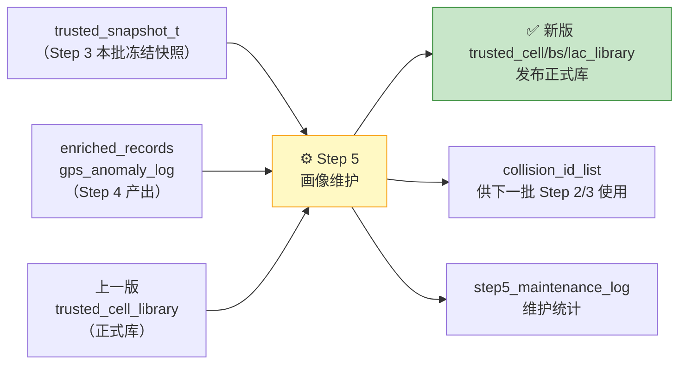

**Step 5 的角色**：Step 3 说"谁通过准入"，Step 5 做"深度治理 + 正式发布"。只有经过 Step 5 维护的正式库，才是系统对外提供服务和补数的依据。

---

## Step 5 的四大职责

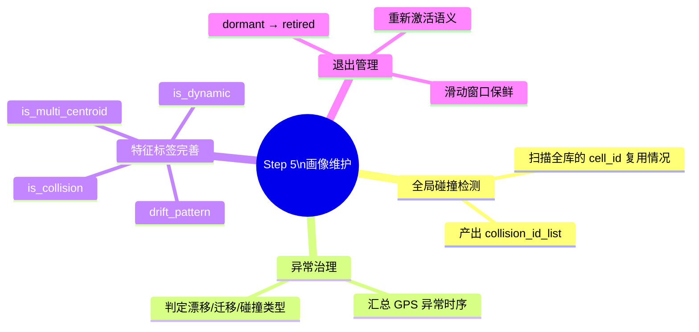

---

## 5.1 全局碰撞检测

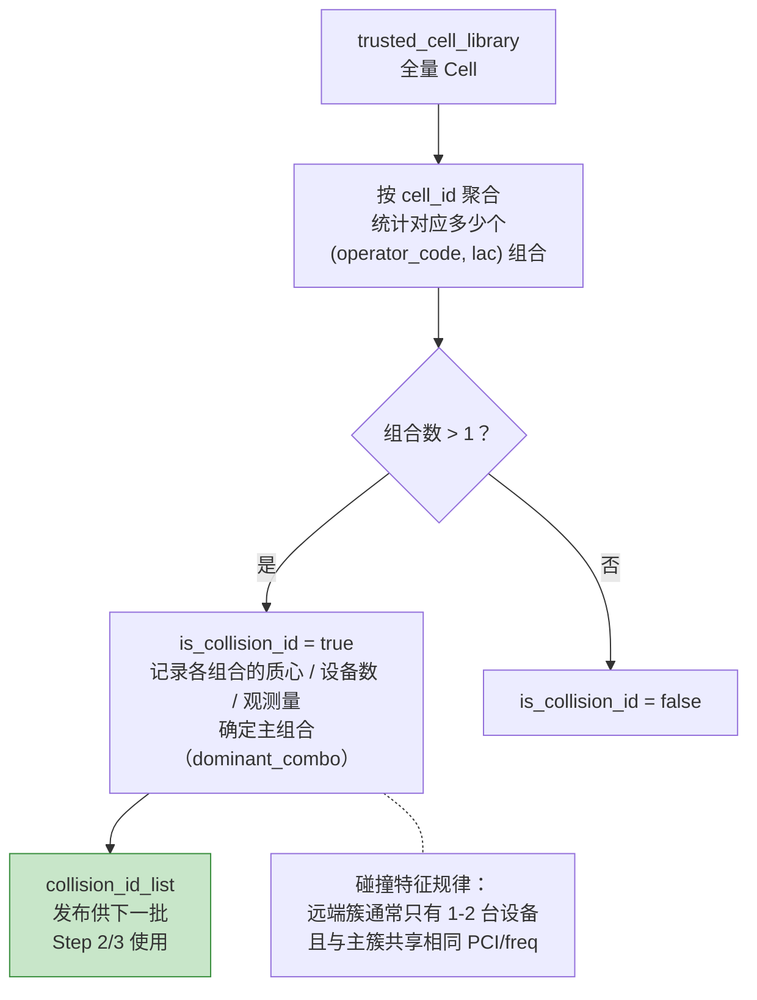

> 这是 Step 5 中**唯一需要全库扫描**的逻辑。其他分析都只处理异常子集，不做全量计算。

---

## 5.2 Cell 维护流程总览

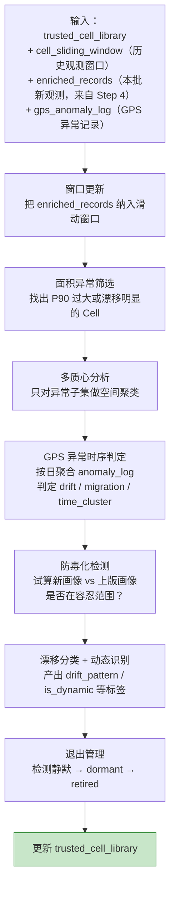

---

## 滑动窗口：为什么 Cell 不能无限积累历史观测

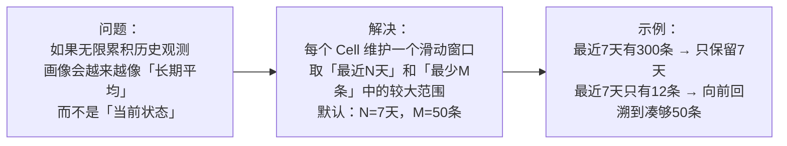

窗口内重算：质心 / P50 / P90 半径 / 漂移轨迹 / 窗口样本量。超出窗口的明细数据归档，不再参与当前画像计算。

---

## GPS 异常时序判定

Step 4 只标记"这条记录有异常（pending）"，Step 5 把多批次的记录串起来做时序判断：

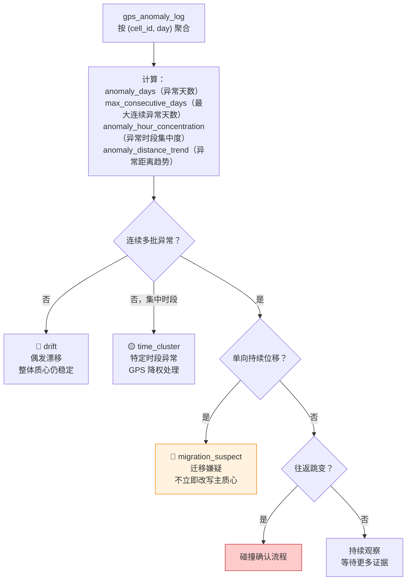

---

## 防毒化：防止异常数据污染已有画像

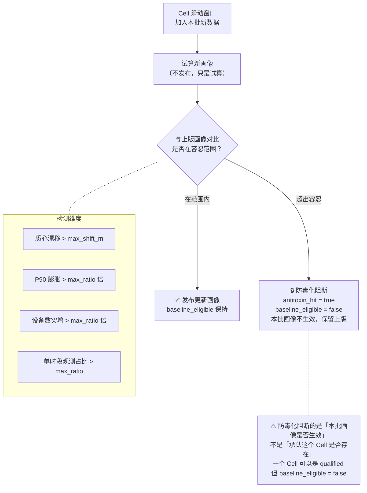

---

## 漂移分类：给 Cell 打上空间行为标签

基于多日质心轨迹，判断 Cell 的空间行为模式：

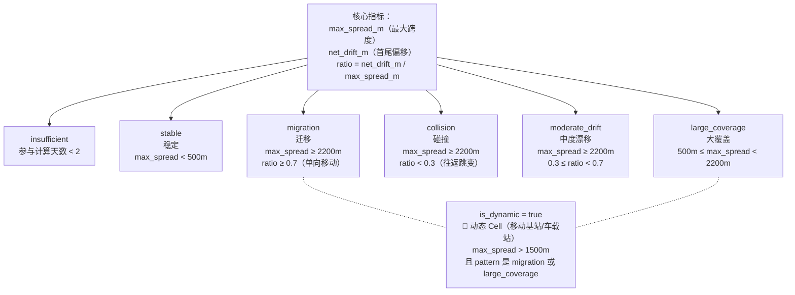

---

## 退出管理

只有**已进入可信库**的 Cell 才走退出链路，从未入库的观察对象直接从评估池清理：

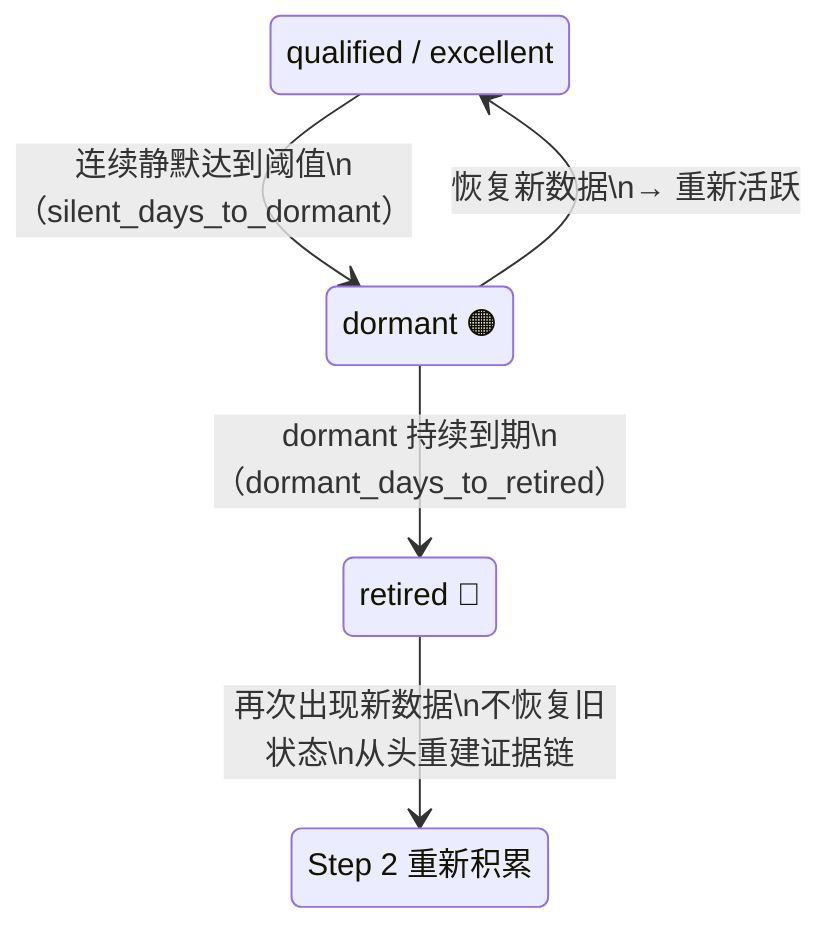

---

## BS / LAC 维护：复用 Cell 结果，不重看原始报文

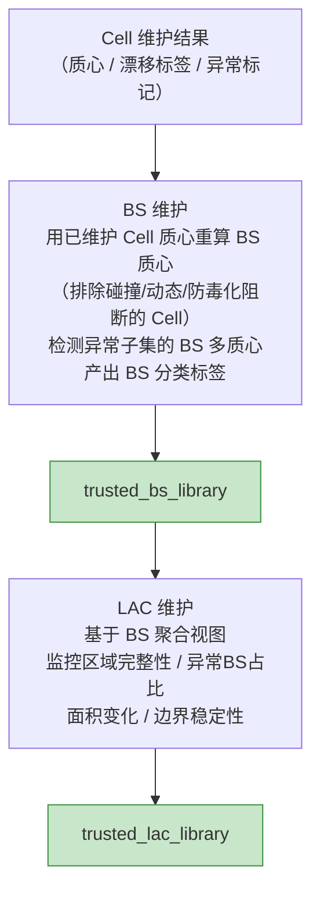

**BS 分类标签**（`classification` 字段）：

| 标签 | 含义 |
|------|------|
| `normal_spread` | 正常 |
| `large_spread` | 下属 Cell 离散过大（> 2500m） |
| `collision_bs` | 受碰撞 Cell 污染 |
| `dynamic_bs` | 含动态 Cell |
| `multi_centroid` | 存在多个稳定质心簇 |

---

## Step 5 发布后，下一批才能读取

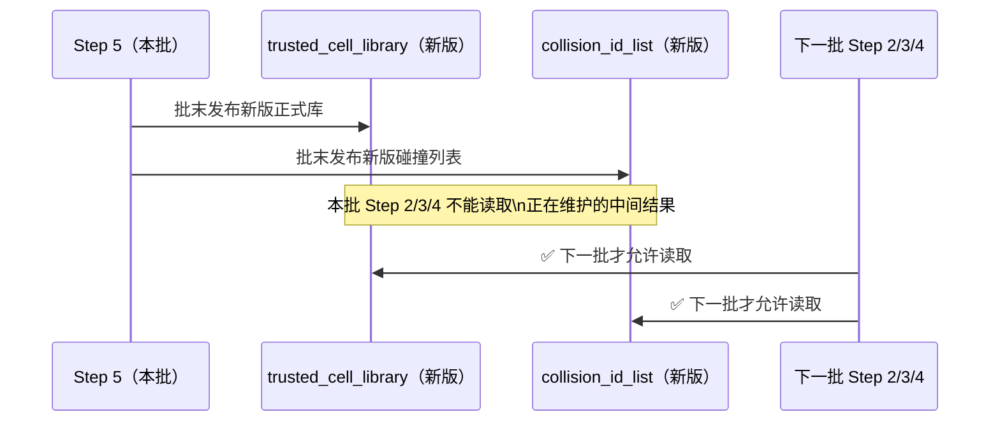

---

## Step 5 只处理"已入库对象"

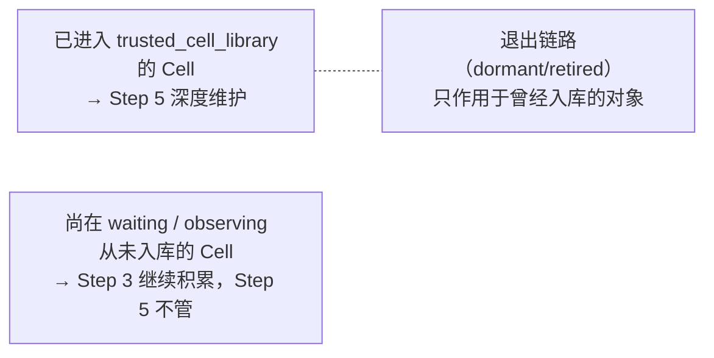

---

## 维护统计（step5_maintenance_log）

每次运行记录：
- 碰撞检测：发现了多少碰撞 `cell_id`，新增了多少
- 多质心：触发检测多少个，确认多质心多少个
- GPS 异常：漂移/时段集中/迁移嫌疑各多少条
- 防毒化：命中多少个，按维度分布
- 退出：新进入 dormant 多少，新 retired 多少，重新激活多少
- 数据窗口：平均窗口观测量，归档了多少条明细
