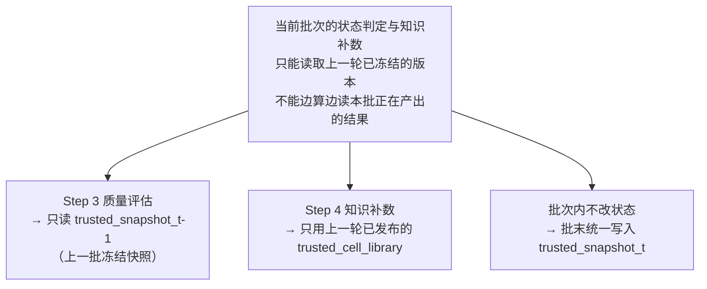
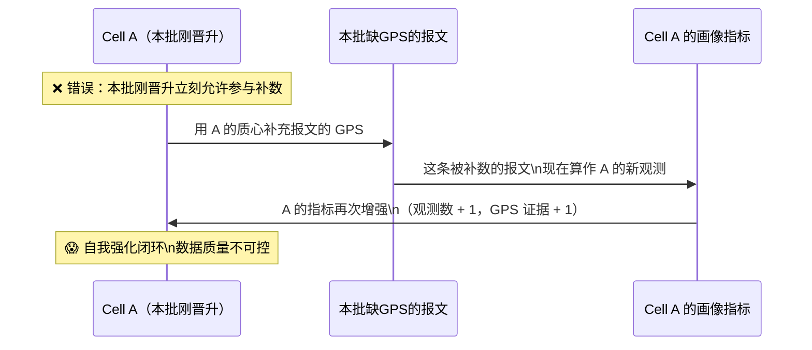
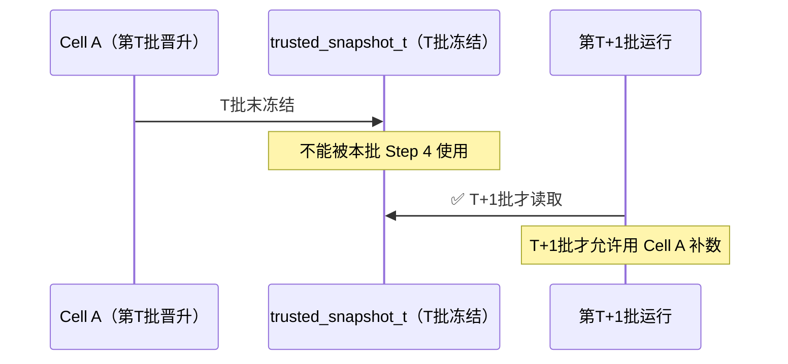
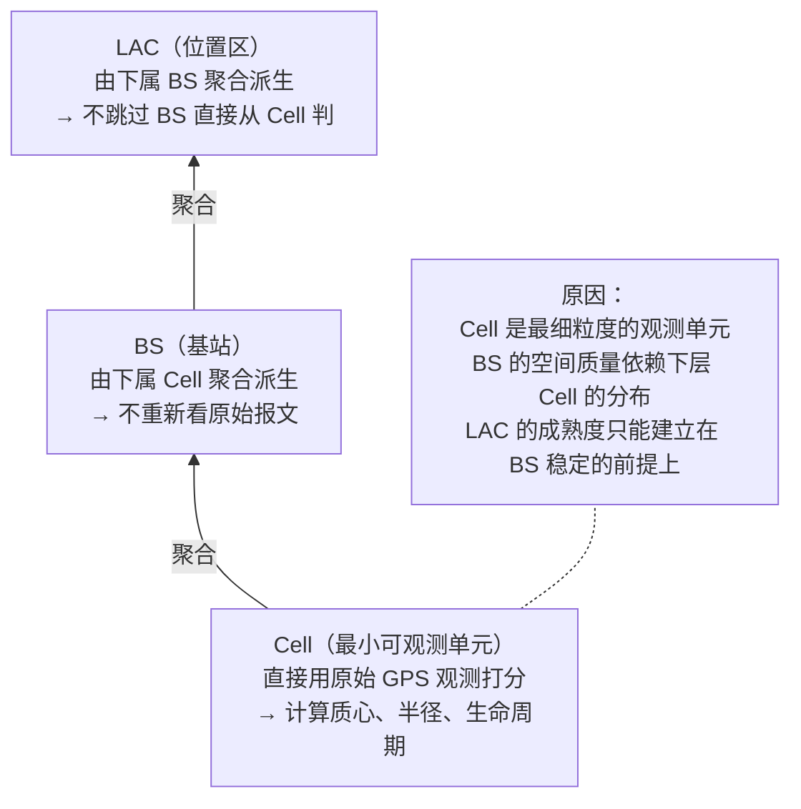
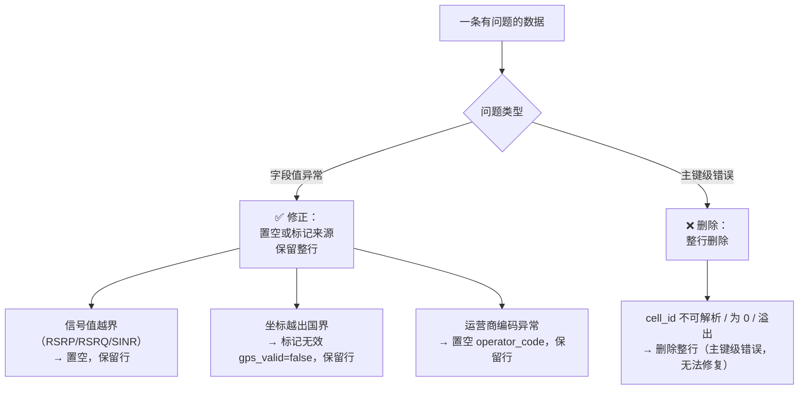
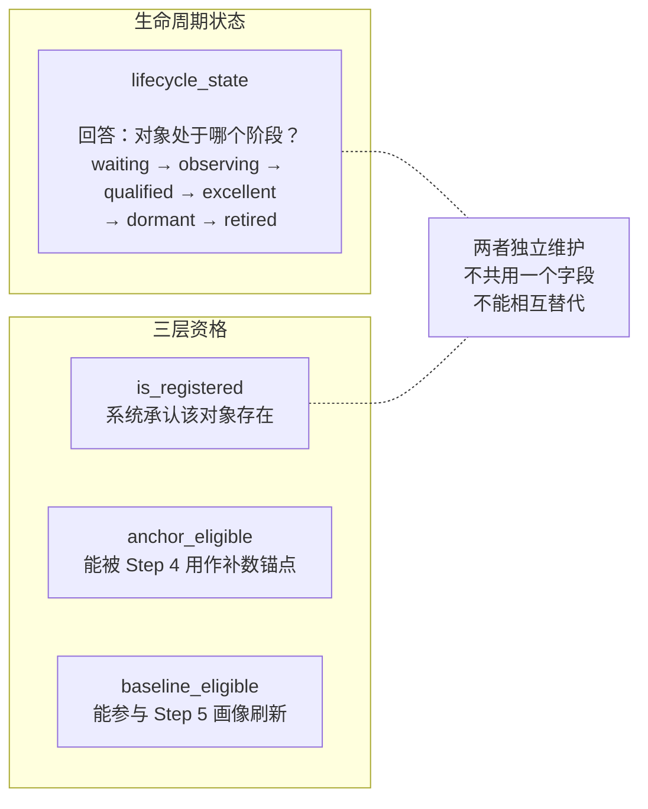
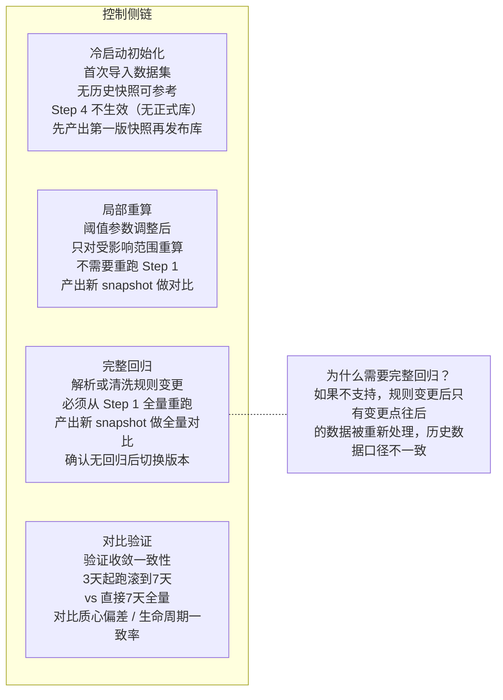
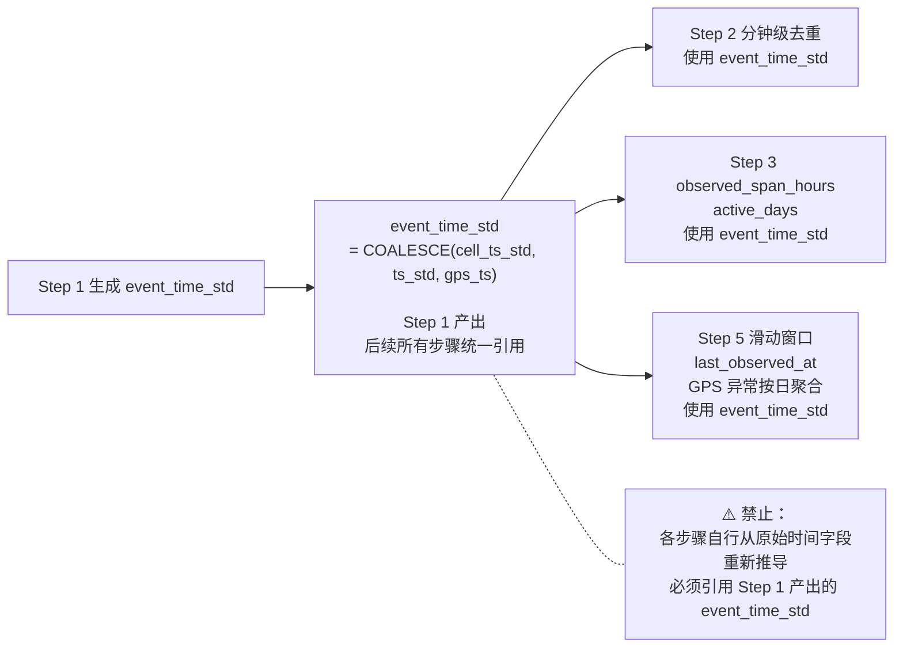

# 核心约束与设计原则

> 本文解释 rebuild5 最重要的几个设计决策：**为什么这样做，不这样做会发生什么**。理解这些原则，是正确开发和运维系统的前提。

---

## 原则一：冻结快照原则（最高优先级）

### 什么是冻结快照原则



### 违反后会发生什么（错误链路）



### 正确链路



---

## 原则二：Cell 先行，自下而上级联

### 为什么必须从 Cell 开始



### 违反后会发生什么

如果试图跳过 Cell 直接对 BS 做独立评分：
- BS 的定位误差会缺少 Cell 级的空间质量背书
- 同一 BS 下，优质 Cell 和碰撞 Cell 的贡献会被混为一谈
- LAC 的成熟度判断失去层级依据，无法确定"因为哪些 BS 达标"

---

## 原则三：修正优于丢弃



**背后的逻辑**：一条报文即使 GPS 无效，其信号值、设备 ID、时间戳依然有价值。整行删除会损失这些有效信息。

---

## 原则四：生命周期状态 vs 三层资格（两套独立系统）

这是系统中最容易引起混淆的设计：



**典型的合法组合**：

| 生命周期 | anchor_eligible | 含义 |
|----------|----------------|------|
| `qualified` | `false` | 观测量够了，但空间质量不达锚点标准（P90 太大） |
| `qualified` | `true` | 可以用于补数，但尚未成熟到刷新基线 |
| `excellent` | `true` | `baseline_eligible` 为 `true` 时可参与画像维护 |

---

## 原则五：只读上一轮，本批产出留到下批

所有步骤对"已发布库"的读写关系：

```mermaid
flowchart LR
    subgraph 本批运行
        S2["Step 2"]
        S3["Step 3"]
        S4["Step 4"]
        S5["Step 5"]
    end

    subgraph 只读（t-1 版本）
        LIB_OLD["trusted_cell_library\n（上一批发布）"]
        SNAP_OLD["trusted_snapshot_t-1\n（上一批冻结）"]
        COLL_OLD["collision_id_list\n（上一批产出）"]
    end

    subgraph 本批产出（下批才能读）
        SNAP_NEW["trusted_snapshot_t"]
        LIB_NEW["新版 trusted_cell_library"]
        COLL_NEW["新版 collision_id_list"]
    end

    S2 -->|"只读"| LIB_OLD & COLL_OLD
    S3 -->|"只读"| SNAP_OLD & COLL_OLD
    S4 -->|"只读"| LIB_OLD

    S3 -->|"产出"| SNAP_NEW
    S5 -->|"产出"| LIB_NEW & COLL_NEW

    style LIB_NEW fill:#c8e6c9,stroke:#388e3c
    style SNAP_NEW fill:#c8e6c9,stroke:#388e3c
    style COLL_NEW fill:#c8e6c9,stroke:#388e3c
```

---

## 原则六：治理视角 vs BI 视角（UI 设计边界）

系统 UI 分两种视角，不能混用：

```mermaid
graph LR
    subgraph 治理视角（Step 1-5 页面）
        G1["关注：规则是否命中？"]
        G2["关注：对象是否异常？"]
        G3["关注：本次 vs 上次的 diff"]
        G4["关注：阻断原因 / 退出预警"]
        G5["受众：系统管理员 / 数据工程师"]
    end

    subgraph BI 视角（Step 6 页面）
        B1["关注：基站覆盖率分布"]
        B2["关注：区域信号质量"]
        B3["关注：趋势分析（月度变化）"]
        B4["关注：运营商对比"]
        B5["受众：业务用户 / 分析师"]
    end
```

Step 5 的维护页面绝对不承载"经营分析报表"类内容，这类内容属于 Step 6 的服务层。

---

## 常见误解清单

| 误解 | 正确理解 |
|------|---------|
| "Step 3 发布可信库" | Step 3 只产出冻结快照，Step 5 才发布正式库 |
| "qualified 就能用于补数" | 补数资格是 `anchor_eligible`，与 `lifecycle_state` 独立 |
| "Step 4 补数结果可以立刻给 Step 3 用" | Step 4 产出不能回灌本批 Step 2/3，下一批才生效 |
| "BS 的质量是独立看原始报文判断的" | BS 完全由下属 Cell 聚合派生，不重新看报文 |
| "collision 标记来自 Step 2" | collision_id_list 由 Step 5.1 产出，Step 2 只是消费者 |
| "防毒化命中意味着 Cell 不可信" | 防毒化只阻断"本批画像是否生效"，不代表 Cell 不存在 |

---

## 控制侧链：非日常操作

除了日常稳态运行，系统还有四种非日常操作场景：



---

## 统一事件时间（避免不同步骤各自解释时间）

所有步骤必须使用同一个时间字段：



---

## 物理常量（不可配置，写入代码）

以下是算法常量，不放入业务配置文件：

| 常量 | 值 | 说明 |
|------|-----|------|
| 经度有效范围 | 73° ~ 135° | 中国边界 |
| 纬度有效范围 | 3° ~ 54° | 中国边界 |
| 经度→米系数 | 85,300 m/° | 北京纬度近似 |
| 纬度→米系数 | 111,000 m/° | 全球近似 |
| RSRP 有效范围 | -156 ~ 0 dBm | 物理约束 |
| RSRQ 有效范围 | -50 ~ 0 dB | 物理约束 |
| SINR 有效范围 | -30 ~ 50 dB | 物理约束 |

可配置的业务阈值（放入 `profile_params.yaml` 等配置文件）：晋级门槛、锚点门槛、漂移分桶、退出静默天数等。
